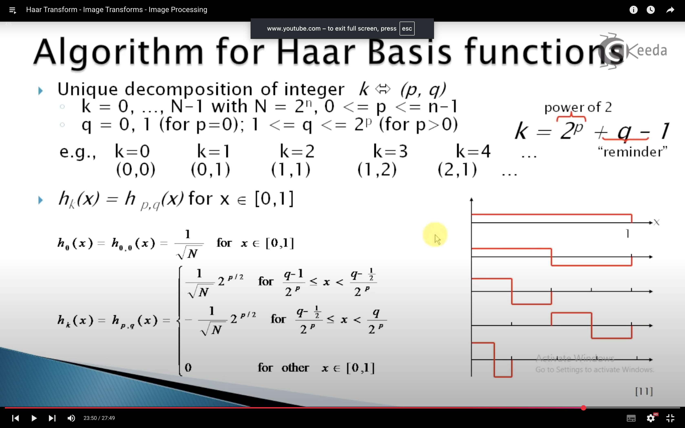

## Image transformations 

are mathematical operations that manipulate images to extract information, enhance features, or convert them from one form to another. These transformations can be applied in the spatial domain or the frequency domain depending on the requirement.

### Need for Image Transform

Image transforms are crucial in image processing because they:

- Change the domain of representation — from spatial domain to frequency domain or other domains for better analysis.
- Enhance image features — like edges, textures, or patterns that are not easily visible in the spatial domain.
- Compress data — by removing redundancies and representing the image in fewer coefficients.
- Filter noise — by transforming the image and removing unwanted components.
- Enable feature extraction — useful for applications like pattern recognition and image classification.

## The Haar Transform 

is one of the simplest wavelet transforms. It decomposes an image into averages and differences, making it useful for compression and feature extraction.

### Algorithm to Generate Haar Basis:

- Start with a vector or matrix of size N (where N is a power of 2).
    - Compute averages and differences between adjacent elements.
- Store the averages in one half and differences in the other half.
- Repeat the process for the average part recursively.

