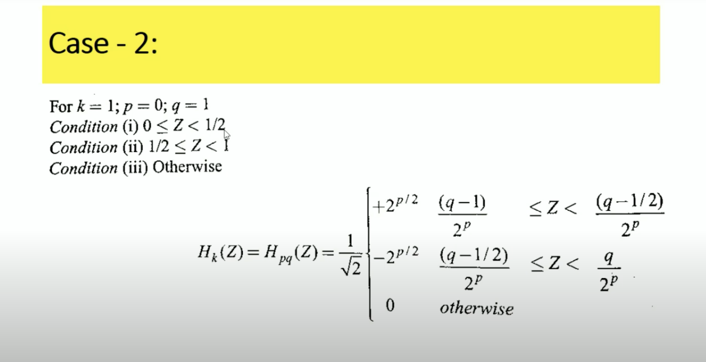

# Q2. What do you mean by computer vision? What are the main steps in a typical computer vision pipeline? Explain with suitable diagram. (4 marks)

- Computer vision is a field of study that enables machines to interpret and understand the visual world using images or videos.
- It applies algorithms and models to extract meaningful information, detect objects, track motion, recognize patterns, and more.

### Main Steps in a Computer Vision Pipeline:
1. Image Acquisition: Capturing the image or video using cameras or sensors.
- can include noises , blurs etc 

2. Preprocessing: Enhancing the image, removing noise, and normalizing brightness or contrast.
- includes smoothing (2-D , Guassian filters ) ,sharpening , removing noises , blur pixels , enhancement etc.

3. Segmentation: Dividing the image into regions or objects of interest.
- Edge detection :
- Color based segmentation 
- 


4. Feature Extraction: Identifying important patterns, edges, textures, or key points.
- Hough Transforms : detect lines 
- color bases transforms :
- Least sq method:

5. Classification or Recognition: Using machine learning or algorithms to recognize objects, shapes, or patterns.

6. Post-processing: Refining results, removing errors, or integrating multiple sources of information.


```yml
Image Acquisition → Preprocessing → Segmentation → Feature Extraction → Classification → Post-processing → Decision/Action
```


# Q1. What is the need of image transform? Explain the algorithm to generate Haar basis. Generate one Haar basis for N = 2. (6 marks)

### Need of Image Transform:
1. Image transforms convert image data from the spatial domain to another domain (frequency domain or another mathematical representation).
2. They help in compression, enhancement, filtering, feature extraction, and reducing noise.
2. Transforms like Fourier, Wavelet, and Haar help to analyze the image in terms of frequency or localized features.

## Haar Transform:
- It is one of the simplest wavelet transforms.
- It works by decomposing the image into approximation and detail components.
- It is widely used for image compression and noise removal.
- low computing requirements and high speed computations.

### Algorithm to Generate Haar Basis:
1. Start with a vector or image of size N.
2. Pair up adjacent elements and calculate their average (approximation) and difference (detail).
3. Repeat the process recursively on the approximation part until reaching size 1.

## haar basis for n=2


## Steps:


- step 5 :
Z e [0,1) ;
ie 0/N , .... N-1/N





