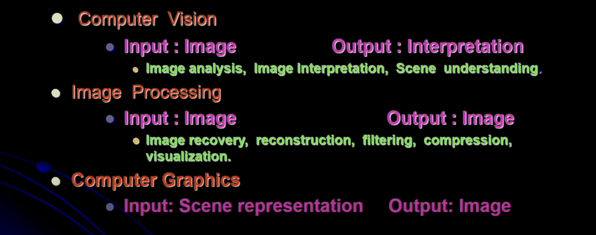
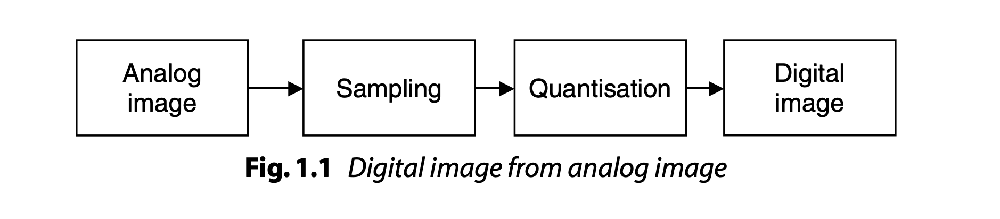
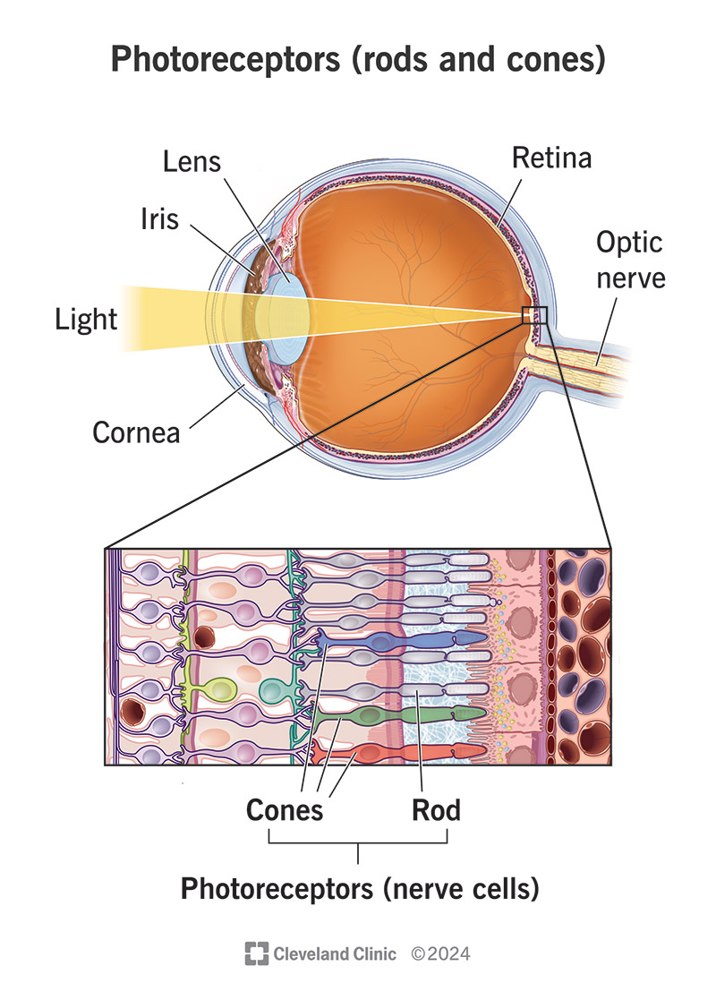
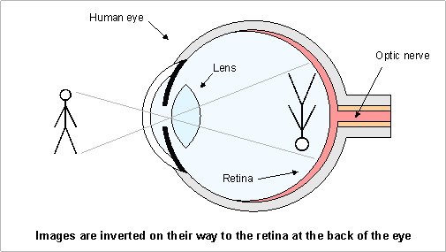
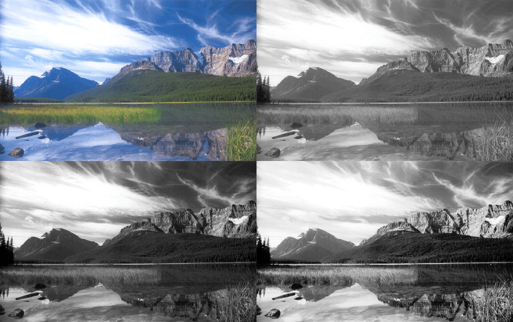
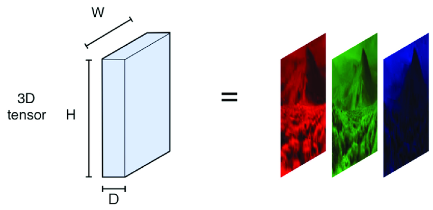
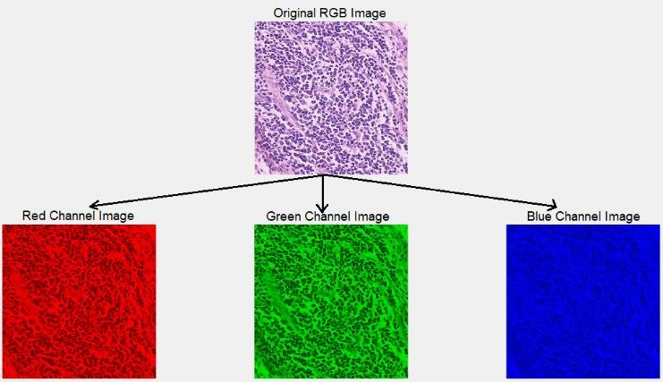

# CV  
- CV vs Image Processing vs Computer graphics

##  image 
- a 2D or 3D matrix of pixel intensity values.
- Each pixel contains a number (or set of numbers) describing how bright or colorful it is.

### 📌 Types of Images in Computer Vision
1. Grayscale Image
- Represents brightness only.
- Stored as a 2D matrix.
- Each pixel is a value from 0 (black) to 255 (white).

2. Color Image (RGB)
- Represents Red, Green, Blue channels.
- Stored as a 3D matrix: height × width × 3.

3. Binary Image
- Only 0 or 1 values.
- Used for masks, segmentation, thresholding.

#### An analog image 
- is a continuous image—smooth and natural—like what you see with your eyes or on film cameras.

#### 2️⃣ Digital Image
- A digital image is a numeric representation of an analog image stored in a computer.

## Digital Image Processing
- Digital Image Processing is the field of computer science where digital images are processed using computer algorithms to improve them or extract useful information.
- 🎯 Goals of DIP
    1. Enhancement
    Making an image look better
    (e.g., brightness, contrast, sharpening)
    2. Restoration
    Removing noise, blur, distortions
    3. Analysis
    Object detection, segmentation, pattern recognition
    4. Compression
    Reducing image size (JPEG, PNG)
    5. Visualization
    Converting raw data into a visible image

- 🔧 Common Operations in DIP
1. 1️⃣ Image Enhancement
- Brightness & contrast adjustment
- Histogram equalization
- Sharpening
- Smoothing/Blurring

2. 2️⃣ Image Restoration
- Noise removal
- Deblurring
- Filtering (Gaussian, median, etc.)

3. 3️⃣ Image Segmentation
- Separating objects from the background
- Thresholding
- Edge detection

4. 4️⃣ Image Compression
- Lossy (JPEG)
- Lossless (PNG)

5. 5️⃣ Image Representation
- RGB, grayscale, binary images
- Pixel matrix format

> The word “spatial” simply refers to space — things related to position, size, shape, distance, or arrangement.

## The Human Visual System 
-  refers to the biological system that allows humans to see, interpret, and understand visual information.
- 👉 HVS = Eyes + Optic Nerve + Visual Cortex (Brain)

| Human Visual System   | Digital Image Processing |
| --------------------- | ------------------------ |
| Uses rods & cones     | Uses pixels              |
| Continuous            | Discrete                 |
| Adaptation to light   | Fixed dynamic range      |
| Rich color perception | Quantized color values   |

## Image Formation :
1. 1️⃣ Light rays from an object enter the eye
- Light passes through the cornea, the transparent outer layer.

2. 2️⃣ The light is controlled by the pupil
- The iris adjusts the size of the pupil to control how much light enters.
- Bright light → pupil becomes small
- Dim light → pupil becomes large

3. 3️⃣ The lens focuses the light
- The lens changes its shape (becomes thick or thin) using ciliary muscles.
- This process is called accommodation.
- Its job is to make light rays fall sharply on the retina.

4. 4️⃣ An image is formed on the retina
- The image formed on the retina is:
    - Real (because light rays actually meet)
    - Inverted (upside-down)
    - Reduced (smaller than the object)

5. 5️⃣ Photoreceptors convert light to electrical signals
- The retina contains:
    - Rods (brightness)
    - Cones (color)

6. 6️⃣ The optic nerve sends the signals to the brain
- The brain (visual cortex) processes the signals and interprets the image.
- The brain automatically flips the inverted image upright.

## 1.6 Classification of Digital Images
- Digital images can be classified based on how they are represented, what information they contain, or how they are sensed.

### 1️⃣ Based on Image Representation
1. a) Binary Images
- Each pixel → 0 or 1
- Used in masks, thresholding, shape detection

2. b) Grayscale Images
- Each pixel → intensity value (0–255)
- No color, only brightness

3. c) Color Images (RGB)
- Each pixel has 3 components: Red, Green, Blue
- Stored as 3D matrix

4. d) Multispectral Images
- Captured in multiple wavelengths (3–10 bands)
- Used in satellites and remote sensing

5. e) Hyperspectral Images
- Have dozens to hundreds of bands
- Very detailed spectral information
- Used in agriculture, mineral detection, medical imaging

## 📘 Elements of an Image-Processing System
- An image-processing system consists of hardware, software, and algorithms used to acquire, store, process, analyze, and display images.
The main elements are:

1. Image Acquisition System (Sensors & Cameras)
- This is the first and most important component.
- Functions:
    - Capture real-world images.
    - Convert light into electrical signals.
    - Perform sampling and quantization to produce digital images.

- Devices:
    - Digital cameras
    - Mobile camera sensors
    - CCTV cameras
    - Scanners
    - X-ray/MRI sensors (medical)
    - Satellite sensors

- Additional Components:
- Lens system
- Illumination source
- Analog-to-Digital Converter (ADC)

## 📘 CCD and CMOS Image Sensors
- Digital cameras use image sensors to convert light into electrical signals.
- The two main sensor technologies are:
1. CCD → Charge-Coupled Device
2. CMOS → Complementary Metal Oxide Semiconductor
- Both perform the same function but differ in design, speed, power consumption, and cost.

### CCD (Charge-Coupled Device) Sensor
- A CCD is an image sensor where light is converted into charge, and the charge is transferred across the chip and read at one point.
#### How CCD Works
1. Light falls on each pixel → creates electron charge.
2. Charges from all pixels are shifted (coupled) row by row.
3. Entire pixel array is read sequentially by a single amplifier.
4. Output is converted into a digital signal.
5. Diagram (simple text form)
> Light → Pixel Array → Charge Transfer → Readout Register → ADC → Digital Image

#### Advantages
1. Very high image quality
2. Low noise
3. Excellent sensitivity (good in low light)
4. Uniform output across pixels

#### Disadvantages
1. Slower readout (sequential transfer of charge)
2. High power consumption
3. More expensive
4. Cannot integrate extra circuitry on the chip

#### Applications
1. Professional photography
2. Medical imaging
3. Astronomy
4. Scientific imaging

### 2. CMOS (Complementary Metal Oxide Semiconductor) Sensor
- A CMOS sensor converts light into voltage directly at each pixel using individual pixel-level amplifiers.

#### How CMOS Works
1. Light hits a pixel → creates charge.
2. Each pixel has its own amplifier or transistor.
3. Pixel outputs a voltage directly.
4. Multiple pixels are read simultaneously → very fast.
5. Diagram (simple text form)
> Light → Pixel Array (each pixel has amplifier) → Parallel Readout → ADCs → Digital Image

#### Advantages
1. Fast readout
2. Low power consumption
3. Low manufacturing cost
4. Easy to integrate with processing circuits (on-chip)
5. Ideal for real-time applications

#### Disadvantages
1. Higher noise than CCD
2. Lower image quality (older CMOS)
3. Non-uniform response between pixels
- (Note: Modern CMOS sensors have greatly improved and now dominate the market.)

#### Applications
1. Mobile phone cameras
2. CCTV
3. Webcams
4. Automotive cameras
5. Consumer electronics

| Feature               | CCD                        | CMOS                                |
| --------------------- | -------------------------- | ----------------------------------- |
| **Image Quality**     | High                       | Moderate → High (modern)            |
| **Noise**             | Very low                   | Higher (improving)                  |
| **Speed**             | Slow                       | Very fast                           |
| **Power Consumption** | High                       | Low                                 |
| **Cost**              | Expensive                  | Cheap                               |
| **Readout**           | Sequential (one amplifier) | Parallel (per-pixel amplifiers)     |
| **Design Complexity** | High                       | Low                                 |
| **Best For**          | Scientific/medical imaging | Phones, security, real-time systems |

## 📘 Image File Formats
- An image file format defines how digital images are stored, compressed, represented, and transmitted.
- Formats differ in:
    - Compression (lossy / lossless / uncompressed)
    - Color depth
    - Metadata support
    - Transparency support
    - File size
    - Quality

- Below are the most important image file formats used in digital image processing.

1. BMP (Bitmap Image Format)
- Type: Uncompressed
- Color Depth: 1-bit to 24-bit
- Key Features
    - Stores image pixel-by-pixel (raster format).
    - Very large file size because no compression.
    - Simple structure → easy to process programmatically.
- Advantages
    - High quality (no data loss)
    - Widely supported by Windows OS
- Disadvantages
    - Very large size
    - Not suitable for web usage
- Applications
    - Image processing experiments
    - Windows applications
    - When quality is more important than size

2. JPEG / JPG (Joint Photographic Experts Group)
- Type: Lossy compression
- Color Depth: 24-bit RGB
- Key Features
    - Uses DCT (Discrete Cosine Transform) for compression.
    - Compression ratio: 10:1 to 20:1
    - Some quality is lost when saved.
- Advantages
    - Small file size
    - Ideal for photos and natural scenes
    - Supported everywhere (web, mobile, cameras)
- Disadvantages
    - Lossy → quality reduces each time image is saved
    - Not suitable for text/line drawings
- Applications
    - Photography
    - Web images
    - Social media

3. PNG (Portable Network Graphics)
- Type: Lossless compression
- Color Depth: 24-bit, supports transparency (alpha channel)
- Key Features
    - Uses DEFLATE compression
    - Supports full transparency (alpha)
    - Better than GIF in most cases
- Advantages
    - No quality loss
    - Excellent for text, logos, icons
    - Transparency support
- Disadvantages
    - Larger file size compared to JPEG
    - Not ideal for high-resolution photographs
- Applications
    - Website graphics
    - Icons, UI design
    - Images requiring transparency

4. 4. GIF (Graphics Interchange Format)
- Type: Lossless, 256 colors only
- Supports: Animation
- Key Features
    - Only 8-bit color (256 colors)
    - Uses LZW compression
    - Very popular for short animations
- Advantages
    - Supports animation
    - Small file size
- Disadvantages
    - Very limited colors → not suitable for photos
    - Lower quality for complex images
- Applications
    - Memes
    - Simple animations
    - Icons

5. 5. TIFF (Tagged Image File Format)
- Type: Can be lossless or lossy
- Color Depth: Very high
- Key Features
    - Stores multiple pages/layers
    - Very high quality
    - Large file size
- Advantages
    - Excellent for archiving and printing
    - Used in professional and medical imaging
- Disadvantages
    - Very heavy files
    - Not supported by all browsers
- Applications
    - Medical imaging (MRI, CT)
    - Publishing
    - Scientific research

6. SVG (Scalable Vector Graphics)
- Type: Vector format (not raster)
- Key Features
    - Uses geometric shapes, lines, paths
    - Infinitely scalable without quality loss
- Advantages
    - Very small file size
    - Great for logos, icons, diagrams
    - Disadvantages
    - Not suitable for real photographs
- Applications
    - Web icons
    - Infographics
    - UI/UX design
---

| Format    | Compression      | Quality          | Transparency | Best Use               |
| --------- | ---------------- | ---------------- | ------------ | ---------------------- |
| **BMP**   | None             | Excellent        | No           | Processing experiments |
| **JPEG**  | Lossy            | Good             | No           | Photos                 |
| **PNG**   | Lossless         | Excellent        | Yes          | Graphics, logos        |
| **GIF**   | Lossless (8-bit) | Low              | Yes          | Animations             |
| **TIFF**  | Both             | Excellent        | Yes          | Medical, printing      |
| **RAW**   | None             | Highest          | No           | Photography            |
| **SVG**   | Vector           | Infinite scaling | Yes          | Web graphics           |
| **WEBP**  | Both             | High             | Yes          | Modern web             |
| **DICOM** | Lossless         | High             | Yes          | Medical imaging        |

