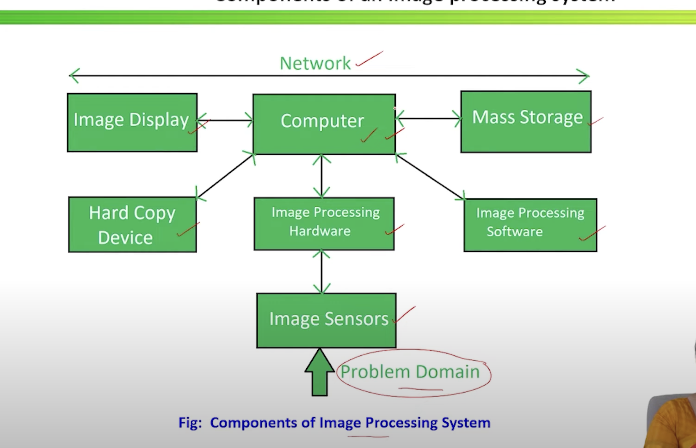
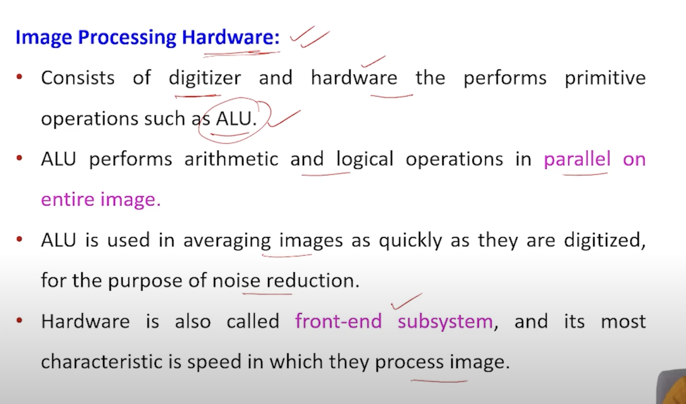
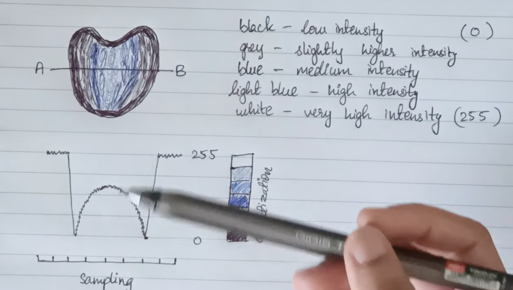

# componenets of image processing system

1. Image sensors :
- Sensor : 
- Digitizer :

2. Image Processing Hardware :
- Digitizer + Hardware compo like ALU(to remove noise)

3. Computer :
- Computer: This is the central processing unit, which can range from a personal computer to a supercomputer, that executes the image processing algorithms.

4. Image Processing Software: This is the core of the system, comprising algorithms and modules for image manipulation.
- Specialized Modules: These perform specific tasks, such as:
    - Image Enhancement: Algorithms for adjusting brightness, contrast, and sharpness.
    - Image Restoration: Techniques to remove noise, blur, and other degradations.
    - Image Segmentation: Algorithms that partition an image into meaningful regions or objects.
    - Image Compression: Methods for reducing file size for efficient storage and transmission (e.g., JPEG).

- Libraries and Frameworks: Popular software libraries like OpenCV, TensorFlow, and PyTorch provide a wide range of pre-built functions and tools for developing image processing applications.

5. Mass Storage: Image data is typically large, so storage is a critical component.
- Short-term storage: Used during processing, often in the form of computer memory or specialized frame buffers.
- On-line storage: For fast recall, such as magnetic or optical disks.
- Archival storage: For massive storage needs with infrequent access, like magnetic tapes or "jukeboxes."

6. Hardcopy Devices: These are used to create physical copies of the images.
- Examples include laser printers, inkjet printers, and film cameras , external ROM or pendrives

7. Image Displays: These devices are used to visualize the images.
- The most common are high-resolution color monitors, which are driven by graphics cards.
- Advanced systems may include stereo displays or specialized monitors for medical imaging.

# Major Classifications of Image Sensors
1. Charge-Coupled Device (CCD) Sensor
- Captures light and converts it to electrical charge.
- Transfers the charge across the chip to a readout amplifier.
- Known for high image quality and low noise.

2. Complementary Metal-Oxide Semiconductor (CMOS) Sensor
- Each pixel has its own amplifier.
- Converts light directly into voltage.
- Offers faster readout, lower power consumption, and integration with circuits.

## Working of Image Sensors
- Light to charge Conversion 
- Charge Accumulation
- Transfer 
- Chrage to voltage conversion
- Amplification

- 
| Feature               | CCD Sensor                  | CMOS Sensor                          |
| --------------------- | --------------------------- | ------------------------------------ |
| **Image Quality**     | High, with low noise        | Moderate, improving with tech        |
| **Power Consumption** | Higher                      | Lower                                |
| **Speed**             | Slower                      | Faster                               |
| **Integration**       | Requires external circuitry | Can integrate with processing        |
| **Cost**              | More expensive              | Less expensive                       |
| **Applications**      | Medical imaging, astronomy  | Consumer electronics, mobile devices |

## xplain the principle of sampling and quantization. Discuss its effect o nincreasing
- (i). sampling frequency (i) quantization levels of image.

1. Sampling – Principle
- Sampling is the process of converting a continuous image (analog image) into a digital image by dividing it into a fine grid of pixels.
- Each pixel represents the image intensity at that spatial location.
- Higher sampling → more pixels → better spatial resolution.
- Mathematically:
    - A continuous 2D image f(x,y) is sampled at discrete points:
    - f(mTx​,nTy​)
    - Tx​,Ty are sampling intervals.

2. Quantization – Principle
- Quantization converts continuous intensity values into a set of discrete gray levels.
- Example: 8-bit image → 256 levels
- The process maps the continuous range to fixed intervals.
- Mathematically:
    - fq​(m,n)=Q(f(m,n))
- where 𝑄 is the quantizer.

### (i) Effect of Increasing Sampling Frequency
- Sampling frequency = number of samples per unit distance (or pixels per inch).
- Higher sampling frequency means:
    - More image pixels
    - Higher spatial resolution
    - Better edge details
    - Reduced aliasing (distortion due to undersampling)
- Benefits:
    - Image looks sharper
    - Fine textures preserved
    - Better for medical imaging, satellite images, etc.

- Disadvantages:
    - Larger file size
    - More memory required
    - More processing time

### (ii) Effect of Increasing Quantization Levels
- Quantization levels = number of possible gray values (2ⁿ levels for n bits).
- Higher quantization levels mean:
    - More accurate representation of brightness
    - Smoother shading
    - Reduced quantization noise (banding effect)
- Benefits:
    - Better visual quality
    - Smooth transitions (no stepping effect)
    - Suitable for medical and scientific images
- Disadvantages:
    - Increased bits per pixel
    - More memory needed
    - Larger file size.

