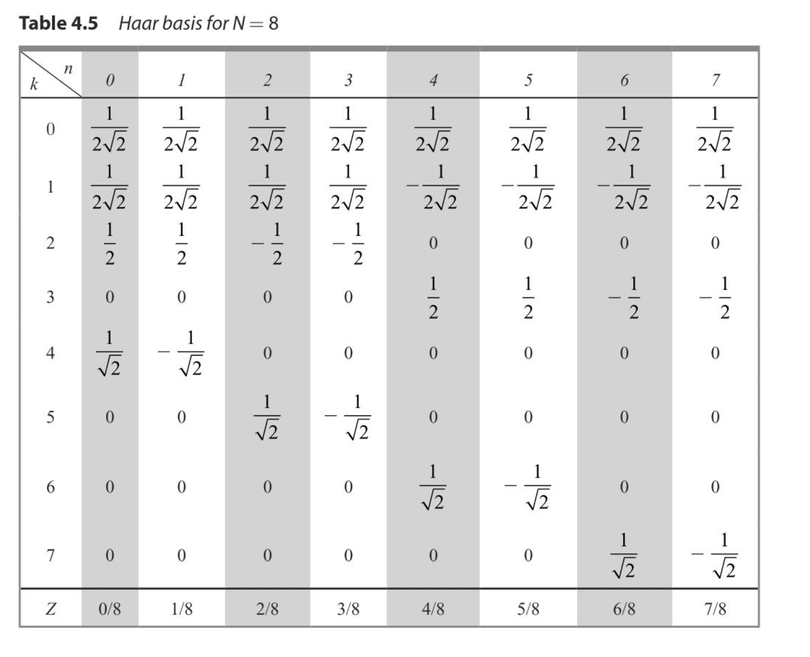

## Haar Transform:
- It is one of the simplest wavelet transforms.
- It works by decomposing the image into approximation and detail components.
- It is widely used for image compression and noise removal.
- low computing requirements and high speed computations.

### Algorithm to Generate Haar Basis:
1. Start with a vector or image of size N.
2. Pair up adjacent elements and calculate their average (approximation) and difference (detail).
3. Repeat the process recursively on the approximation part until reaching size 1.

### STEPS:
for N=2;
1. n= Log2(N)=1

2. Find p&q 
-  0 <= p <= n-1
==> p = 0.

- if p=0 ===> q=0,1
- else 1 <= q <= 2^p .
===> q = 0,1 .

3. k = 2^p + q - 1 
==> if p=0 , q=0 ====> k= 0
==> if p=0 , q=1 ====> k= 1;

4. determine z .
z = { 0/N , 1/N , .... , N-1/N } ===> [0,1)
z = { 0 , 1/2 }

5. if k=0 ===> H(z)=1/(root(N))
   if k=1 ===> H(z)= {  + 2^(p/2)         (q-1)/2^p  <=  z < ((q-1)/2)/2^p
                        - 2^(p/2)         ((q-1)/2)/2^p  <= z < q/2^p 
                         0                otherwise 
                            }

6. make table between n & k for H(z).

