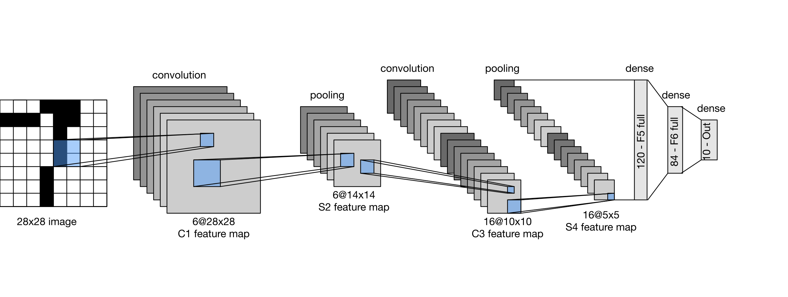
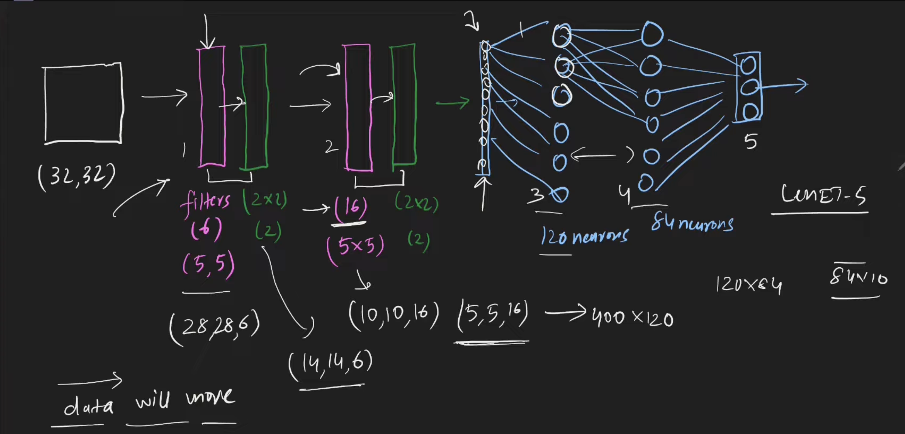
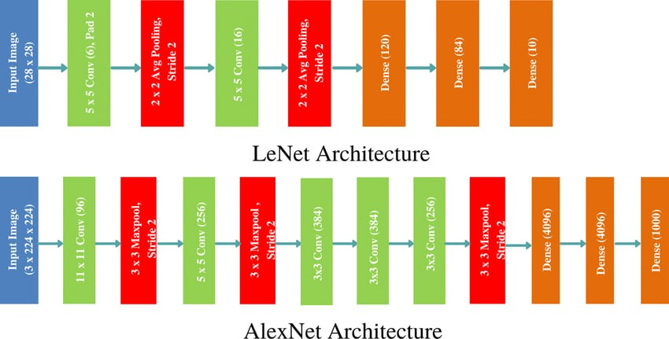
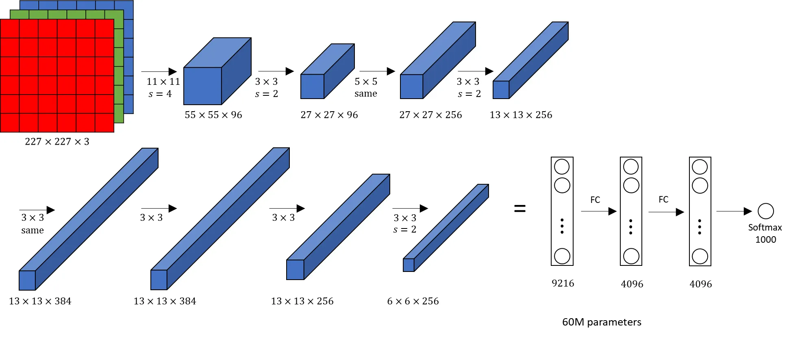
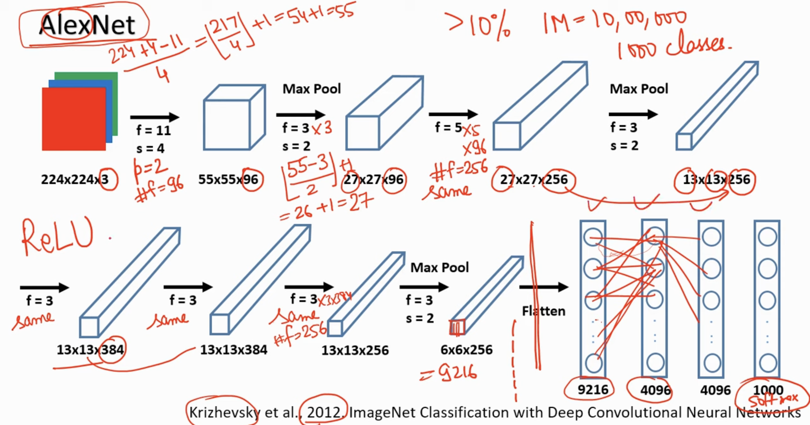
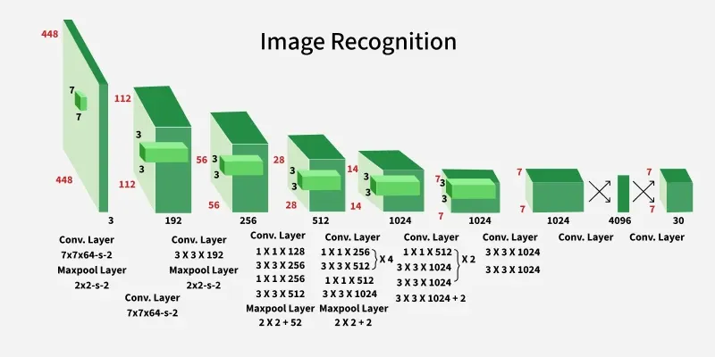

## 1. Neural Networks & Deep Learning for Image Analysis (Overview)
- Neural networks are models made of layers of artificial neurons that learn to map inputs to outputs from data.
- Deep learning means using many layers so the network can automatically learn complex features.

### For image analysis, we mainly use:
- ANN (Artificial Neural Network) – fully connected layers (good for small/simple images).
- CNN (Convolutional Neural Network) – special layers that slide filters over images and learn automatically from raw pixels (standard for vision).
- Deep architectures like LeNet, AlexNet, R-CNN, SSD, YOLO, etc.

### Why CNNs are preferred for images:
- Local connectivity – filters see small regions at a time (edges, corners, textures).
- Weight sharing – same filter is applied everywhere → fewer parameters, less overfitting.
- Translation invariance – object can move in the image but still be recognized.

### Typical CNN pipeline:
> Image → Convolution → Non-linearity (ReLU) → Pooling → …(repeat)… → Fully Connected Layers → Output (class scores / bounding boxes)
- Fully Connected Layers : 

## 2. Image Classification

### 2.1 Image Classification using ANN
- Image classification: Input is an image; output is a single class label (e.g., cat, dog, car).
#### Using ANN (fully connected network):
1. Flatten image
- A grayscale 28×28 image → 784 inputs.
- Color 224×224×3 → 150,528 inputs.

2. Hidden layers
- One or more fully connected (dense) layers with activation functions (sigmoid/ReLU).

3. Output layer
- One neuron per class (Softmax for multi-class classification).

#### Limitations of ANN for images:
- Very high number of parameters for large images.
- Ignores spatial structure (treats all pixels as independent).
- Hard to train and prone to overfitting.
- This is why CNNs (LeNet, AlexNet, etc.) are used instead.
------------------------------------

### 2.2 LeNet (LeNet-5)
- One of the earliest CNNs for image classification (Yann LeCun, ~1998).
- Originally designed for handwritten digit recognition (MNIST).
- Input: 32×32 grayscale image
#### Architecture (conceptual):
1. C1 – Convolution layer
- 6 feature maps, small filters (e.g., `5×5`).
- Detects basic features (edges, corners).

2. S2 – Subsampling (Pooling)
- Performs `average` pooling → reduces size, adds some translation invariance.

3. C3 – Convolution layer
- 16 feature maps; combines features from S2 → learns more complex patterns.

4. S4 – Subsampling (Pooling)

5. C5 / F6 – Fully Connected Layers
- Flatten and connect to dense layers.

6. Output Layer
- 10 neurons for 10 digits (0–9), `softmax` activation.

#### Key points for exams:
- Introduced convolution + pooling for images.
- Used weight sharing and local receptive fields.
- Worked very well for small, simple images like digits.

## 2.3 AlexNet
- AlexNet (2012) is a deeper CNN that won the ImageNet competition and showed the power of deep learning.
- Input: 224×224×3 RGB image
- Main contributions:
- Deep architecture – 8 learnable layers
    - 5 convolutional layers + 3 fully connected layers.
- ReLU activation instead of sigmoid/tanh
    - Avoids vanishing gradients, makes training faster.
- Dropout in fully connected layers
    - Helps reduce overfitting.
- Data augmentation
    - Random crops, flips, etc. → more training data.
- GPU training
    - Used 2 GPUs to handle the large model and dataset.

- Architecture (high-level):
> Conv1 → Conv2 → Conv3 → Conv4 → Conv5 → Flatten → FC6 → FC7 → FC8 (1000-class output for ImageNet).

- Impact:
    - AlexNet triggered the deep learning boom, proving that large CNNs trained on big datasets can greatly outperform traditional methods.

- NEW SIZE = (prev-f+s)/4
#### Parameters :

## 3.1 Object Detection Using CNN & R-CNN
1. (a) Naive CNN for Detection
- Simplest idea:
    - Slide a window over the image → crop patches → classify each patch with a CNN.
    - But this is very slow and redundant.

2. (b) R-CNN (Regions with CNN features)
- R-CNN improves speed and accuracy using region proposals:
- Region Proposal
    - Use Selective Search (or similar) to propose ~2000 candidate regions likely to contain objects.
- Feature Extraction with CNN
    - Each region is resized and passed through a CNN (like AlexNet) to get a feature vector.
- Classification
    - A separate SVM classifier decides the class for each region.
- Bounding Box Regression
    - A regressor adjusts the coordinates to better fit the object.
- Advantages:
    - Much more accurate than traditional HOG/SIFT based methods.
- Drawbacks:
    - Very slow (each of the ~2000 regions passes through the CNN).
    - Multi-step training pipeline (CNN + SVM + box regressor separately).

## 3.2 Single Shot Multibox Detector (SSD)
- SSD is a single-stage object detector → detection in one forward pass, so it is fast.
- Key ideas:
- Single network
    - No separate region proposal stage.
    - One CNN takes the full image and directly predicts bounding boxes and class scores.

- Default (anchor) boxes
    - At each location in several feature maps, SSD defines multiple default boxes of different sizes and aspect ratios.
    - The network predicts:
        - Offsets to adjust these boxes
        - Class probabilities for each box

- Multi-scale feature maps
    - Early layers capture small objects (high resolution).
    - Deeper layers capture large objects (low resolution).

- Loss function combines:
    - Localization loss (for box coordinates)
    - Confidence loss (for classification)

- Advantages:
    - Fast enough for real-time in many applications.
    - Reasonable accuracy.

- Use cases: Mobile/embedded devices, autonomous driving, surveillance.

## 3.3 YOLO (You Only Look Once)
- YOLO is another single-shot detector but with a different philosophy.
- Main idea: Treat detection as a single regression problem from image pixels → bounding boxes + class probabilities.
- Basic YOLO (v1) pipeline:
    - Divide the image into an S×S grid.
    - For each grid cell, the network predicts:
        - B bounding boxes (x, y, w, h, confidence)
        - C class probabilities
    - Combine confidence with class probabilities to get final detections.
- Features of YOLO:
    - Global reasoning – Looks at the entire image at once, so it captures context.
    - Very fast – Real-time object detection (dozens of FPS).
- Later versions (YOLOv2, v3, v4, v5, v7, v8 …) add:
    - Anchor boxes (similar to SSD)
    - Better backbones (Darknet, CSPNet etc.)
    - Multi-scale detection and improved training tricks.
- YOLO vs SSD (generally):
    - Both are single-stage detectors.
    - YOLO is famous for very high speed; SSD also fast but often slightly more accurate for some datasets.

### Arch :

1. Input Preprocessing:
The model accepts an image as input. It resizes the input image to **448×448** pixels ensuring that the aspect ratio is preserved using padding. This ensures uniformity of input dimensions across the network which is essential for batch processing in deep learning.

2. Backbone Convolutional Neural Network (CNN):
- After preprocessing the image is passed through a deep CNN architecture designed for object detection:
    - The model consists of **24 convolutional layers** and 4 max-pooling layers.
    - These layers help in extracting hierarchical spatial features from the image.

3. Use of 1×1 and 3×3 Convolutions:
- To reduce the number of parameters and compress channels, 1×1 convolutions are employed.
- These are followed by 3×3 convolutions to capture spatial patterns in the feature maps.
- This design pattern i.e 1×1 followed by 3×3 improves computational efficiency while maintaining expressive power.

4. Fully Connected Layers:
- Following the convolutional layers, the architecture has 2 fully connected layers. The final fully connected layer produces an output of shape (1, 1470).

5. Cuboidal Prediction Output:
- The output vector of size 1470 is reshaped to (7, 7, 30). Here, 7×7 represents the grid cells, and 30 represents the prediction vector for each cell:
> 30=(2 bounding boxes×5)+(20 class probabilities) 

6. Activation Functions:
The architecture predominantly uses Leaky ReLU as its activation function. The Leaky ReLU is defined as:

f(x)=   x,      if x>0 
        0.01x,  else 
- This activation allows a small gradient when the unit is not active, preventing dead neurons.

7. Output Layer Activation:
- The last layer uses a linear activation function, suitable for making raw predictions like bounding box coordinates and confidence scores.

8. Regularization Techniques:
- Batch Normalization is employed across layers to stabilize and accelerate training.
- Dropout is also incorporated to prevent overfitting by randomly deactivating neurons during training, encouraging the network to learn more robust features.
