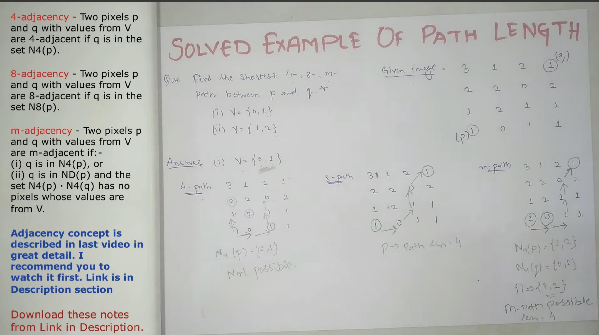
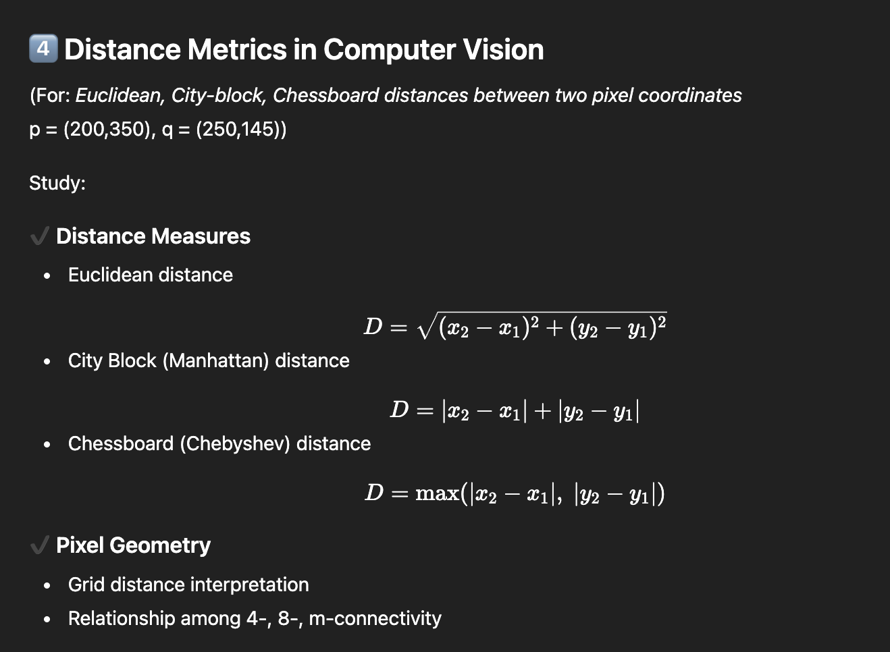

## 


1. City block dist is equi to D4 ( 4 Adjancency )
2. ChessBoard dist is equi to D8.
3. For Dm , straight path is preffered over diagonal.

##


## Knowledge-Based Vision
- Knowledge-based vision refers to an approach in computer vision where prior knowledge about the world is used to interpret and understand images.
- Instead of relying only on raw pixel data, the system uses stored knowledge, such as shapes of objects, spatial relationships, rules, constraints, or semantics, to make intelligent decisions.
- Why is it needed?
    - Because images are often noisy, ambiguous, or incomplete. Human vision relies heavily on prior knowledge to understand scenes; knowledge-based vision tries to imitate that.

### Forms of Knowledge Representation in Computer Vision :
- Knowledge must be stored in a format that a vision system can use.
The major forms are:
1. Semantic Networks
- A semantic network represents knowledge as a graph of nodes (concepts/objects) and edges (relationships).
- Features
    - Easy to visualize
    - Represents hierarchical and associative relationships
    - Useful for scene understanding
```yml
Car → has → Wheels
Car → part_of → Road Scene
```
- Used for:
    - Object relationships
    - Scene context
    - Hierarchical classifications

2. Frames
- A frame is a structured template that stores properties of an object or situation in slots and values (like an object in OOP).
- Example Frame – “Chair”
```yml
Object: Chair
Slots:
- Color: Brown
- Material: Wood
- Has_backrest: Yes
- Function: For sitting
```
- Used for:
    - Representing typical object properties
    - Position and structure information
    - Reasoning about expected attributes

3. Rules (Production Rules)
- Knowledge expressed as IF-THEN rules to make decisions during vision tasks.
```css
IF shape is circular AND color is red
THEN object is Stop Sign
```
- Used for:
    - Recognition of objects
    - Decision making
    - Constraint checking

5. Probabilistic Models
- Used when knowledge is uncertain; represented mathematically.
- Examples
    - Bayesian Networks
    - Markov Random Fields
    - Hidden Markov Models
- These help to:
    - Infer unknown values
    - Handle noisy data
- Estimate object identity and pose

6. Geometric Models
- Use mathematical geometry to represent:
    - Shape
    - Size
    - Edges
    - Surfaces
    - 3D models
- Example
    - Polyhedral models
    - Wireframe models
    - CAD-like models
- Used in:
    - Object recognition
    - Pose estimation
    - Robotics.
- 

| Representation Type          | What it Represents          | Use-Cases                     |
| ---------------------------- | --------------------------- | ----------------------------- |
| **Semantic Networks**        | Concepts + relationships    | Scene understanding           |
| **Frames**                   | Templates for objects       | Attribute reasoning           |
| **Rules**                    | IF-THEN logic               | Object detection, constraints |
| **Ontologies**               | Formal structured knowledge | Semantic vision, robotics     |
| **Probabilistic Models**     | Uncertain knowledge         | Recognition, inference        |
| **Geometric Models**         | Shape, pose, 3D info        | Robotics, 3D vision           |
| **Symbolic Representations** | Abstract symbols            | High-level reasoning          |


