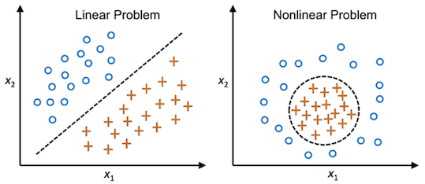
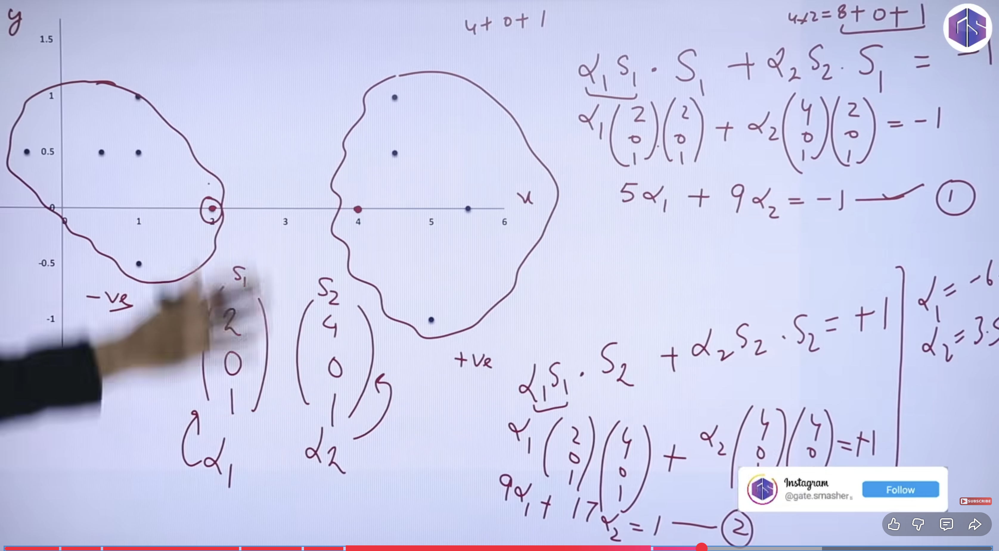
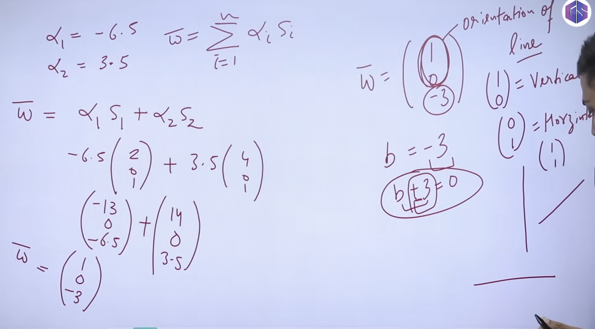
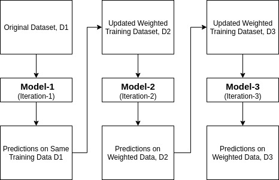
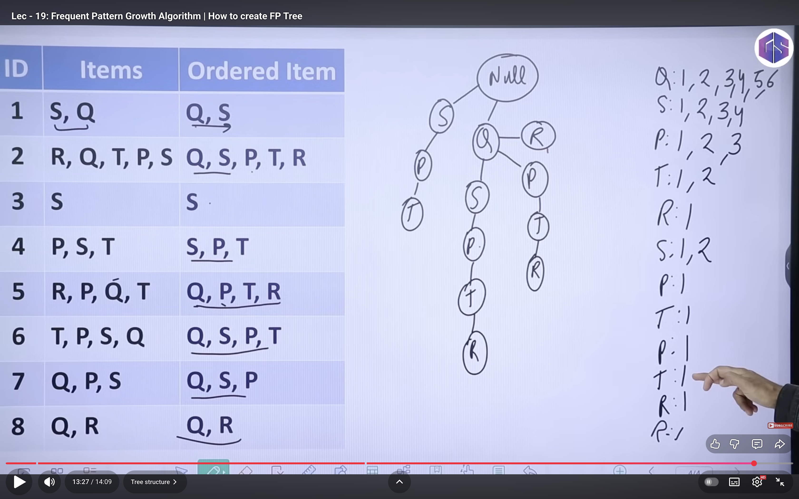
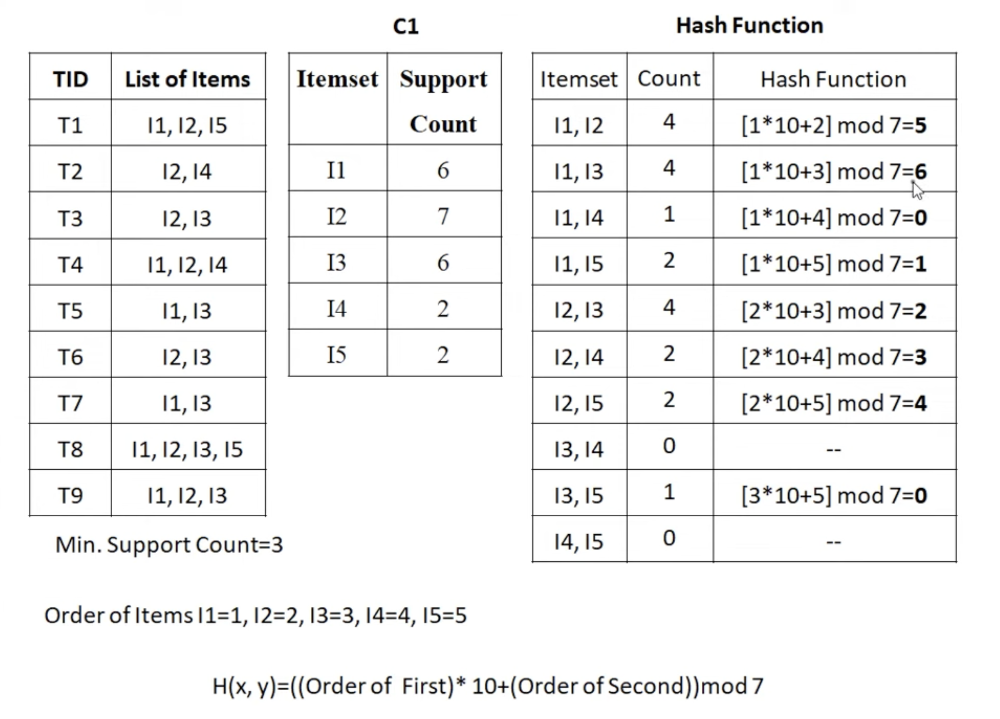
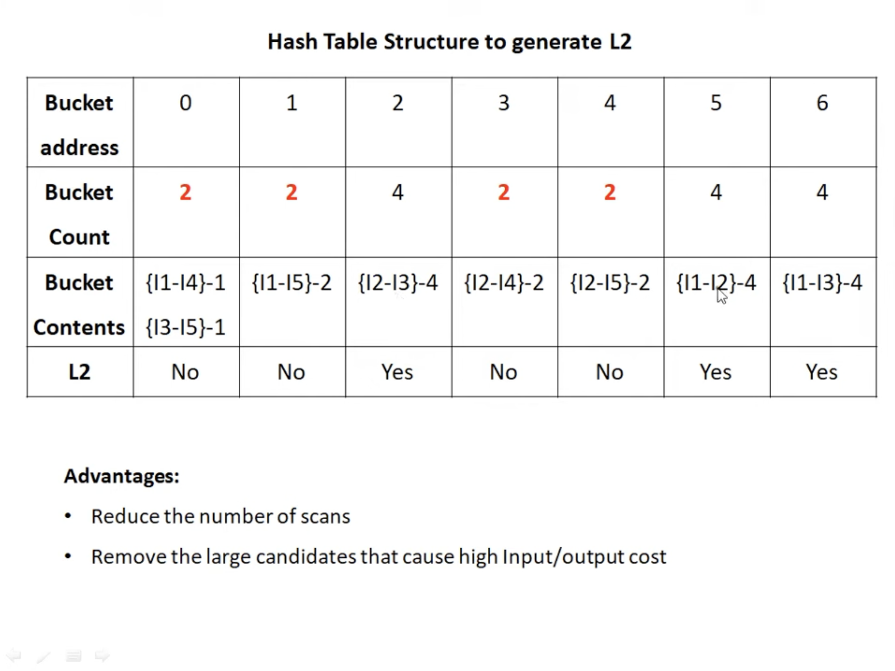
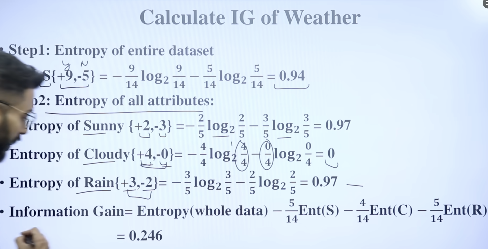
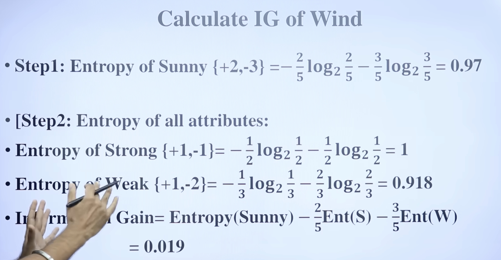

## Explain the working of Support vector machine with emphasis on case when the data is linearly separable.
---
- A Support Vector Machine (SVM) is a supervised machine learning algorithm used for:
1. Classification (main use)
2. Regression (SVR) ( dependent = something *+-indepent  )
- SVM tries to find the best decision boundary (called a hyperplane) that separates different classes.
- SVM chooses the hyperplane that gives the maximum margin, i.e., the largest possible distance between the boundary and the nearest data points of each class.

### Hyperplane : A line (in 2D), plane (in 3D), or higher-dimensional surface that separates classes.
- w⋅x+b=0
- It divides the feature space into:
    - One side → class +1
    - Other side → class –1

> Margin : Distance between the hyperplane and the closest data points from each class.
> Support Vectors : The data points closest to the hyperplane.
- ➡️ These points define the margin.
- ➡️ Removing other points does not change the decision boundary.

### Goal of SVM
- Find the hyperplane that:
    - Maximizes the margin
- A larger margin means:
    - Better generalization
    - Less overfitting

## 🔹 How SVM Works (Intuition)

### 🔸 Case 1: Linearly Separable Data
- The algorithm finds a straight line (or plane) that separates classes with the maximum margin.
#### Mathematical Working for Linearly Separable SVM
- We want all samples (xi​,yi​) to satisfy:
    - yi​(w⋅xi​+b)≥1
- This ensures:
    - Points of class +1 lie on one side
    - Points of class –1 lie on the other side
    - Margin boundaries are:
        - w⋅x+b=+1
        - w⋅x+b=−1
    - Margin width formula:
        - Margin= 2 / ∥w∥​
        -  ​∥w∥ = cardinality of w.
        - To maximize the margin → minimize ∥w∥.
- ⭐ Optimization Problem =>   min 1/2 * ​∥w∥^2
	​

### 🔸 Case 2: Not Linearly Separable
- SVM uses the Kernel Trick to project data into a higher-dimensional space where it becomes separable.

## 

## How to Effectively Construct an Ensemble Classifier
- Ensemble methods combine multiple weak or base classifiers to create a strong classifier.
- ✔️ Basic Principles for an Effective Ensemble
1. Diversity among models
Models should make different types of errors.
2. Independence
Errors of one model should not be the same as the others.
3. Combination rule
Use majority vote, weighted vote, averaging, or stacking.

- ⭐ Three Popular Ensemble Methods
1. Bagging (Bootstrap Aggregating) – e.g., Random Forest
2. Boosting (Sequential Model Training) – e.g., AdaBoost
3. Stacking (Meta-learner to combine models)

## AdaBoost = Adaptive Boosting
1. 🔷 STEP 1 — Initialize Weights
- If the dataset has N samples, each sample starts with equal weight:
- wi ​= 1/N
- This means every person initially has equal importance.

2. STEP 2 — Train the First Weak Learner
- Example weak rule:
- If Income = High → predict Buy = 1
- else → predict 0
- After evaluating this classifier:
- Some samples are correctly classified
- Some are misclassified → these samples keep higher weight in next round

3. Compute Classifier Weight
- α1​= 1/2 * ​ln( 1-ϵ / ϵ1​​)
- If error is small → α is large → classifier is strong
- If error is big → α is small → classifier is weak

4. Update Weights of Samples
    wi​← wi​⋅ e ^ −α1.​yi.​h1​(xi​)
Meaning:
- Correctly classified → weight decreases
- Misclassified → weight increases
- Then weights are normalized (to sum to 1).
- This forces the next model to focus on difficult examples.

5. 🔷 STEP 5 — Train Second Weak Learner

## FP-TREE
1. First pass — item supports (count occurrences)
- Keep only items with support ≥ 3 (minsup = 3):
Frequent items = { c:4, f:4, a:3, b:3, m:3, p:3 }.

2. Order frequent items (descending support) and prepare transactions

3. Build FP-tree (insert ordered transactions)
- start with NULL

## 6. Advantages & Disadvantages of FP-tree (FP-growth) vs Apriori
- Advantages (FP-tree / FP-growth):
    - No candidate generation: FP-growth does not generate large sets of candidate itemsets (unlike Apriori), so is generally much faster on dense datasets.
    - Compact representation: The FP-tree compresses the database into a small structure when there is overlap in transactions.
    - Typically much faster for large databases and low minsup because it requires fewer scans after the initial passes (two DB scans typically).

- Disadvantages / Caveats:
- Memory for tree: The FP-tree and conditional trees must fit in memory; in some cases (very large, low overlap) tree can be big.
- Implementation complexity: FP-growth implementation and conditional tree building is more complex than straightforward Apriori.
- Worst case: If the tree does not compress well (transactions are very different), FP-growth may degrade in performance.

## i) How d o you improve the efficiency o f Apriori algorithm? Explain any one method.?
- Apriori suffers from:
    - Too many candidate itemsets
    - Repeated database scans
    - High computation when minsup is low

- To improve efficiency, several strategies are used:
1. Hash-Based Technique (Hashing Candidates)
2. Transaction Reduction
3. Partitioning
4. Sampling
5. Dynamic Itemset Counting (DIC)

## 1. Hash-Based Technique (Hashing Candidates)
This method reduces the number of candidate k-itemsets by hashing item pairs (or tuples) into a hash table during the scanning of the database.
- How it Works
    - While scanning transactions to count support for frequent 1-itemsets (L1),
    generate all possible 2-itemsets from each transaction.
    - Each 2-itemset is hashed into a bucket using a hash function such as:
        > h({x,y})=(x∗10+y)modB
        where B = number of buckets.
    - For each bucket, maintain a counter.
    - After scanning the database:
        - If a bucket count < minsup → all itemsets in that bucket can be pruned.
        - Only remaining buckets are used to generate candidate 2-itemsets (C2).

## Give an example to show that items in a strong association rule actually may be negatively correlated. :
| Item        | Support |
| ----------- | ------- |
| Bread       | 90%     |
| Jam         | 20%     |
| Bread & Jam | 15%     |

1. conf(Bread→Jam)= support(Bread union Jam) / support(Bread)

2. 
Lift=support(Bread)⋅support(Jam)support(Bread∩Jam)​
	​=(0.90)(0.20)0.15​=0.180.15​=0.83
- Lift < 1 → Negative correlation
This means:
- When people buy Bread, they actually buy Jam less often than expected if they were independent.
- So despite being a strong association rule,
Bread → Jam shows negative correlation.

## ⭐ Does choosing the feature with maximum information gain at each step produce the optimal decision tree? Why or why not?
- Short Answer: NO — it does not guarantee the optimal decision tree.
- ⭐ Reason (Explained Simply)
- Decision tree algorithms like ID3, C4.5, and CART use a greedy strategy:
    - At each node, they choose the attribute that gives the highest information gain locally.
    - This is a myopic (short-sighted) choice because the algorithm optimizes only the current split, not the entire tree.
- However, the globally optimal tree is the one with:
    - Minimum misclassification error
    - Minimum depth or complexity
    - Best generalization performance
- A greedy local choice does not guarantee the best outcome for the whole tree.
### ⭐ Why Not Optimal? (Key Points)
1. Greedy ≠ Global Optimum
Choosing the best attribute at each node may block more optimal splits that could appear later if another attribute had been chosen earlier.

2. The optimal decision tree problem is NP-complete
- Finding the smallest or best tree requires checking all possible trees.
- This is computationally infeasible for real datasets.

3. Local best split may not lead to best future splits
- A feature that is not best now may lead to simpler or more accurate splits later.
- The greedy method cannot foresee this.

4. Information gain is biased
- It prefers attributes with many values, even if they do not ultimately improve classification.

## ⭐ **Q: How will you design a model to classify handwritten English alphabets (A–Z)?

| **Step**                                  | **What to Do**                                                                 | **Reason / Why This Step is Needed**                                                         |
| ----------------------------------------- | ------------------------------------------------------------------------------ | -------------------------------------------------------------------------------------------- |
| **1. Data Collection**                    | Gather a large dataset of handwritten A–Z letter images from many people.      | To capture variations in handwriting styles, thickness, slants, and noise.                   |
| **2. Data Preprocessing**                 | Convert to grayscale, resize images to fixed size, normalize pixel values.     | Ensures uniform input format, reduces noise, and makes training more stable.                 |
| **3. Data Augmentation**                  | Apply rotations, shifts, scaling, distortions.                                 | Increases dataset diversity and improves model robustness to handwriting variation.          |
| **4. Train–Validation–Test Split**        | Divide data into training, validation, and test sets.                          | Allows proper evaluation, hyperparameter tuning, and prevents overfitting.                   |
| **5. Choose a Suitable Model (CNN)**      | Use a Convolutional Neural Network for classification.                         | CNNs automatically learn strokes, curves, and spatial patterns; best suited for image tasks. |
| **6. Model Training**                     | Train the model using training data; adjust learning rate, epochs, batch size. | To optimize performance and minimize classification errors.                                  |
| **7. Validation & Hyperparameter Tuning** | Use validation set to tune the model and apply early stopping/regularization.  | Ensures the model generalizes well and avoids overfitting.                                   |
| **8. Model Evaluation**                   | Test accuracy, confusion matrix, precision/recall on test data.                | Measures how well the model performs on unseen handwriting.                                  |
| **9. Deployment**                         | Save and deploy the model to classify new handwritten images.                  | Enables real-world usage such as OCR systems or handwriting recognition apps.                |

## ID3 :
> Entropy(S)=−∑pi *​ log2​pi​
> Gain(S,A)=Entropy(S)− ∑ ∣Sv∣ / ∣S∣ * Entropy(Sv).

1. Calculate Entropy of whole dataset .
 = -log2(p1/p1+p2)-log2(p2/p1+p2) = 0 .94 

2. Calculate Entropy for all Attributes of each column .
- use these Attributes to find IG of whole Column 

3. Highest IG is Root.

4. Repeat wrt new root not whole dataset.
- nodes like sunny and rain. 
- example wrt sunny.

5. Try Reaching leaf node .

## Naive Bayes algorithm :
| ID | Color | Leg | Height | Smell | Species |
| -- | ----- | --- | ------ | ----- | ------- |
| 1  | White | 3   | Short  | Yes   | M       |
| 2  | Green | 2   | Tall   | No    | M       |
| 3  | Green | 3   | Short  | Yes   | M       |
| 4  | White | 3   | Short  | Yes   | M       |
| 5  | Green | 2   | Short  | No    | H       |
| 6  | White | 2   | Tall   | No    | H       |
| 7  | White | 2   | Tall   | No    | H       |
| 8  | White | 2   | Short  | Yes   | H       |

- 
X=(Color-Green, Legs=2, Height=Tall, Smelly=No)

- Find Prob od P(M / Green , 2 , Tall , No ) = P(Green/M)*P(2/M)*P(Tall/M)* p(No/M) * P(M)
Similarly P(H, Green , 2 , Tall , No ) using same above .

