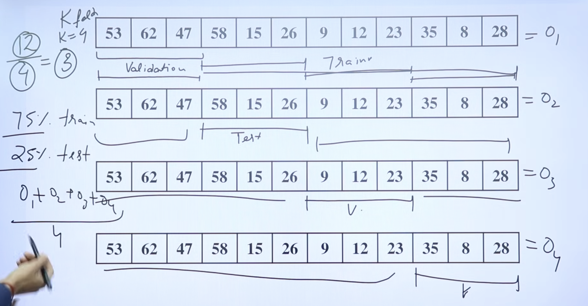
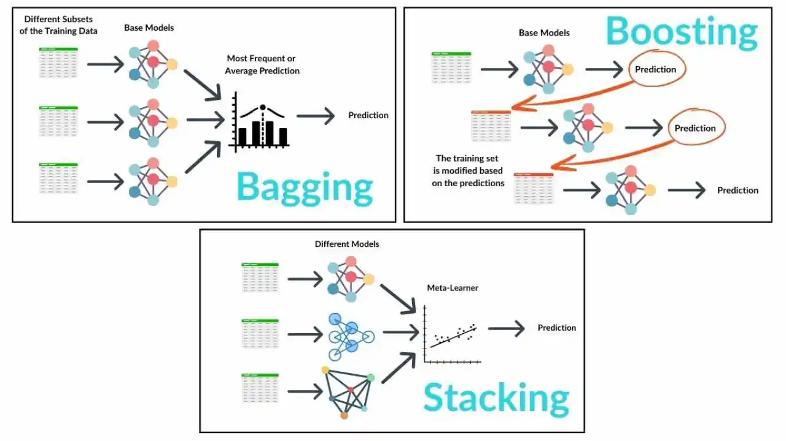

## Classification Rule Mining

- Goal: Discover rules of the form

IF (condition on attributes) THEN class = C

from data.

- Example rule:

IF (income = high AND age < 30) THEN class = “Buys Laptop”

- Steps

1. Preprocess data – handle missing values, discretize numeric attributes if needed.
2. Search for patterns – use algorithms (e.g., decision trees, association-rule–based methods) to generate candidate rules.
3. Evaluate rules using:

- Support – how often rule’s condition occurs in data.
- Confidence – how often rule’s conclusion is correct when the condition is true.

4. Prune rules – remove redundant/weak rules.

- Use: Rule-based classifiers (e.g., RIPPER, C4.5rules) for interpretable models.

## 2. Introduction to Classification and Prediction

1. Classification:

- Target (output) variable is categorical (e.g., “spam” / “not spam”).
- Learn a mapping: X → class label from labeled training data.
- Algorithms: decision trees, Naïve Bayes, SVM, k-NN, etc.

2. Prediction (Regression)

- Target variable is numeric (e.g., house price, temperature).
- Learn a function: X → continuous value.
- Algorithms: linear regression, polynomial regression, etc.
- Common workflow for both:
    - Data collection.
    - Data preprocessing.
    - Model building (training).
    - Model evaluation.
    - Deployment (using the model on new data).

## 3. Classification by Decision Induction (Decision Trees)

- Idea: Represent classification model as a tree of tests.
    - Internal nodes: tests on attributes

    (e.g., “age < 30?”)

- Branches: outcomes of the test
- Leaves: class labels (e.g., “Buys Computer = Yes”)
- Basic algorithm (like ID3 / C4.5 style)
- Start with all training examples at the root.
- If all examples in node have the same class → make it a leaf.
- Otherwise:
    - Select the best attribute (using Information Gain / Gini, etc.).
    - Split data by attribute values to create child nodes.
    - Recursively build the tree.
- Advantages
    - Easy to understand and interpret.
    - Can handle both categorical and numeric attributes.
    - Relatively fast.
- Disadvantages
    - Easily overfits if tree becomes too deep.
    - Small changes in data can change the tree.

## 4. Attribute Selection Measures

- Used to choose which attribute to split on at each node in the decision tree.

1. Entropy

- Measures impurity in a dataset.

> Entropy =  - ∑(i=0->k) pi.log2(pi)

- If all examples are of one class → entropy = 0 (pure).
- If classes are equally mixed → entropy is maximum.

2. Information Gain (IG)

- How much uncertainty (entropy) is reduced by splitting on attribute A.

> Information gain = Entropy(whole data) -  ∑(​∣Sv∣/∣S​∣​)Entropy(Sv​)

- Higher IG → better attribute for splitting.
- Used in ID3, C4.5 (with modifications).

3. Gini Index

- Used mainly in CART (Classification and Regression Trees).
- For dataset S with k classes:

> Gini = 1 - ∑(i=0->k) 𝑝𝑖^2.

- Pure node (all one class) → Gini = 0
- More mixed classes → Gini increases.

## 6. Bayesian Classification

- Bayesian Classification is a statistical approach to classification based on Bayes’ Theorem.
- Uses probability theory and Bayes’ theorem to classify data.
- Bayes’ Theorem :: 𝑃(𝐶∣𝑋)= (𝑃(𝑋∣𝐶) * 𝑃(𝐶)) / 𝑃(𝑋)
    - P(C∣X): posterior probability of class C given X
    - P(C): prior probability of class C
    - P(X∣C): likelihood of observing X given class C
    - P(X): probability of observing X (same for all classes when comparing).
- Classification rule:
    - Choose the class 𝐶 with highest posterior probability  P(C∣X).

## 7. Naïve Bayesian Classification

- A simplified Bayesian classifier with the assumption that features are conditionally independent given the class.

> P(C∣X)∝ P(C) * (i=1∏n) ​P(xi​∣C)

## 9. Classifier Accuracy Measures

- (Sensitivity, Specificity, Precision, Accuracy)
- All these are derived from the confusion matrix for binary classification:

|                     | Predicted Positive  | Predicted Negative  |
| ------------------- | ------------------- | ------------------- |
| **Actual Positive** | True Positive (TP)  | False Negative (FN) |
| **Actual Negative** | False Positive (FP) | True Negative (TN)  |

1. Accuracy

- Overall proportion of correctly classified cases.

> Accuracy = (TP+TN) / (FP+FN+TP+TN).

2. Sensitivity (Recall, True Positive Rate)

- How many actual positives were correctly predicted as positive.

> Sensitivity=Recall = TP / TP+FN

3. Specificity (True Negative Rate)

- How many actual negatives were correctly predicted as negative.

> Specificity= TN / TN+FP 

## Predictor Error Measures

- Instead of just “accuracy”, we can look at errors:

1. Error Rate

Error Rate =1−Accuracy= FP+FN / TP+TN+FP+FN

## Accuracy Evaluation Methods

- Goal: estimate how well a classifier will perform on unseen data.

1. Holdout Method

- Split data into two disjoint sets:
- Training set (e.g., 70%)
- Test set (e.g., 30%)
- Train model on training set.
- Evaluate on test set (compute accuracy, etc.).
- Pros: simple.
- Cons: result depends on how data is split; may waste data.

2. Random Subsampling (Repeated Holdout)

- Repeat the holdout process multiple times with different random splits.
- Average the performance over all runs.
- Pros: more reliable than single holdout.
- Cons: some examples may never be tested; some may be in test set many times.

3. Cross-Validation

- Most popular evaluation technique.
- k-Fold Cross-Validation:
    - Divide data into k equally sized folds (e.g., k = 10).
    - For each i from 1 to k:
    - Use fold i as test set.
    - Use remaining k-1 folds as training set.
    - Average accuracy over k runs.

    

- Pros:
    - Every example used for both training and testing.
    - More stable estimate of performance.
- Special case: Leave-One-Out (LOO) cross-validation – k = number of records; train on n−1, test on 1 each time.

## ⭐ 2. Types of Ensemble Methods

1. A. Bagging (Bootstrap Aggregating)

- Train multiple models on random samples WITH replacement.
- Each model sees a slightly different dataset.
- Combine predictions using majority vote.

Example: Random Forest.

2. B. Boosting

- Models are trained sequentially.
- Each new model focuses on correcting errors made by the previous one.
- Example: AdaBoost, Gradient Boosting.

3. C. Stacking

- Train multiple models.
- Input their outputs into a meta-learner (another model) that makes the final prediction.

