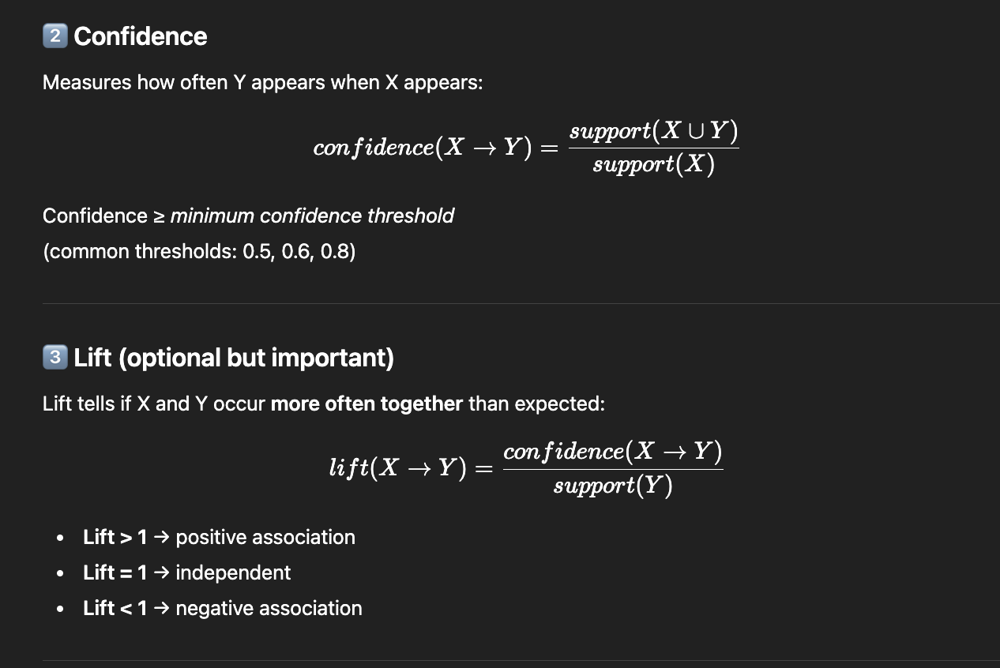

## 🌟 Apriori Algorithm

1. ⭐ Step 1: Generate Frequent 1-itemsets (L1)
- Count support for every individual item.
- Keep only those whose support ≥ minimum support threshold.

2. ⭐ Step 2: Generate Candidate Itemsets (Ck)
- Use L(k−1) to create new combinations.
- If L2 has:
{milk, bread}
{milk, butter}
Combine them → candidate: {milk, bread, butter}

3. ⭐ Step 3: Prune Itemsets Using the Apriori Property
- Remove any itemset whose any subset is not frequent
( Because if a subset isn't frequent, the superset cannot be frequent )

4. ⭐ Step 5: Repeat

## 📘 Association Rule

1. Step 1: Generate subsets

2. Step 2: Create rules

3. Keep the rules only if confidence ≥ threshold.

