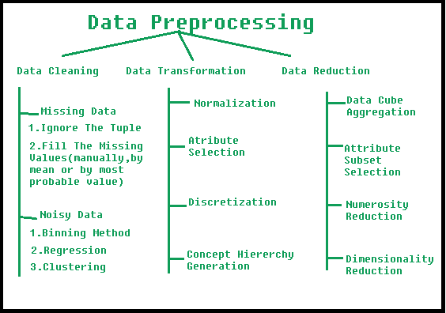
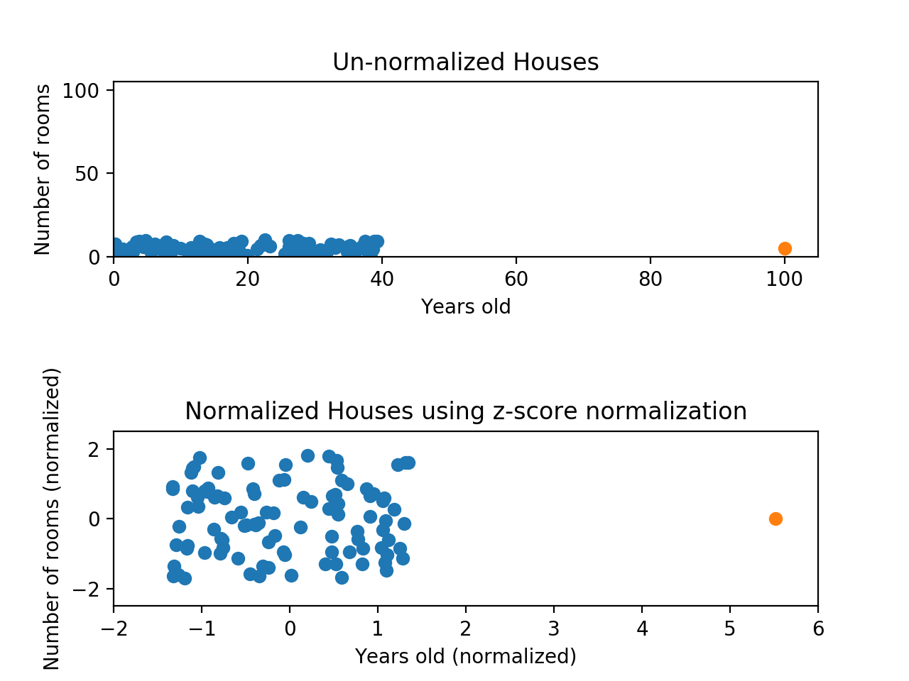
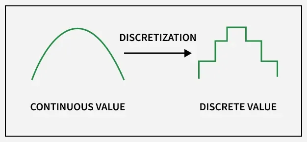

## What do you understand by central tendency of data? How is it measured?
- Central tendency refers to a statistical concept that identifies the central value or typical value around which the entire dataset tends to cluster.
    - It gives a single representative value that summarizes the whole dataset.
    - Measures of Central Tendency
### Central tendency is mainly measured using:
1. Mean (Arithmetic Average)
- Calculated by dividing the sum of all observations by the number of observations.

2. Median
- The middle value when the data is arranged in ascending or descending order.
    - If 𝑛 is odd → middle value.
    - If 𝑛 is even → average of the two middle values.

3. Mode
- The value that occurs most frequently in the dataset.
- Useful for categorical data.

- These measures help in understanding the overall distribution and provide a basis for comparison between different datasets.

## ii) Give a brief explanation for data reduction strategies. (DNDD)

- Data reduction refers to the process of minimizing the volume of data while preserving its meaningful information and integrity.
- It improves storage efficiency, reduces computation time, and enhances data processing performance.
- Its a Preprocess Techinique.

- Major Data Reduction Strategies
1. Dimensionality Reduction
- Reduces the number of attributes or features.
- Techniques: Principal Component Analysis (PCA), feature selection, attribute subset selection.

2. Numerosity Reduction ( CHDRS )
- Reduces the data volume by replacing the data with smaller forms that still retain essential information.
- Methods include:
    - Data aggregation (averages, sums)
    - Sampling
    - Histograms
    - Clustering
    - Regression models

3. Data Compression
- Encodes data in a more compact form.
- Can be **lossless** (no information lost) or **lossy** (some information lost but acceptable for analysis).

4. Data Cube Aggregation: 
- This technique is used to aggregate data in a simpler form. 
- For example, imagine the information you gathered for your analysis for the years 2012 to 2014, that data includes the revenue of your company every three months. They involve you in the annual sales, rather than the quarterly average,  So we can summarize the data in such a way that the resulting data summarizes the total sales per year instead of per quarter. It summarizes the data. 

- These strategies help make data analysis faster, more efficient, and more scalable.

### Discuss one :
- ✔️ How PCA Works

1. Standardize the data
Ensures all features contribute equally.

2. Compute the covariance matrix
Measures relationships between features.

3. Find eigenvalues and eigenvectors
Eigenvectors → principal components
Eigenvalues → amount of variance captured

4. Select top k principal components
These new features capture the maximum variance.

5. Transform original data
Original high-dimensional data → lower-dimensional form.


## Data mining is a confluence of multiple discipline. Justify this statement b y describing the technical aspects o f the statement.

```yaml

                           +-----------------------+
                           |   Artificial          |
                           |   Intelligence (AI)   |
                           |  - Pattern recognition|
                           |  - Expert systems     |
                           +-----------+-----------+
                                       |
                                       |
        +------------------------------+------------------------------+
        |                                                             |
        v                                                             v
+---------------+                                         +---------------------+
|  Statistics   |                                         |   Machine Learning  |
| - Probability |                                         | - Classification    |
| - Sampling    |                                         | - Clustering        |
| - Regression  |                                         | - Neural networks   |
+-------+-------+                                         +----------+----------+
        |                                                             |
        +------------------------------+------------------------------+
                                       |
                                       v
                         +-----------------------------+
                         |       DATA MINING           |
                         | - Pattern discovery         |
                         | - Prediction                |
                         | - Knowledge extraction      |
                         +--------------+--------------+
                                        |
        +-------------------------------+------------------------------+
        |                                                               |
        v                                                               v
+---------------------+                                     +----------------------+
|   Database Systems  |                                     |  Information Theory  |
| - Data warehouses   |                                     | - Entropy            |
| - OLAP, indexing    |                                     | - Info gain          |
+----------+----------+                                     +----------+-----------+
           |                                                            |
           +-------------------------------+----------------------------+
                                           |
                                           v
                              +----------------------------+
                              |   Visualization & HCI      |
                              | - Patterns presentation    |
                              | - Dashboards, plots        |
                              +----------------------------+

```

## 1. Curse of Dimensionality
- The curse of dimensionality refers to the problems that arise when the number of features (dimensions) in data becomes very large.
- As dimensionality increases:
    - Data becomes sparse
    - Distance measures become less meaningful
    - Computation cost increases
    - Models require more data to generalize
- Conclusion: High-dimensional data becomes difficult to analyze and leads to poor model performance.

## (ii) Underfitting
- Underfitting occurs when a model is too simple to capture the underlying patterns in the data.
- It has:
    - High bias
    - Low variance
    - Poor performance on both training and test data
- Example:
- Fitting a straight line to data that is clearly curved → the model cannot learn the pattern.

## (iii) Overfitting
- Overfitting happens when a model learns too much detail or noise from the training data, making it perform poorly on unseen data.
- It has:
    - Low training error
    - High test error
    - High variance
- Example:
- Decision tree that grows too deep and memorizes the training data instead of learning general patterns.

## Closed Itemset
- A closed itemset is a frequent itemset such that none of its supersets have the same support.
- In other words:
    - Itemset X is closed if no superset of X occurs in exactly the same number of transactions.
- Benefit:
    - Closed itemsets reduce redundancy while preserving all frequency information.

## Confidence (in Association Rule Mining)
- Confidence measures how often items in the consequent appear in transactions that contain the antecedent.
For a rule X→Y:  
> Confidence=  Support(X∪Y)​ / Support(X)
- It represents the conditional probability that Y occurs given X.

## Specificity (in Classification/Evaluation)
- Specificity measures how well a classifier identifies negative cases correctly.
- Specificity = True Negatives / ( True Negatives + False Positives )
- “Out of all actual negatives, how many were correctly predicted as negative?”
- Use case:
- Medical testing — high specificity means fewer false alarms.

| Term                    | One-line Definition                                                                             |
| ----------------------- | ----------------------------------------------------------------------------------------------- |
| Curse of dimensionality | Difficulty of analyzing high-dimensional data due to sparsity and loss of meaning in distances. |
| Underfitting            | Model too simple → poor accuracy on training and test data.                                     |
| Overfitting             | Model too complex → memorizes training data, poor generalization.                               |
| Closed itemset          | Frequent itemset with no superset having same support.                                          |
| Confidence              | Conditional probability of Y occurring when X occurs.                                           |
| Specificity             | Ability of classifier to correctly identify negative cases.                                     |

## Jaccard similarity 
- measures how similar two sets are by comparing the intersection to the union.
> J(A,B) = ∣A∩B∣ / ∣A∪B∣ 
- 0≤J(A,B)≤1

## ⭐ 2. Supremum Distance (Chebyshev Distance, L ∞)
- Supremum distance measures the maximum absolute difference among the corresponding features of two points.
> d∞​(x,y)=max(i)​ ∣xi​−yi​∣

## Given the following 2 objects represented b y the tuples (15,3,10,25,4) and (8,10,4,17,8) Find the Euclidean distance, Jaccard similarity and Supremum distance.
---
| Measure                | Value                         |
| ---------------------- | ----------------------------- |
| **Euclidean Distance** | (\sqrt{214} \approx 14.628)   |
| **Jaccard Similarity** | ( \frac{2}{7} \approx 0.2857) |
| **Supremum Distance**  | (8)                           |


## ⭐ Data Transformation Strategies in Data Preprocessing ( NASA DC )
- Data transformation converts raw data into a suitable format for data mining. It improves data quality and helps algorithms work effectively.
- Common data transformation strategies include:

1. Normalization / Standardization :

   1. Min–Max Normalization :
     - v = v−min / max−min
    Converts values to range [0,1].
   2. Z-score Standardization :
    > v′= v−μ​ / σ

2. Attribute / Feature Construction :
- Creating new attributes from existing ones to improve model quality.
> Example: BMI = weight / height².

3. Aggregation:
Combines two or more attributes or objects into a single feature.

4. Smoothing

5. Discretization :
- Converts continuous numeric data into categorical/binned intervals.


6. Concept Hierarchy Generation

7. Encoding (One-Hot, Label Encoding)
8. Data Integration & Transformation (merging attributes)