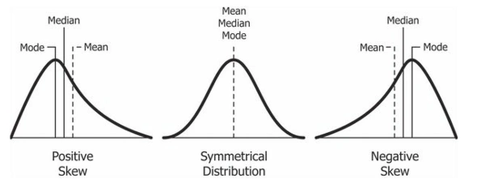
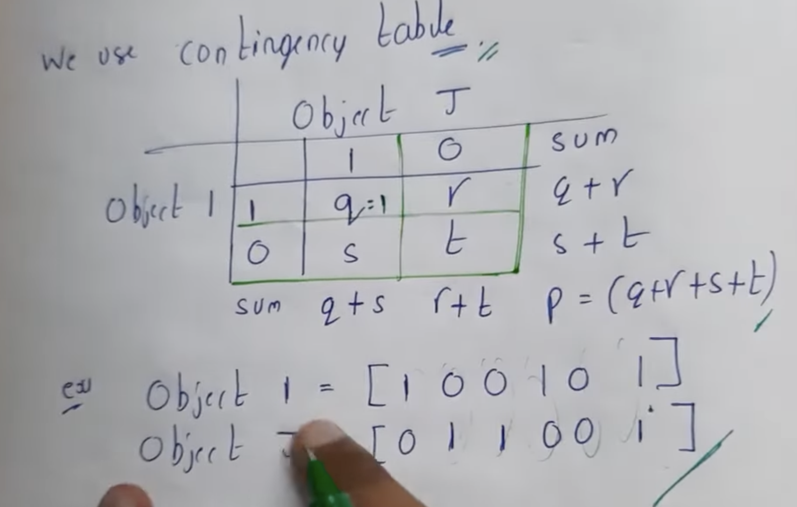
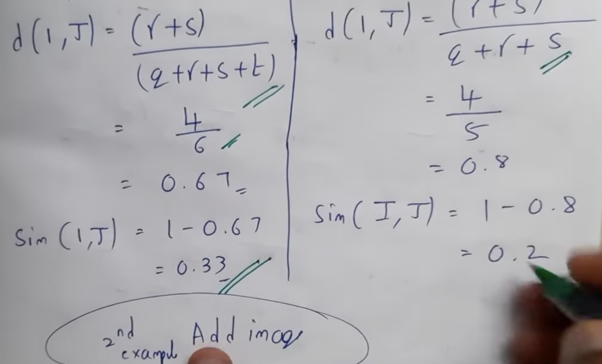
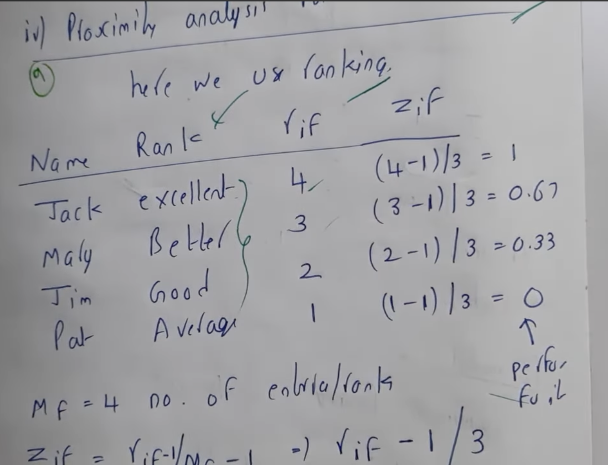
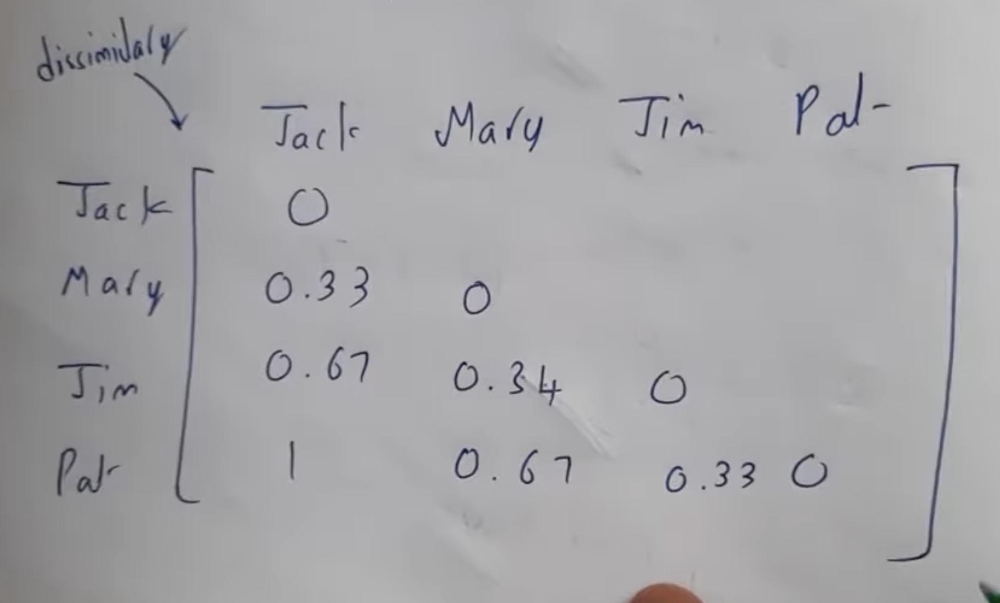

## 🔹 1. KDD, Process and Data Mining
- KDD (Knowledge Discovery in Databases) → the overall process of finding useful knowledge from data.

- Data Mining → one key step in KDD, focused on applying algorithms to discover patterns.
- extraction of useful , non-trivial , implicit , preiously unknown patterns and knowldege fron huge amount of data.

### 🔹 2. KDD Steps
- Steps in the KDD process: (CS IT MPK)
1. Data cleaning (removing noise/inconsistencies)
2. Data integration (combining multiple sources)
3. Data selection (choosing relevant data)
4. Data transformation (preprocessing/normalization)
5. Data mining (core algorithms)
6. Pattern evaluation (identify useful patterns)
8. Knowledge presentation (visualization, reporting)

### 🔹 3. Types of Data for Data Mining
1. Relational data (tables, SQL databases)
2. Transactional data (sales, logs)
3. Time-series data
4. Spatial/geographical data
5. Multimedia data (images, video, audio)
6. Web data (clickstreams, logs)

### 🔑 5. Data Mining Functionalities

1. Data Characterization – summarizing general features of data.
2. Data Discrimination – comparing data to highlight differences.
3. Mining Frequent Patterns – finding commonly occurring items or patterns.
4. Association – discovering relationships, like “if A is bought, B is also bought.”
4. Correlation – identifying statistical relationships between attributes.
4. Classification – assigning data to predefined classes (e.g. spam vs. non-spam).
4. Prediction – forecasting future trends based on past data.
4. Cluster Analysis – grouping similar data points together.
    - Classification type but in this the labels are unknown 
4. Outlier Analysis – finding abnormal or rare patterns.
    - eg noise , expceptions , frauds etc .
4. Evolution Analysis – tracking how patterns change over time.

### 🔑 7. Data Mining Task Primitives
- Defines what users want to mine:
- Kind of data to analyze.
- Background knowledge.
- Interestingness measures.
- Constraints on patterns (e.g. minimum support).

### 8. Major Issues in Data Mining
- Scalability – handling large datasets.
- Data quality – missing or noisy data.
- Privacy and security – protecting sensitive information.
- Integration – merging data from various sources.
- Pattern evaluation – ensuring discovered patterns are meaningful and useful.

## Skewness 
- is a measure of the asymmetry of a distribution around its mean.

1. 1️⃣ Positive Skew (Right-Skewed)
- Tail is longer on the right side
- Mean > Median > Mode
- Examples:
    - Income distribution
    - Housing prices

2. 2️⃣ Negative Skew (Left-Skewed)
- Tail is longer on the left side
- Mean < Median < Mode
- Examples:
- Exam scores when most students score high
- Lifespan data (rarely many very young deaths)

3. 3️⃣ Zero Skew (Symmetric Distribution)
- Mean = Median = Mode
- Perfectly symmetric
- Example:
- Normal distribution (bell curve)

## A nominal attribute 
- is a categorical attribute where the values are names or labels with no order or ranking.
### Proximity measure for nominal Attributes : 
- 
    - dissimilarity = (p-m) / p .
    - simmilarity = 1 - dissimilarity
- p = 1 for like gender etc and 2 like color = red,green.

## A binary attribute 
- is a special type of nominal attribute with only two possible values.
### Proximity measure for binary Attributes : 
- 

## Ordinal Atribute :
- 
- dissimilatity = minus of Zif.
- 

