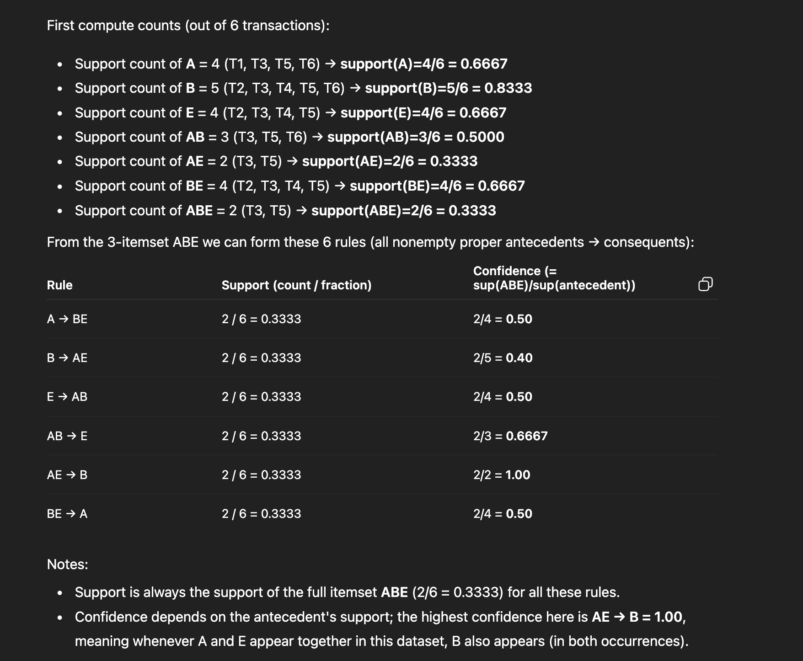

## Given the foliowing database, show all rules that one can generate from the set
--- 
- Confidence = sup(ABE)/ sup(antecedent)

## Maximal frequent itemsets are sufficient to determine all frequent itemsets with their supports. ??
- Answer: FALSE
Reason:
- Maximal frequent itemsets do not store support counts of their subsets.
- We can infer which subsets are frequent (because all subsets of a frequent itemset are frequent), but we cannot know their support values.
- Example:
- Suppose transactions produce these frequent itemsets:
- Frequent itemsets: {A}, {B}, {C}, {A,B}, {A,C}, {A,B,C}
- Maximal frequent itemset: {A,B,C} only.
- We cannot determine:
    - support({A})
    - support({A,B})
    - support({B,C})
- Only storing {A,B,C} does NOT give information about supports of its subsets.
- Hence maximal frequent itemsets are NOT sufficient to determine all supports.

## ✅ b) The set of all maximal frequent sets is the set of longest possible frequent sets.
- Answer: TRUE
Reason:
- A maximal frequent itemset is defined as a frequent itemset that has no frequent superset.
- That means:
- It is the longest possible frequent itemset in its branch of the lattice.
- You cannot add any more items to it while keeping it frequent.
- Example:
- Frequent itemsets:
{A}, {B}, {A,B}, {A,B,C}
- Maximal frequent itemset is: {A,B,C}
- Because no larger set containing A, B, C is frequent.
- Thus maximal frequent itemsets are exactly the longest frequent itemsets.

## constructing the dissimilarity matrix for mixed data types using numeric, nominal, and ordinal attributes.
---
| Obj | Age (Numeric) | Color (Nominal) | Satisfaction Index (Ordinal) |
| --- | ------------- | --------------- | ---------------------------- |
| 1   | 25            | Red             | 3                            |
| 2   | 42            | Blue            | 4                            |
| 3   | 38            | Red             | 2                            |
| 4   | 60            | Green           | 5                            |

1. Numeric Age : Formula for numeric dissimilarity between objects i and j:
> dnum​(i,j)= ∣xi​−xj​∣​ / range
- Range = 60−25=35

2. Nominal : 
> P-M/P.

> dnom​(i,j)= 0 if same color
             1​ if diff color

3. Ordinal :
> zi ​= ri​−1​ /  M−1.
- M=5 (highest rank),
> dord​(i,j)=∣zi​−zj​∣

### ⭐ Final Dissimilarity Matrix (Gower)
|       | 1     | 2     | 3     | 4     |
| ----- | ----- | ----- | ----- | ----- |
| **1** | 0     | 0.578 | 0.207 | 0.833 |
| **2** | 0.578 | 0     | 0.538 | 0.588 |
| **3** | 0.207 | 0.538 | 0     | 0.793 |
| **4** | 0.833 | 0.588 | 0.793 | 0     |

