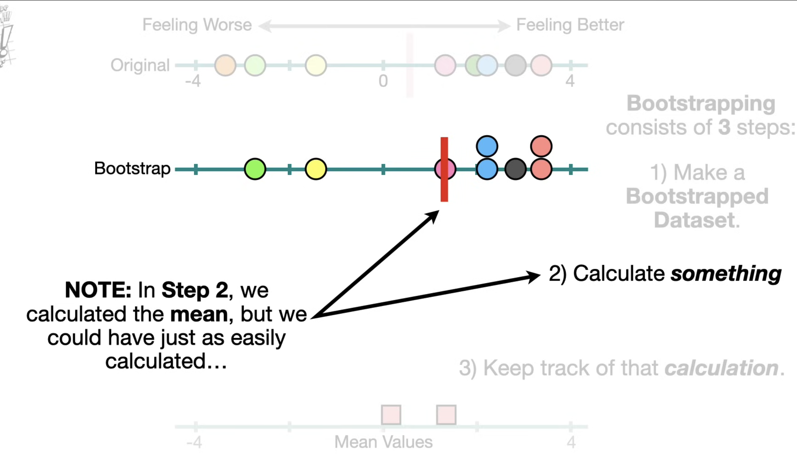

## 1. Methods for Model Evaluation and Selection
- Model evaluation determines how well a model performs on unseen data. Common methods include:

1. A) Holdout Method
- Dataset split into:
    Training set (e.g., 70%) → model learns
    Test set (e.g., 30%) → model evaluated
- Pros: Simple, fast
- Cons: Performance varies depending on the split; may not use data efficiently

2. B) k-Fold Cross-Validation
- Data is split into k equal parts (folds).
- For each fold:
    - Train on (k−1) folds
    - Test on the remaining fold
- Average performance over all folds = final estimate.
- Pros:
    - More reliable and stable than holdout
    - Uses full dataset efficiently
- Cons:
    - More computationally expensive.

## C) Leave-One-Out Cross-Validation (LOOCV)
- Special case of k-fold where k = n (each sample is its own test set).
    - Pros: Uses almost all data for training
    - Cons: Very slow for large datasets; high variance

## D) Bootstrapping
- Sampling with replacement to create multiple bootstrap datasets.
- For each bootstrap sample:
    - Train on the bootstrap sample
    - Evaluate on the remaining unused samples (called out-of-bag data)
- Bootstrapping helps when dataset is small.
> Simple bootstrap tends to overestimate performance, because the model is trained repeatedly on a dataset where some points appear multiple times.
- Therefore, the .632 bootstrap was introduced.

## The .632 Bootstrap Method
- The .632 bootstrap estimator is defined as:
    - Error.632​=0.368⋅Errorresubstitution​+0.632⋅Errorbootstrap​
- Where:
    - Resubstitution error = training error (optimistic; usually too low)
    - Bootstrap error = average error on out-of-bag samples
- The .632 estimator combines these two using specific weights: 0.368 and 0.632.

### Where does the 0.632 come from?
- Consider a dataset with n samples.
- When we draw n samples with replacement, what is the probability that a given sample is not selected?
    - P(not selected)=1−1/n
- After n draws:
    - P(never selected)=(1−1/n​)^n
- As n→∞:
- (1−1/n)^n≈e^−1=0.368.
- Thus:
- 36.8% of samples are not selected → Out-of-Bag data
- 63.2% of samples are selected at least once

Meaning:
- 63.2% of the training set is effectively available in each bootstrap sample
- 36.8% is used for testing (out-of-bag)

- So .632 bootstrap weights the more reliable out-of-bag error by 0.632.

