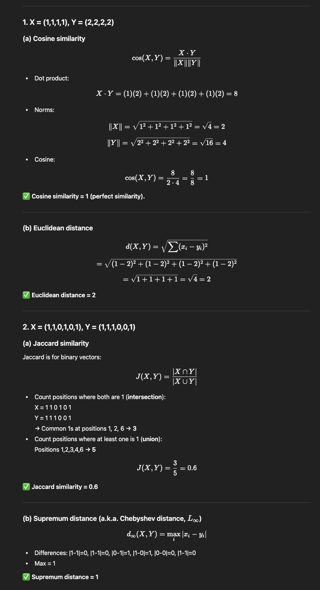

## We generally will be more interested in association rules with high confidence. However, often we will not be interested in association rules that have a confidence of 100%. Why? What is your observation regarding association rules with 99% or 98% confidence?

1. Why rules with 100% confidence are often not interesting

- Trivial rules:
If a rule has 100% confidence, it usually means whenever the antecedent occurs, the consequent always occurs. Many times, this is due to a logical implication or redundancy in the data rather than a meaningful insight.

Example: In a supermarket dataset, {milk, bread} → {milk} will always have 100% confidence, but it tells us nothing useful (it’s tautological).

- Overfitting / lack of generality:
A 100% confidence rule may be the result of very few occurrences (low support). For instance, if only 2 transactions contain {caviar}, and both also contain {champagne}, the rule {caviar} → {champagne} has 100% confidence but is not useful for general decision-making.

- Deterministic relationships:
Sometimes the 100% confidence rules simply reflect structural constraints in the data (e.g., "if someone buys a PC, they also buy an operating system" because the system forces it). These are not new discoveries.

2. Rules with 99% or 98% confidence

These rules are often more interesting than 100% confidence rules.
Why? Because they suggest a strong tendency, not a trivial certainty. They show that almost all cases with the antecedent also have the consequent, which may reveal patterns in customer behavior or correlations in attributes.

Example:
- {diapers} → {beer} with 98% confidence is interesting because it shows a behavioral trend, not just a structural fact.

However, even here we need to consider:

- Support: A 99% confidence rule with very low support may still be misleading.
- Lift or other interestingness measures: Confidence alone can be deceptive if the consequent is very frequent in the dataset.

## i. Association analysis will yield the same frequent itemsets and strong association rules whether a specific item occurs once or more number of times in an individual transaction. (True/false with reasons)

- Reason: Standard association mining treats each transaction as a set of items (presence/absence). If an item appears once or multiple times in the same transaction, it makes no difference — that transaction either contains the item or it doesn’t. So frequent itemsets and the derived rules are identical whether the dataset records multiplicity or just presence.

- Caveat / exception: If you use a variant of association analysis that incorporates quantities (e.g., weighted/quantitative association rules, utility mining, or algorithms that use item frequency inside transaction), then multiplicity does matter and the result can change.

## ii. Show a dataset with at least 5 transactions containing at least 5 items in which the number of closed itemsets is equal to the number of max itemsets. (e.g., 1. ABCD, 2. CDE ………)

##

## 