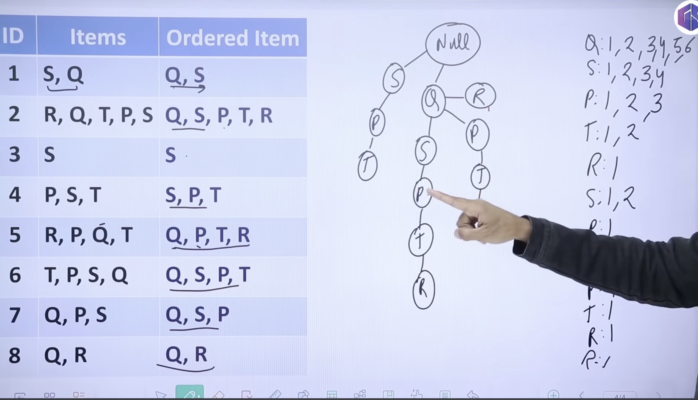

- FP growth tree
  

## Bootstrapping 
is a sampling technique used to create multiple datasets from the original data by random sampling with replacement.

## Bagging 
is an ensemble method that builds multiple models (usually the same type, like Decision Trees) on different bootstrap samples, then aggregates (averages or votes) their predictions.

## Boosting 
is an ensemble technique that builds models sequentially, each new model focusing on the errors (residuals) made by the previous ones.

