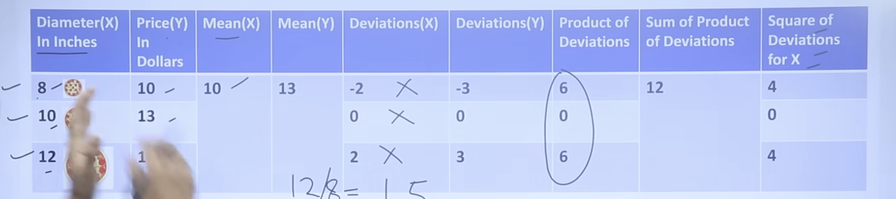
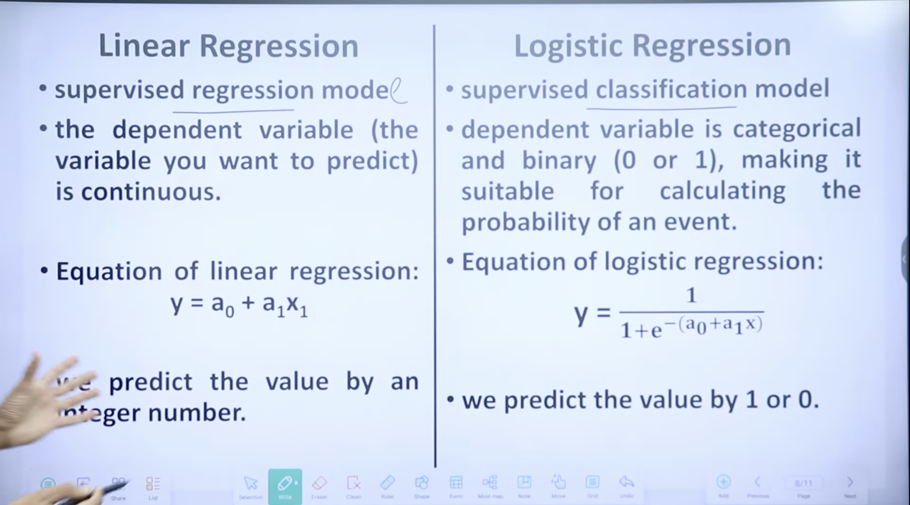
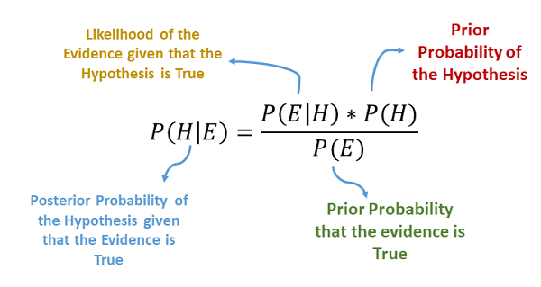
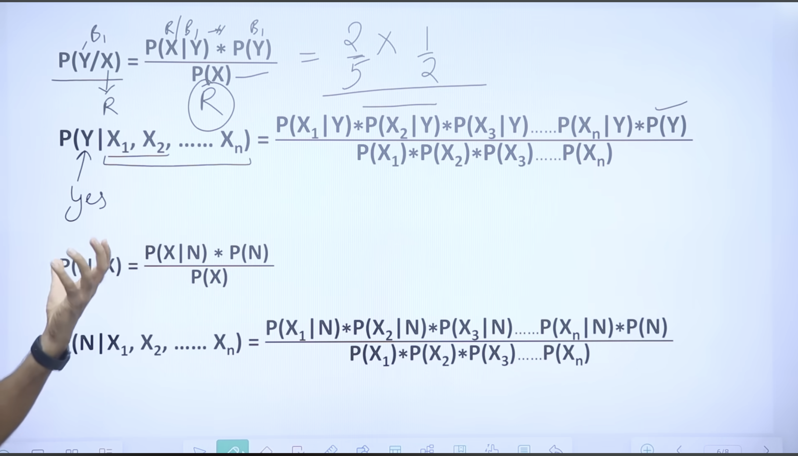

## Linear Regression
- Linear Regression is a supervised machine learning algorithm used to model the relationship between a dependent variable (target) and one or more independent variables (features) by fitting a straight line.
- 📘 Equation of Simple Linear Regression
> y = mx+c+ε 
Where:
- y = dependent variable (target)
-  x = independent variable (input)
- c = intercept (value of y when x = 0)
-  ε = error term

- 

- m = sum of product of deviations of X / sum of square of deviations for X.
- b = Mean of Y - (m * Mean of X)

## Logistic Regression 
- sigmoid fn 
- discrete values .

## K-NN
- uses Euclideans distance .
> root((y2-y1)^2 + (x2-x1)^2)
- of jo predict karna with everyone .

## Naive Bayers classification :
- conditional prob

## Decision Tree :
A Decision Tree is a supervised learning algorithm that splits data into branches based on feature values until it reaches a decision (leaf node).

| Type                    | Target Variable                                       |
| ----------------------- | ----------------------------------------------------- |
| **Classification Tree** | Categorical (e.g. “Yes” / “No”)                       |
| **Regression Tree**     | Continuous (e.g. predicting price, temperature, etc.) |

1. Entropy : 
- Measures impurity (disorder) in a dataset.
- Entropy = 0 → pure node (only one class)
- Entropy = 1 → impure (equal distribution)
> Entropy(S)=−p1​log2​(p1/p1+p2​)−p2​log2​(p2/p1+p2​)− ⋯ −pn​log2​(pn​)

> Information gain = Entropy(whole data) -  ∑(​∣Sv∣/∣S​∣​)Entropy(Sv​)

- highest information gain => root ;

- Example : H(Passed in ML ∣ Studied)
> Information gain = Entropy(whole data) -  ∑ (weight*Entropy) 
while Entropy= -(p1/p1+p2 )​log2​(p1/p1+p2​)− (p2/p1+p2)​log2​(p2/p1+p2​)

