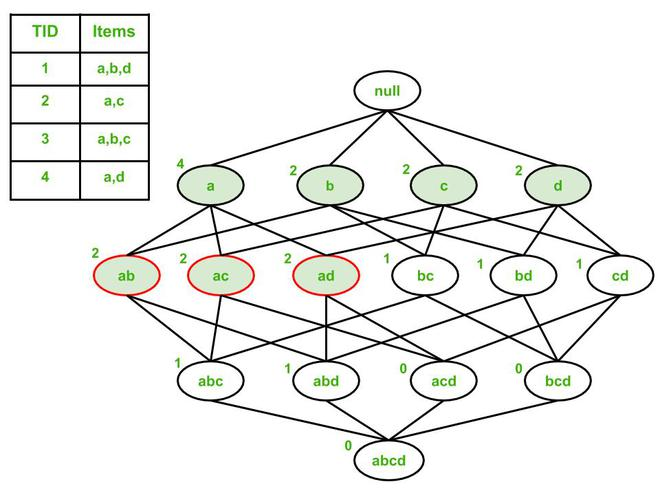
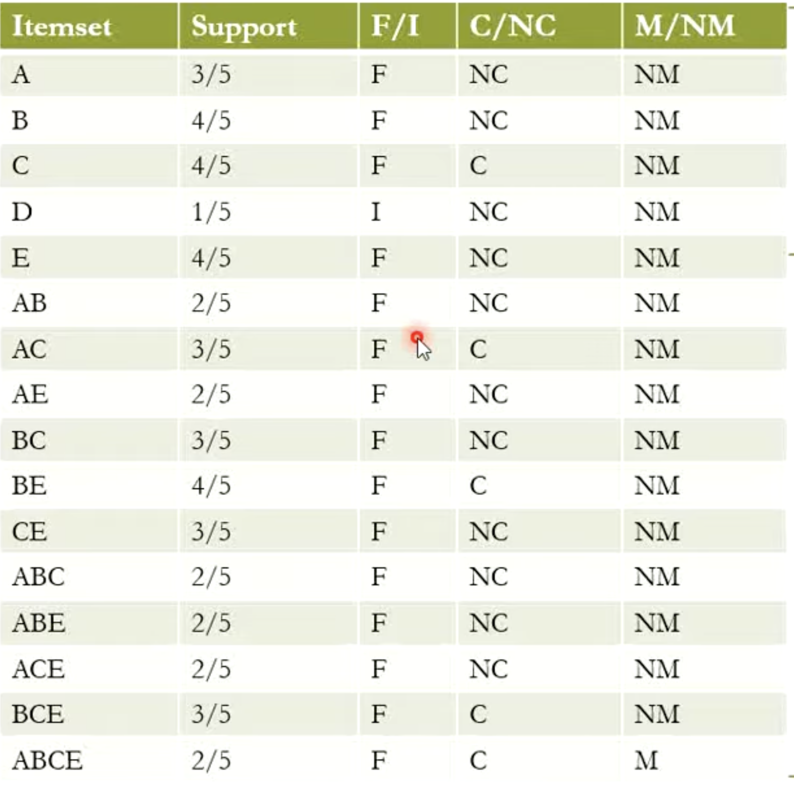

## ✅ Supervised Learning
A machine learning approach where the model learns from labeled data (i.e., input–output pairs are provided).

## UnSupervised Learning
- A machine learning approach where the model learns from unlabeled data (no given outputs; the model finds patterns on its own).

## candidate rules : 
In association rule mining, candidate rules are the possible rules generated from frequent itemsets before checking whether they satisfy the minimum confidence.

## ⭐ Maximal Frequent Itemsets (MFI) 
A maximal frequent itemset is a frequent itemset that has no frequent superset.
- If an itemset X is frequent, but X ∪ {item} is not frequent for any item, then X is a maximal frequent itemset.

## Frequent vs Closed vs Maximal Itemsets

1. A frequent itemset is closed if none of its supersets have the same support.
2. A frequent itemset is maximal if none of its supersets are frequent.

