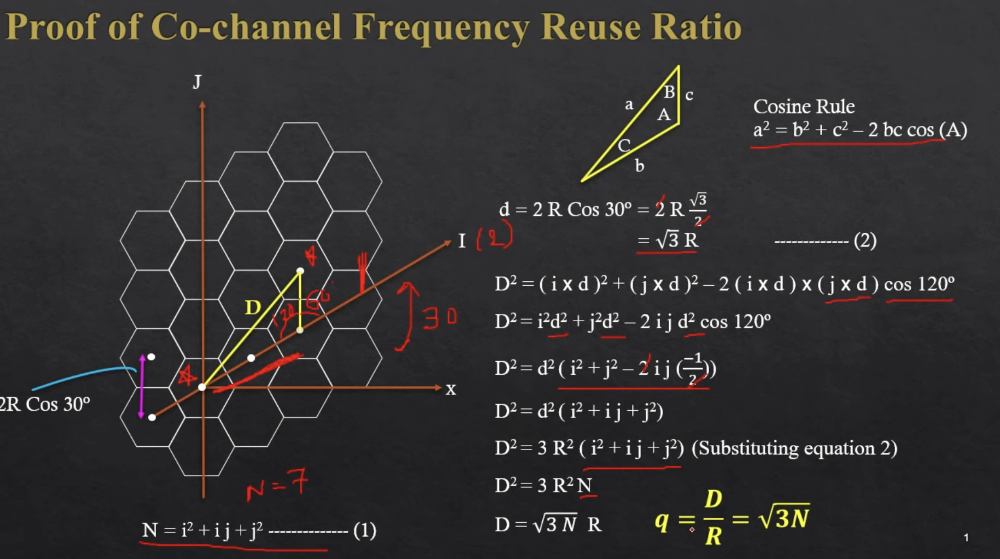
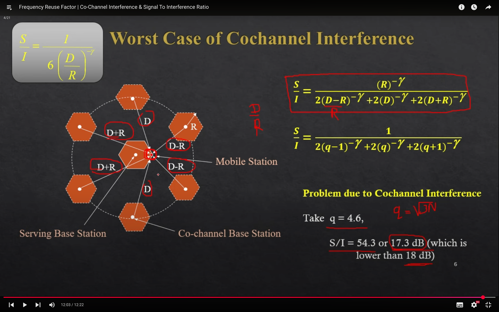
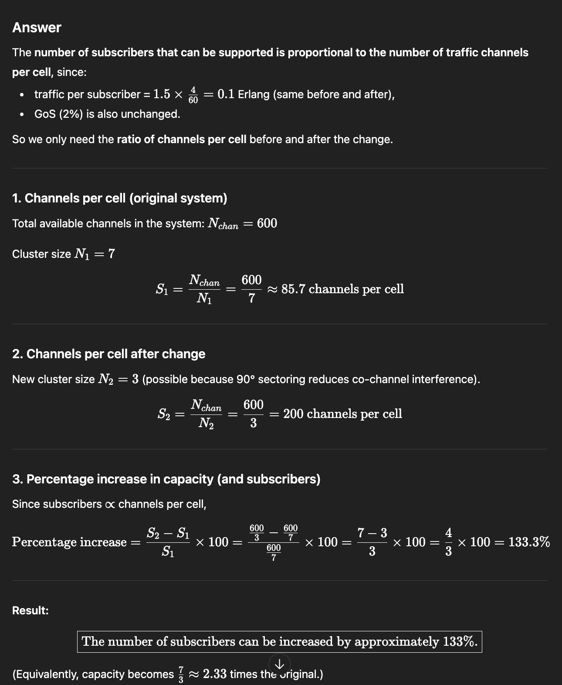

## Frequency Reuse Ratio Derivation

- Frequency Reuse factor :
==> q = D/R = root(3).N 

## Co-Channel Interference & Signal To Interference Ratio
- Co-Channel Interference occurs when two or more cells use the same frequency channel and their signals interfere with each other.
- Since spectrum is limited, frequencies must be reused → this reuse causes CCI.

- Now ,
    - S/I ratio  = S/ summation(0->6)(I)
=> I = (D/R)^-y
where y = path loss exponent..
1. For same distnace : 
> S/I = S/6*(root(3.N))^-y.
> q = [6/(S/I)]^1/y.

2. Worst case :
- distances : 2 ( D+R , D , D-R ).
- root(21) = 4.6 .
- S/I = 17.3DB < 18 DB .
=> S/I reduction needed.

---

## A mobile communication system allocates 200 MHz of bandwidth, utilizing 50 kHz channels. If 15% of the bandwidth is used for control channels, how many channels are available for voice communication? Furthermore, compute the number of voice channels available per cell if a system uses (a) 4-cell reuse, (b) 7-cell reuse, and (c) 12-cell reuse. What inference do you draw about the relation between capacity and cluster size?
---
1. Total number of RF channels = Bandwidth / Channel bandwidth = 200 MHz / 50 kHz = 4000 channels.

2. Channels available for voice
- 15% used for control → 85% for voice
𝐶 (voice) = 0.85×4000 = 3400 voice channels

3. Voice channels per cell for different reuse patterns
- Number of channels per cell = S = 𝐶 (voice) / N where  N = cluster size.
    1. (a) 4-cell reuse (N = 4)
    voice channels per cell = 3400/4 = 850 voice channels per cell

    2. N = 7
    => 485 
    3. N = 12
    =>  ≈283.3≈283 voice channels per cell

4. Inference about capacity and cluster size
- As cluster size  N increases, the number of channels per cell decreases.
- Therefore, system capacity per cell is inversely proportional to cluster size.
    - Smaller N → higher capacity but more co-channel interference;
    - Larger N → lower capacity but less interference.
-
---

## A cellular system with an allocation of 𝑁=600 channels requires a 12 dB carrier-to-interference ratio. It operates with a 7-cell cluster layout and uses omni-directional antennas. Each subscriber makes an average of 1.5 calls per hour for an average duration of 4 minutes during peak hours. The system has a GoS of 2%. If the cluster size is changed to 3 with 90-degree sectoring, by what percentage can the number of subscribers be increased?

- Answer
- The number of subscribers that can be supported is proportional to the number of traffic channels per cell, since:
- traffic per subscriber = 
    - 1.5×4/60=0.1 Erlang (same before and after),
- GoS (2%) is also unchanged.
- So we only need the ratio of channels per cell before and after the change.

1. . Channels per cell (original system) 400 / 7 ≈85.7 channels per cell

2. Channels per cell after change
New cluster size 𝑁 =3 (possible because 90° sectoring reduces co-channel interference).
=200 channels per cell

## 