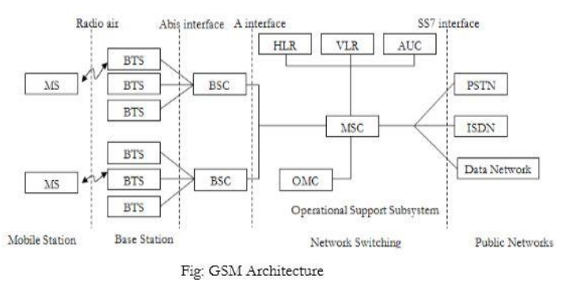
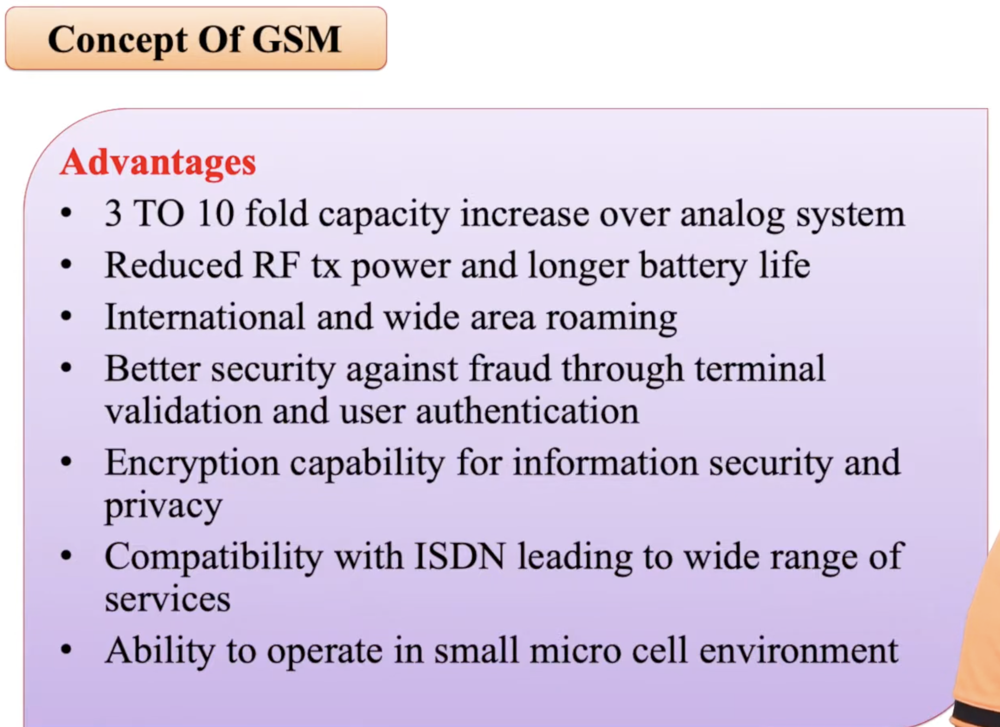
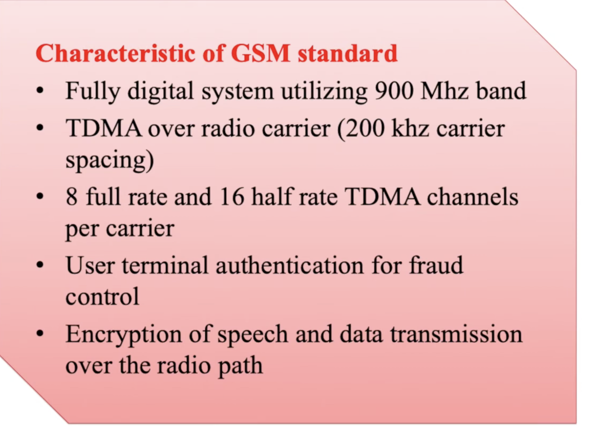
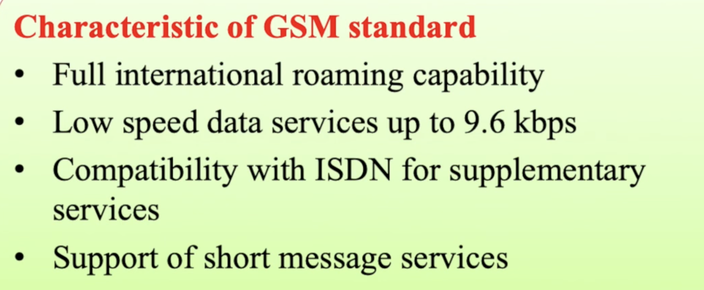

## 1. GSM Architecture

- Based on TDMA Digital cellular network replacing esisting analog system .
- Antenna height should be small => cell size is small => more clusters => system capacity increses. 

### The Global System for Mobile Communications (GSM) consists of three major subsystems:
1. Mobile Station (MS)
- It is the mobile phone + SIM card.
- SIM (Subscriber Identity Module) stores:
    - IMSI
    - Authentication key
    - Temporary identities
    - Phonebook/SMS
- MS identifies itself to the network using IMSI (International Mobile Subscriber Identity) or TMSI((Temporary Mobile Subscriber Identity)).

2. Base Station Subsystem (BSS)
- Responsible for radio communication.
    1. BTS (Base Transceiver Station)
    - Contains antennas, transceivers.
    Handles air-interface communication with mobile phones.

    2. BSC (Base Station Controller)
    - Controls multiple BTS.
    - Responsible for:
        - Frequency allocation
        - Handover
        - Power control
        - Traffic management

3. Network Switching Subsystem (NSS)
- Controls call switching and subscriber information.
    1. MSC (Mobile Switching Centre)
    - Main switching component.
    - Routes calls, SMS, and manages mobility.
    2. HLR (Home Location Register)
    - Stores permanent subscriber information.
    3. VLR (Visitor Location Register)
    - Stores temporary information of subscribers currently in the region.
    4. AuC (Authentication Center)
    - Stores security keys (Ki).
    - Performs authentication and ciphering.
    5. EIR (Equipment Identity Register)
    - Stores IMEI lists (valid/invalid/stolen devices).

## 2. Channels Used in GSM
- Two types of channels:
1. Physical Channels
- Based on TDMA time slots (8 users per carrier).
2. Logical Channels
- Divided into:
    1. Traffic Channels (TCH)
    - Carry voice/data.
    - Full-rate TCH (TCH/F) – 13 kbps speech
    - Half-rate TCH (TCH/H) – 6.5 kbps speech
    2. Control Channels
    - Used for network management.
        1. Broadcast Channels (BCH)
        FCCH – Frequency Correction
        SCH – Synchronization
        BCCH – Cell information broadcast
        2. Common Control Channels (CCCH)
        PCH – Paging
        RACH – Random access (used by MS to request a channel)
        AGCH – Access Grant
    3. Dedicated Control Channels (DCCH)
    SDCCH – Used for call setup & authentication
    SACCH – Supervisory channel
    FACCH – Fast control for handover
