## 1. Introduction to Internet of Things (IoT)
- The Internet of Things refers to a network of physical objects (“things”) embedded with sensors, software, and connectivity that enable them to collect, exchange, and act on data.
- Devices communicate with each other without human intervention, creating smart environments.

### IOT :
- “A dynamic, global network infrastructure where physical and virtual objects have unique identities, can communicate using standard protocols, and have the ability to sense, process, and exchange data.”

#### Key ideas:
1. Devices (“things”) are identifiable.
2. They connect and communicate autonomously.
3. They sense the environment and act on data.

## IOT componenets :
1. Sensors and Actuators :
- These are the “things” in IoT that collect data.
- They monitor physical conditions of the environment.
- atuators are used to give output like led or motor etc.
- Types of sensors:
Temperature sensor
Motion sensor
Light sensor (LDR)
Humidity sensor
Gas sensor
Pressure sensor
Proximity sensor

2. Connectivity :
- wired or wireless 
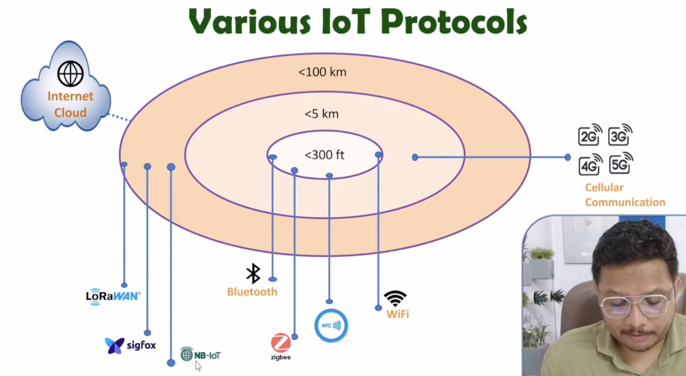

3. IOT Cloud or 

4. IOT Analytics and data Management / Data Processing

5. User interface .

## iot Architecture
### IoT Architecture: Data Flow, Components, Working and Technologies Explained
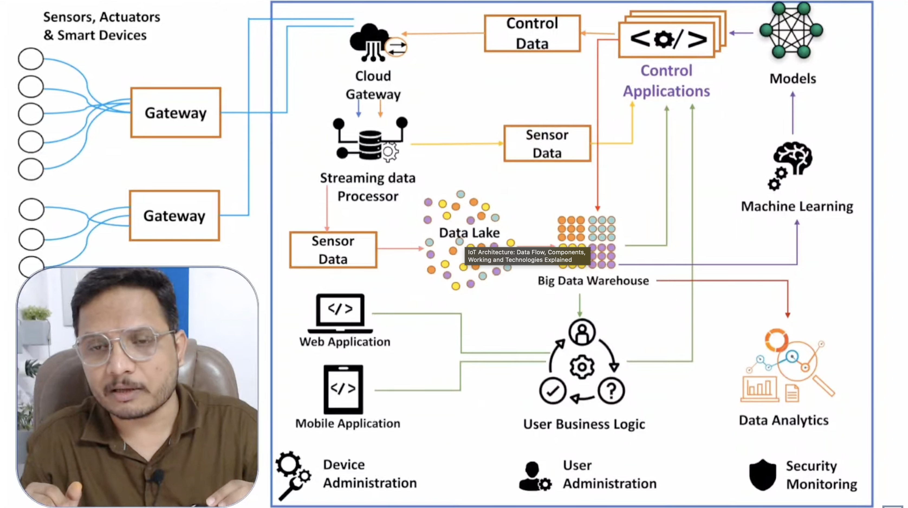

### iot arch wrt OSI 

 ---------------------------
|       Business Layer       |
 ---------------------------
|      Application Layer     |
 ---------------------------
|      Middleware Layer      |
 ---------------------------
|       Network Layer        |
 ---------------------------
|      Perception Layer      |
 ---------------------------

### Explanation of Interrelationships
1. ✔ IoT Perception Layer ≈ OSI Physical + Data Link ≈ TCP/IP Network Access
- Handles sensing, RFID, actuators, low-level transmission.

2. ✔ IoT Network Layer ≈ OSI Network Layer ≈ TCP/IP Internet Layer
- Handles addressing, routing, protocols (IPv4/IPv6).

3. ✔ IoT Middleware Layer ≈ OSI Session + Presentation ≈ TCP/IP Application
- Responsible for data processing, cloud services, API gateways.

4. ✔ IoT Application Layer ≈ OSI Application Layer ≈ TCP/IP Application
- User-facing IoT services like smart homes, industry, healthcare.

5. ✔ IoT Business Layer
- Exists only in IoT, not in OSI/TCP-IP.
- Performs data analytics, business logic, billing, KPIs.

## 3. Characteristics of IoT
1. a) Connectivity
- Devices connect through WiFi, Bluetooth, Zigbee, 5G, etc.

2. b) Sensing and Perception
- Sensors collect real-time data (temperature, motion, humidity, etc.).
- Actuators are used to give physical response .

3. c) Intelligence
- Devices analyze data (local or cloud-based) to make decisions.

4. d) Scalability
- IoT networks can support millions of devices.

5. e) Heterogeneity
- Different devices, platforms, and technologies work together.

6. f) Interoperability
- Different manufacturers’ devices can exchange data using standard 'protocols'.
- UDP , TCP , HTTPS , Wi-Fi , Bluetooth etc .

7. g) Security
- Ensuring confidentiality, integrity, and authentication of data.

8. Dynamic and Adaptive :
- example : 
    - day and night .
    - movement and stop.

9. Unique Identity od IOT device 
- will be IP 

### 4. IoT Standards
- IoT needs global standards to ensure interoperability. Major standard bodies include:

1. a) IEEE
Standards for communication (e.g., 802.15.4 for low-power networks).

2. b) IETF
Protocols like IPv6, 6LoWPAN, CoAP.

3. c) ITU-T
Global telecom standards for IoT architecture.

4. d) ISO/IEC
Security and device management standards.

5. e) OneM2M
Standard for machine-to-machine (M2M) communication.

## 5. IoT Protocols
Protocols define how devices communicate.
They operate at different layers:

1. a) Application Layer Protocols
- MQTT – lightweight publish/subscribe protocol for low-power devices.
- CoAP – for simple devices over UDP.
- HTTP/HTTPS – used when web communication is required.

2. b) Network Layer Protocols
- IPv6 – large address space.
- 6LoWPAN – IPv6 over low-power wireless networks.

3. c) Communication/Link Layer Protocols
- WiFi – high bandwidth.
- Bluetooth / BLE – short-range communication.
- Zigbee – mesh networking for low-power sensors.
- NFC – very short range.
- LoRaWAN – long-range, low-power communication.

## 6. IoT Communication Models
- These represent patterns of how data flows between devices.

1. a) Device-to-Device (D2D)
Devices communicate directly (e.g., Bluetooth).

2. b) Device-to-Cloud (D2C)
Devices send data to cloud servers for storage/processing.

3. c) Device-to-Gateway (D2G)
Device communicates with a gateway, which then connects to the cloud.

4. d) Back-End Data Sharing Model
Cloud data is shared among multiple servers or analytics platforms.

## 7. IoT Communication APIs
- APIs allow IoT devices and applications to exchange data.

1. a) RESTful APIs
- Use HTTP (GET, POST, PUT, DELETE) for communication.
- Based on Request - Response Model. 
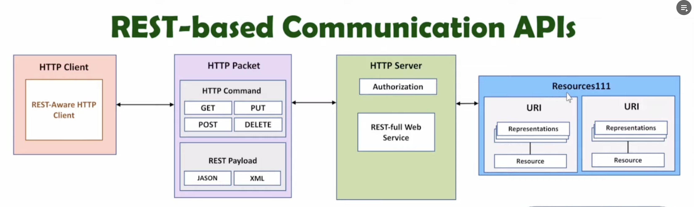
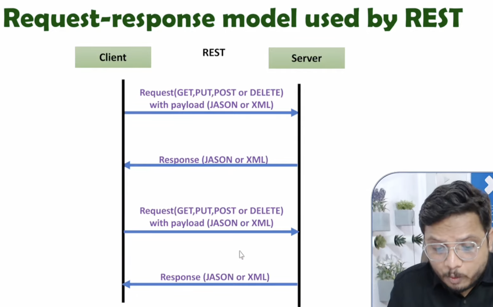
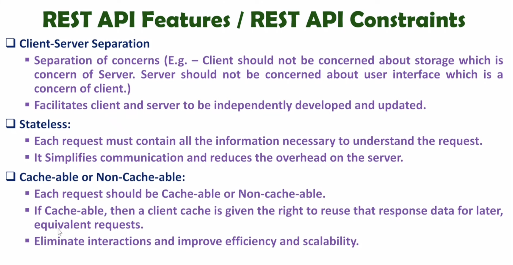
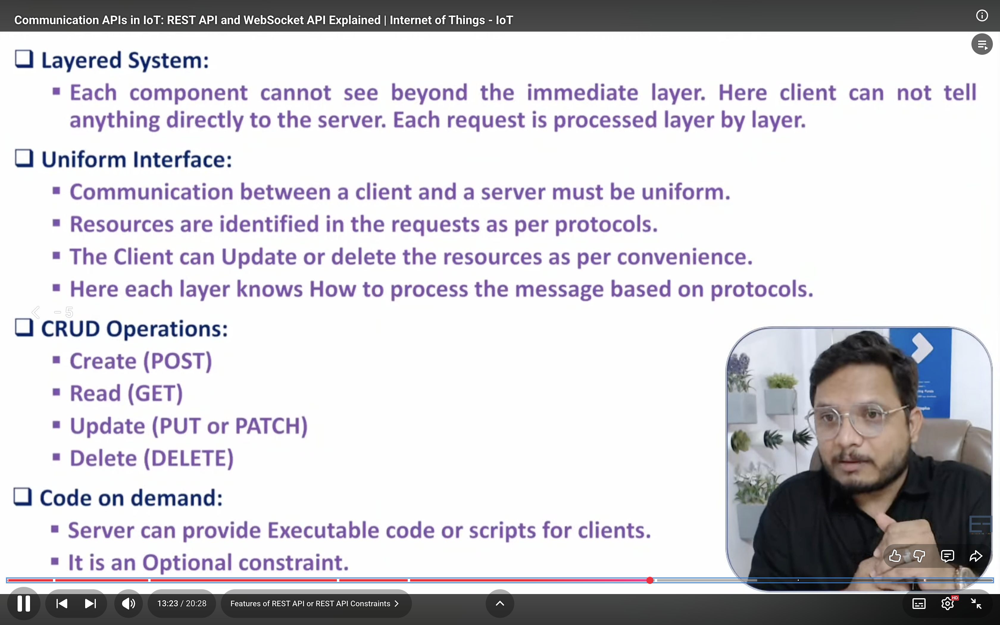

2. b) WebSocket API
- For real-time, two-way communication (live IoT dashboards).
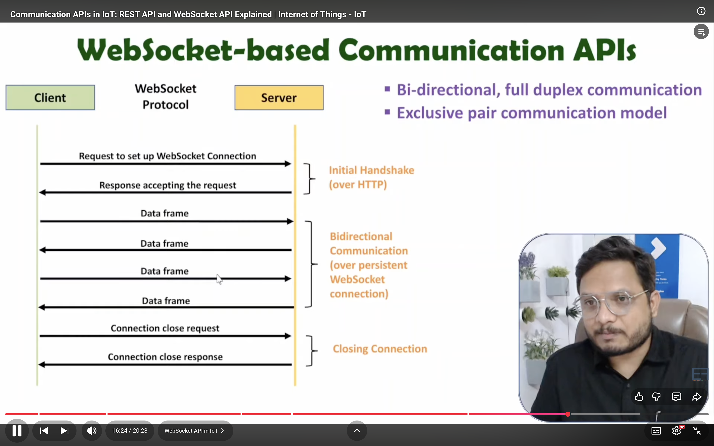

3. c) MQTT APIs
Publish–subscribe communication between devices and brokers.

4. d) CoAP APIs
Lightweight API using request–response over UDP.

5. e) Vendor-specific APIs
APIs provided by cloud platforms such as:
AWS IoT
Azure IoT Hub
Google Cloud IoT

## 8. IoT Applications
1. A. Home (Smart Home Applications)
- Smart homes use IoT to automate household activities.

Examples:
- Smart lighting
- Smart thermostats
- Smart locks
- Voice-controlled assistants
- Energy management

2. B. City (Smart City Applications)
- IoT makes cities more efficient and livable.

Examples:
Smart traffic management
Smart streetlights
Smart waste management
Smart parking systems
Public safety and surveillance

## Pillars of IOT :
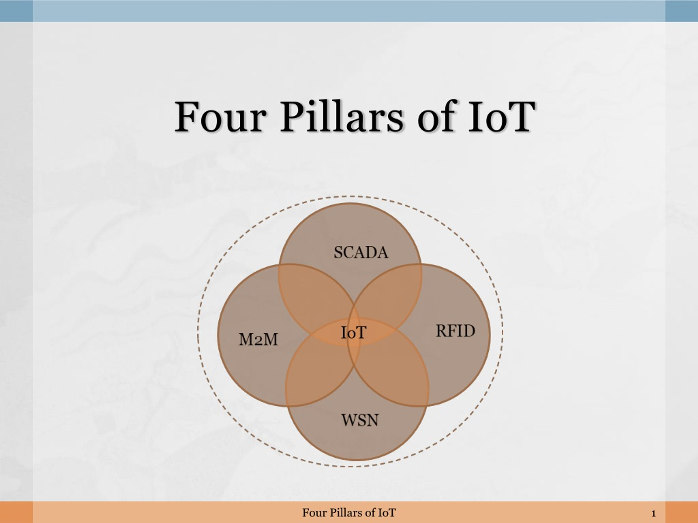

1. M2M :
- Refers to Machine to Machine or netwrok of machines in IOT .
- these machines have embedded hardware modules for sensing and communication .
- purpose :
    - remote control and monitoring of data .
- protocols used : 
    - Zigbee , bluetooth , IEEE , M-Bus etc .
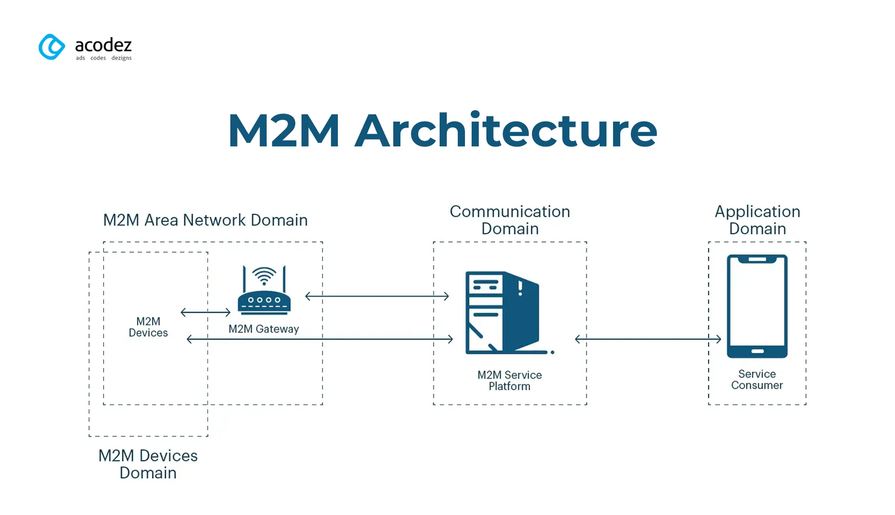

2. SCADA :
- Supervisory control and data acquization .
- Its a type of ICS (Industrila control sysytem ).
- ICS are computer controlled systems that monitor and control industrial processes that exist in physical world .
- Role :
    - Acts as a backend control system for factories, power plants, and utilities.
    - Collects sensor data through RTUs/PLCs.
    - Provides dashboards, alarms, and automation logic.
    - Works as a bridge between industrial systems and IoT platforms.
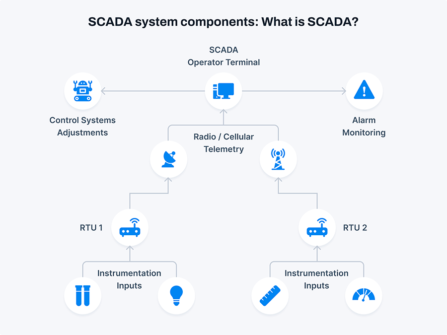

3. RFID (Radio Frequency Identification)
- RFID uses tags and readers to automatically identify objects using radio waves.
- Role in IoT:
    - Provides automatic identification, tracking, and monitoring of objects.
    - Used to track inventory, assets, humans, animals, etc.
    - Supports IoT applications that need object tagging and smart logistics.
- Components:
    - RFID Tag (Active/Passive)
    - RFID Reader
    - Backend database
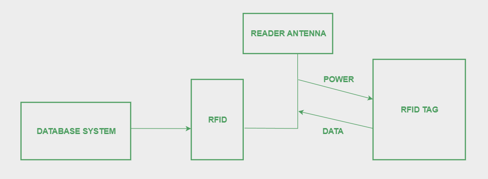

4. WSN (Wireless Sensor Networks)
- A WSN is a network of spatially distributed, battery-powered sensor nodes that collect environmental data and communicate wirelessly.
- Role in IoT:
    - Acts as the eyes and ears of IoT systems.
    - Collects data such as temperature, humidity, motion, vibration, etc.
    - Nodes communicate with each other and send data to a base station or cloud.
- Features of WSN:
    - Low cost
    - Self-organizing network
    - Energy efficient
    - Multi-hop communication
- Where used:
    - Agriculture IoT, smart homes, environmental monitoring, disaster management.
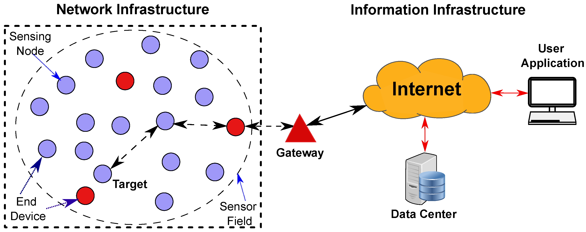

### ⭐ Role of Cloud Computing in IoT
- Cloud computing is a backbone of IoT due to its scalability and massive processing power.
1. Large-Scale Storage
Stores sensor data from millions of devices.

2. On-Demand Computing Power
IoT devices are low-power; cloud handles heavy analytics and machine learning.

3. Real-Time Monitoring
Cloud-based dashboards allow users to monitor devices from anywhere.

4. Device Management
Cloud services manage firmware updates, authentication, and security policies.

5. Integration with AI/ML
Cloud platforms analyze patterns, detect anomalies, predict failures.

### ⭐ Role of Big Data in IoT
- IoT produces massive volumes of data (velocity, variety, volume).
- Big Data technologies help in extracting meaningful insights.
1. Storing Huge Data Volumes
Tools like Hadoop, Spark, and NoSQL handle terabytes/petabytes of IoT data.

2. High-Speed Processing
Real-time analytics for traffic, health monitoring, factories, etc.

3. Insights & Predictions
Big Data algorithms detect trends, forecast equipment failure, optimize performance.

4. Improved Decision-Making
Transforms raw IoT data into actionable intelligence.

