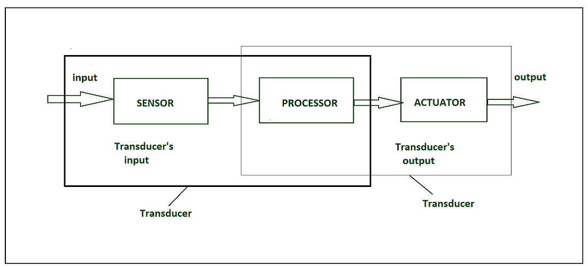
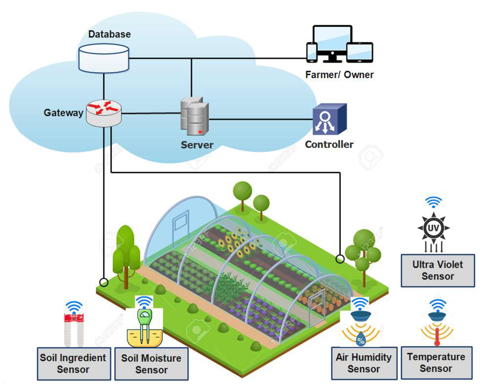

## Sensors and Actuators in IoT
1. Sensors
- What they do: Convert a physical quantity into an electrical signal.
    - Temperature sensor → voltage changes with temperature
    - LDR (light sensor) → resistance changes with light
    - Ultrasonic sensor → time of echo gives distance
- In IoT: Sensors collect data from the environment and send it to a microcontroller (Arduino, ESP8266, etc.) which then sends it to the cloud or performs local decisions.

- Transducer : 
    - A transducer converts a signal from one physical structure to another.
    - It converts one type of energy into another type.
    - It might be used as actuator in various systems.

### Sensors characteristics :
1. Static characteristics :
- It is about how the output of a sensor changes in response to an input change after steady state condition.
    - Accuracy: Accuracy is the capability of measuring instruments to give a result close to the true value of the measured quantity. It measures errors. It is measured by absolute and relative errors. Express the correctness of the output compared to a higher prior system. 
        - Absolute error = Measured value - True value
        - Relative error = Measured value/True value
    - Range: Gives the highest and the lowest value of the physical quantity within which the sensor can actually sense. Beyond these values, there is no sense or no kind of response.
    e.g. RTD for measurement of temperature has a range of -200`c to 800`c.
    - Resolution: Resolution is an important specification for selection of sensors. The higher the resolution, better the precision. When the accretion is zero to, it is called the threshold.
    - Provide the smallest changes in the input that a sensor is able to sense.
    - Precision: It is the capacity of a measuring instrument to give the same reading when repetitively measuring the same quantity under the same prescribed conditions.
    - Drift: The difference in the measurement of the sensor from a specific reading when kept at that value for a long period of time.

2. Dynamic Characteristics :
- Properties of the systems
    - Zero-order system: The output shows a response to the input signal with no delay. It does not include energy-storing elements.
    Ex. potentiometer measure, linear and rotary displacements.
    - First-order system: When the output approaches its final value gradually.
    Consists of an energy storage and dissipation element.
    - Second-order system: Complex output response. The output response of the sensor oscillates before steady state.

2. Actuators
- What they do: Convert electrical signals into physical action.
- Examples:
- Motors → rotation / motion
- Relay → turns AC devices ON/OFF
- Buzzer → sound
- Servo / stepper → precise movement
- In IoT: Actuators perform actions based on commands from software (e.g., turn ON fan when temperature > 30°C).

## ⭐ Major Factors Influencing the Choice of Sensors in IoT :
- Choosing the right sensor is critical for accuracy, reliability, and efficiency. The major factors are:

1. Type of Measurement Required
- Different IoT applications need different sensors:
    - Temperature → Thermistor, RTD, LM35
    - Motion → PIR
    - Gas → MQ-series
    - Pressure → BMP180
- Select the sensor depending on what you want to measure.

2. Accuracy and Precision
- High-accuracy sensors are needed in healthcare or industrial monitoring.
- Low-accuracy may be acceptable in home automation.

3. Range and Sensitivity
- Sensor must operate within the required measurement range (e.g., –40°C to 125°C).
- Sensitivity decides how small a change the sensor can detect.

4. Response Time
- Fast sensors are needed in real-time systems (fire detection, motion detection).
- Slow sensors are acceptable in environmental monitoring.

5. Power Consumption
- Battery-operated IoT devices need low-power sensors.
- Passive sensors (RFID, capacitive sensors) consume less power than active ones.

6. Cost and Availability
- The sensor should be cost-effective for large-scale IoT deployments.
- Availability in the market ensures easy maintenance and replacement.

7. Environmental Conditions
- Dust, humidity, temperature, and vibration resistance depend on the deployment area.
- Outdoor IoT sensors require rugged, waterproof, long-life sensors.

8. Communication and Interfacing
- Compatibility with microcontrollers (ESP32, Arduino, Raspberry Pi).
- Supported interfaces: I2C, SPI, UART, analog, digital.

        +----------------------------+
        |        Physical Input      |
        |   (Temp, Light, Pressure)  |
        +-------------+--------------+
                      |
                      v
            +------------------+
            |  Sensing Element |
            |  (Transducer)    |
            +------------------+
                      |
                      v
            +------------------+
            | Signal           |
            | Conditioning      |
            | (Amplification,   |
            | Filtering, ADC)   |
            +------------------+
                      |
                      v
            +------------------+
            |   Processing     |
            |  (MCU/Logic)     |
            +------------------+
                      |
                      v
            +------------------+
            | Output Interface |
            | (Analog/Digital, |
            |  I2C/SPI/UART)   |
            +------------------+

## Controlling Hardware
- “Controlling hardware” means using a microcontroller’s pins (digital/analog) to read sensors and drive actuators.
- Input side:
    - digitalRead() or analogRead() to sense buttons, LDR, temperature, motion, etc.
- Output side:
    - digitalWrite() to turn things ON/OFF (LED, relay, buzzer).
    - analogWrite() (PWM) to control speed/brightness/position.
- Because microcontroller pins can only give small current (~20–40 mA), we often need:
- Transistors / MOSFETs / Drivers to control motors, relays, etc.
- External power supply for high-power loads.

## 3. Connecting LED
- LED (Light Emitting Diode) glows when current flows in forward direction.
- Always use a current-limiting resistor (e.g., 220–1kΩ) in series.
- Connection:
- Anode (+ longer leg) → resistor → microcontroller pin
- Cathode (– shorter leg, flat side) → GND
- Code: set that pin as OUTPUT and use digitalWrite(pin, HIGH/LOW).

## 4. Buzzer
- Two types:
    - Active buzzer: Just give 5V or a digital HIGH → it produces a fixed tone.
    - Passive buzzer: Needs a square wave (PWM) at certain frequency to create sound.
- Connection similar to LED, often with a small transistor if current is higher.
- Can be used for alarms, beeps in intruder alert, etc.

## 5. Controlling AC Power Devices with Relays
- Relay: An electrically controlled switch that can turn high-voltage AC (fan, bulb, pump) ON or OFF using low-voltage 5V signal from microcontroller.
- Inside a relay:
- Coil: creates magnetic field when energized.
- Contacts: move to connect/disconnect AC circuit (NO/NC terminals).
- We never connect AC directly to microcontroller. Instead:
- Microcontroller pin → transistor/optocoupler → relay coil
- AC live wire → relay common & NO (or NC) → load (bulb/fan).
- In IoT, relays are used in smart home: remote control of lights, appliances via Wi-Fi.
- Safety note: AC wiring must be done carefully, usually with pre-built relay modules.

## Describe the architecture of a cloud-based IoT platform for smart agriculture.

1. Sensing Layer 
2. Network and Comm layer .
3. Iot Gateway Layer 
4. Cloud Platform Layer .
5. Application Layer .
6. Business Layer .

