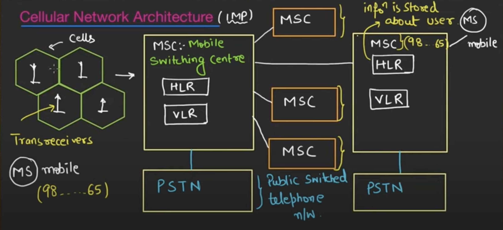

## ✅ Basic Cellular System
A cellular system divides a geographic area into smaller regions called cells, each served by a base station. These cells work together to provide seamless wireless communication.

### ➤ Components:
- Cell: A small area with coverage provided by a base station
    - Distance betwenn 2 centres = root(3).Radius of hexagon

- Base Station (BTS): 
    - ✔ Provides wireless coverage to a specific cell area
    - ✔ Consists of:
        1. Base Transceiver Station (BTS): Handles radio communication with mobile stations
        2. Base Station Controller (BSC): Manages multiple BTSs, handles handovers, frequency allocation, etc.

- Mobile Devices: 
    - Communicate with the base station
    - ✔ The user's device — like a smartphone, tablet, or laptop

- Mobile Switching Center (MSC)
    - ✔ The central component in the cellular network
    - ✔ Controls call setup, routing, and switching between cells
    - ✔ Handles mobility management, roaming, and authentication
    - ✔ Connects the cellular network to external networks like PSTN (Public Switched Telephone Network)
    - Registers Inside MSC : 
        1. Home Location Register (HLR)
        ✔ A database storing permanent information about subscribers

        2. Visitor Location Register (VLR)
        ✔ Temporary database containing information about subscribers currently within a specific area
        ✔ Works with HLR to verify users and track roaming subscribers

- Public Switched Telephone Network (PSTN) / External Networks
    - ✔ Enables communication between mobile users and landline phones or other networks
    - ✔ Provides internet connectivity and external routing

### Architecture :

## ✅ Frequency Reuse in Cellular Systems
Frequency reuse is a fundamental concept in mobile networks that allows the efficient use of the limited radio spectrum by reusing the same frequency bands in different geographic areas separated by sufficient distance to avoid interference.
- ✔ It is the practice of using the same frequency channels in different cells that are far enough apart so that they do not interfere with each other.
- ✔ This allows mobile networks to support more users without needing more spectrum.
- ✔ It’s essential for handling increasing traffic in cellular systems.

### 📦 How Frequency Reuse Works
- The entire coverage area is divided into cells.
- Each cell is assigned a set of frequency channels.
- The same set of frequencies can be reused in another cell that's far enough away.
- A reuse distance ensures signals from neighboring cells do not interfere.

> Reuse Factor (N) : The number of cells in a cluster before frequency reuse is allowed.
> Reuse Distance (D) : The distance between cells using the same frequency set.
> D = Root(3).R.N

## Handoff
Handoff is a critical process in mobile networks that ensures uninterrupted communication as a mobile device moves from one cell to another.
- ✔ Handoff is the process of transferring an ongoing call or data session from one cell (base station) to another without dropping the connection.
- ✔ It maintains service continuity when the user moves geographically.
- ✔ It’s essential for mobile users traveling across different coverage areas.

### Types:
| Type                   | Description                                                                                                            |
| ---------------------- | ---------------------------------------------------------------------------------------------------------------------- |
| **Hard Handoff**       | The connection to the current cell is broken before establishing a new one ("break-before-make")                       |
| **Soft Handoff**       | The connection to the new cell is established before breaking the old one ("make-before-break"), used in CDMA networks |
| **Horizontal Handoff** | Switching between cells within the same network                                                                        |
| **Vertical Handoff**   | Switching between different networks (e.g., from Wi-Fi to LTE)                                                         |

## Channel Allocation 
refers to the process of assigning frequency channels to different users or cells in a cellular network so that communication can occur efficiently without interference.
- ✔ It’s a method by which available channels (frequencies, time slots, codes, etc.) are distributed among users or cells.
- ✔ The goal is to maximize the usage of limited spectrum while minimizing interference and ensuring communication quality.
- ✔ Channel allocation plays a crucial role in how a network handles traffic, supports mobility, and maintains performance.

### 📌 Types of Channel Allocation Methods

1. 1️⃣ Fixed Channel Allocation (FCA)
- ✔ Each cell is assigned a fixed set of channels
- ✔ Channels cannot be used by others, even if idle
- ✔ Simple to implement but not flexible
- ✔ Can lead to underutilization of resources

> Freq reuse is max 

2. ✅ 2. Dynamic Channel Allocation (DCA)
- Channels are assigned based on current demand.
- Channels are allocated when needed and returned to the pool when not in use.
- Requires more sophisticated control and signaling.
- Efficient use of channels, reducing idle resources.

Example: A channel from Cell B can be used by Cell A if it’s not busy.
