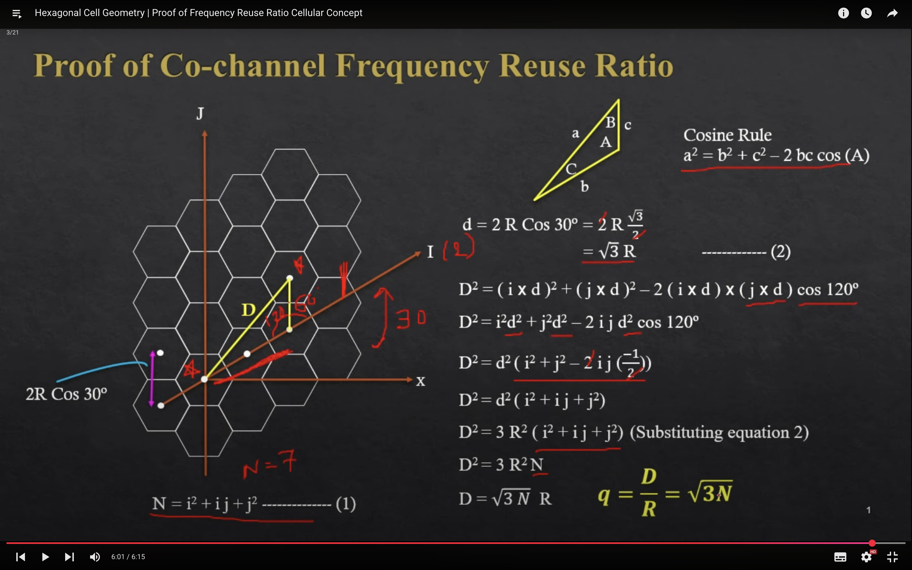

## why hexagonal cells?
- trianlgle = 17% circle area
- square = 63
- hexagon = 83
    
## Co-channel Frequency reuse rario:

## Co-channel Interference :
- normally :
    - q= 6(S/I)^1/y

- worst case :

## Cell Sectoring 
- to overcome Co-channel Interference

##  Cell Splitting

## Hand off 

## Trunking 
is a method of efficiently sharing a limited number of communication channels among a larger number of users. Instead of allocating a dedicated channel to each user, multiple users share the available channels, and a channel is assigned to a user only when needed.

## Grade of Service (GoS) 
is a measure of the quality and availability of a communication system. It typically refers to the probability that a call or connection request will be blocked or delayed due to insufficient resources.

## 

 
