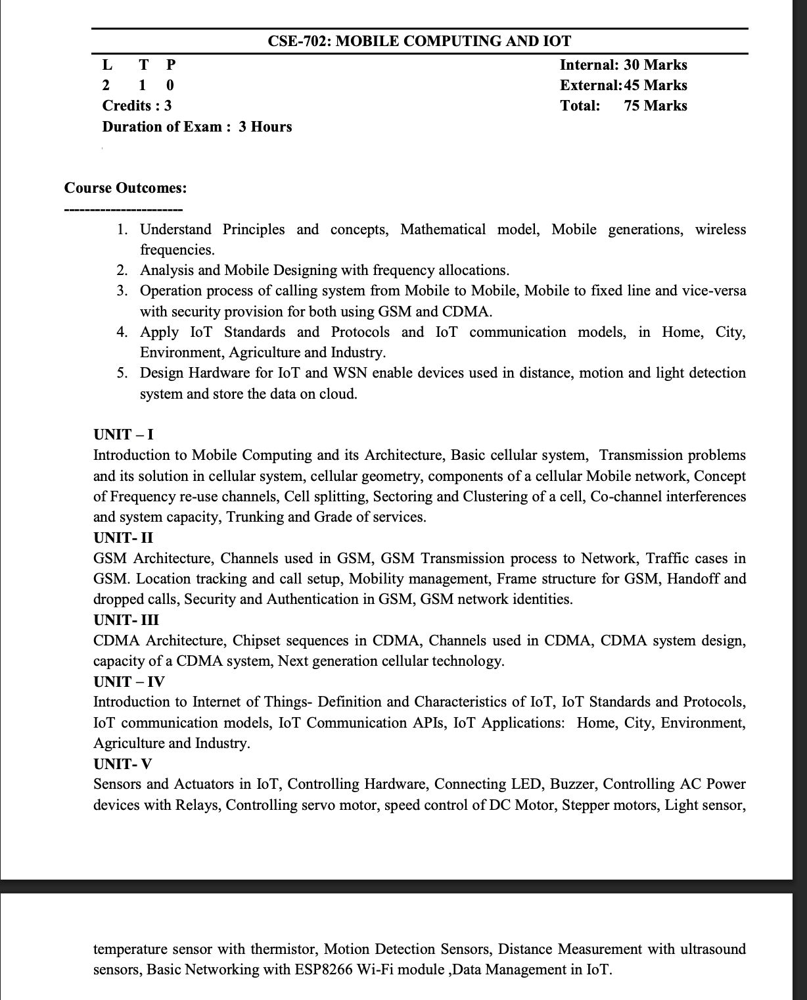

Syllabus for sessional II
 Co-channel interferences and system capacity, Trunking and Grade of services, GSM Architecture, Channels used in GSM, Location tracking and call setup, Mobility management, Handoff and dropped calls, Security and Authentication in GSM, GSM network identities, Chipset sequences in CDMA

 - and the important presentation group-wise  are "Group 1, 2, 3,7,9,12,15,16 "
 - https://docs.arduino.cc/built-in-examples/
 - https://drive.google.com/drive/folders/10rkbbLXOX2av3UWehVka5Rc4aJnYdZvg

 
 - Arduino
Communication (starting 3)
Digital (Starting 5)
Just go through string, USB, control structure, communication

Arduino codes:
Do
Basics
Digital (1st 4)
Analog (full)
Sensor 
Display
Arduino ISP (read)

Leave 
Control structure, USB, string etc