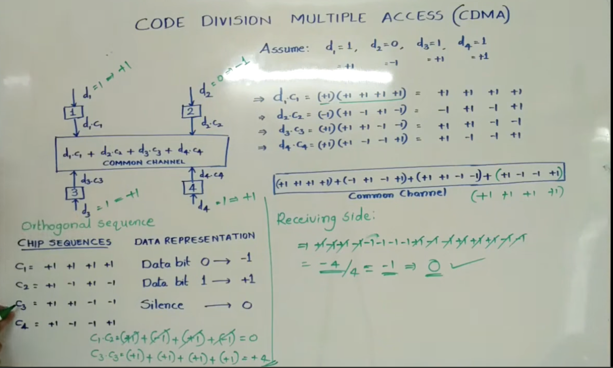

## CDMA (Code Division Multiple Access)
 is a spread spectrum communication technique used in 2G and 3G cellular systems (like IS-95 and cdma2000).

 

- common channel data = d1.c1 + d2.c2 + d3.c3 + d4.c4 

- chip sequence :
+1 +1
+1 -1 

==> for 4*4 
c1 +1 +1 +1 +1
c2 +1 -1 +1 -1
c3 +1 +1 -1 -1
c4 +1 -1 -1 +1

- Data Representation 
  - 0 => -1 
  - 1 => 1
  - silent => 0

- Multiply d1.c1 + d2.c2 + d3.c3 + d4.c4  , each seprately with 4 diff bits of c's

=>> (d1.c1 + d2.c2 + d3.c3 + d4.c4 ) * c1 = c1's message and so on .

