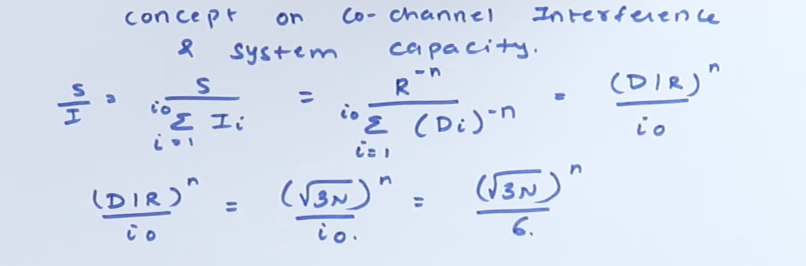
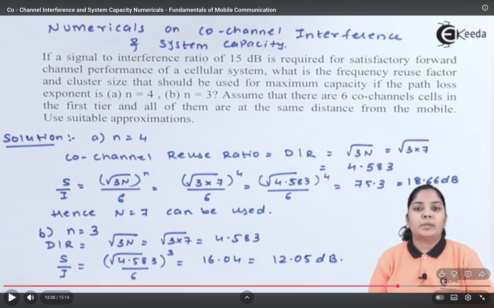
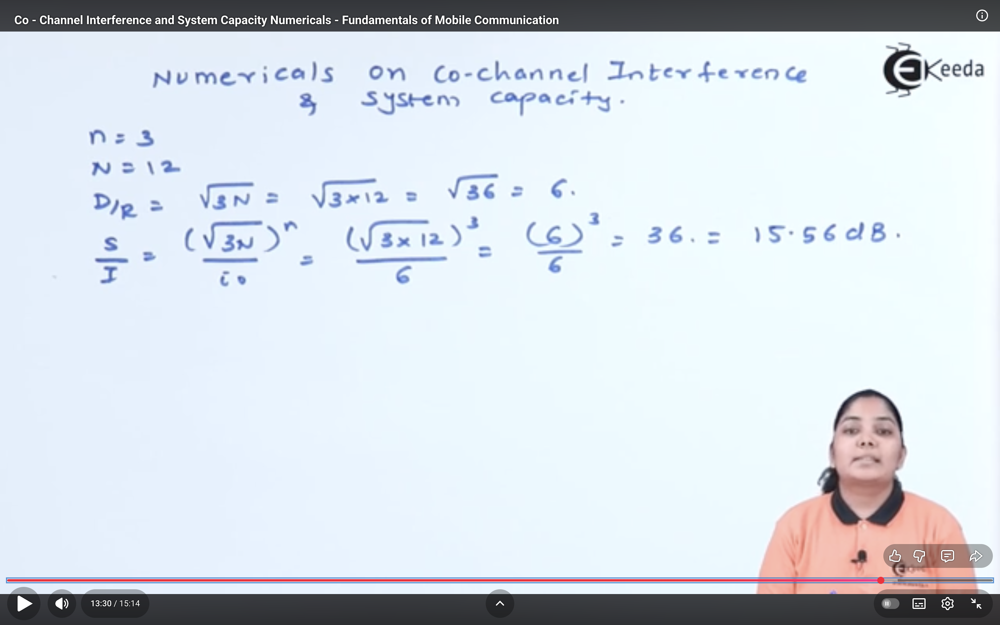

## Co-channel interference : 
Co-channel interference occurs when two or more cells using the same frequency channel interfere with each other’s signals.
It is a type of inter-cell interference that arises due to frequency reuse in cellular systems.

Explanation:
- In cellular networks, the total available frequency spectrum is limited.
- To support more users, the same set of frequencies is reused in different cells that are sufficiently far apart.
- However, if these co-channel cells are too close or signals overlap, interference occurs — this is Co-Channel Interference (CCI).

### Causes of Co-Channel Interference:
- Small reuse distance between co-channel cells.
- High transmitter power or tall antennas.
- Multipath propagation and environmental reflections.
- Improper frequency planning or cluster configuration.

### Ways to Reduce Co-Channel Interference:
- Increase the reuse distance (D) between co-channel cells.
- Use directional antennas (cell sectoring).
- Lower the transmission power.
- Use interference cancellation or adaptive equalization in receivers.
- Use smart antenna systems (beamforming and MIMO).

> Co-Channel Reuse Ratio: D/R = root(3).N

## System capacity 
refers to the maximum number of simultaneous users (or calls) that a mobile communication system can support while maintaining acceptable Quality of Service (QoS).

- Dependence on Frequency Reuse:
    - The frequency reuse principle directly affects capacity.
    - A cellular system divides its total frequencies among clusters of cells.
        - S = total available channels
        - N = number of cells in a cluster
    Then each cell gets:
    - Channels per cell = S/N
    - If the total number of cells in the system is 𝑀
      then:  Total Capacity = M*S/N.

## Signal-to-Interference Ratio (SIR)
The Signal-to-Interference Ratio (SIR) is the ratio of the desired signal power to the sum of interference powers received from co-channel cells.

 