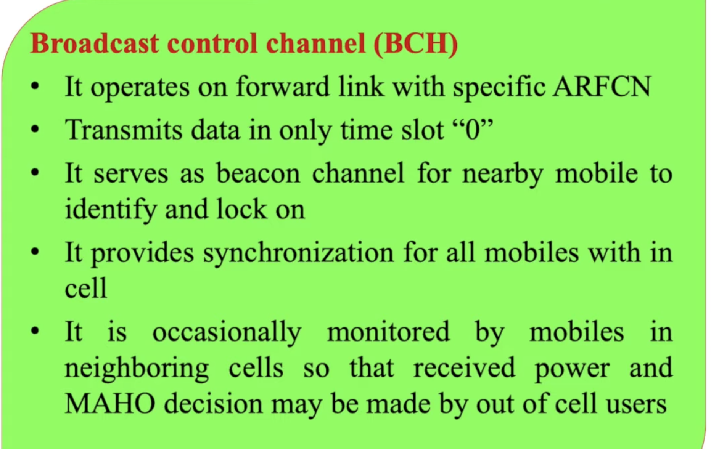
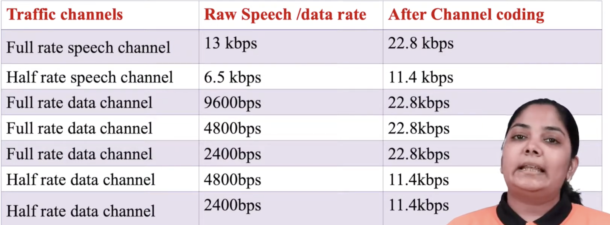
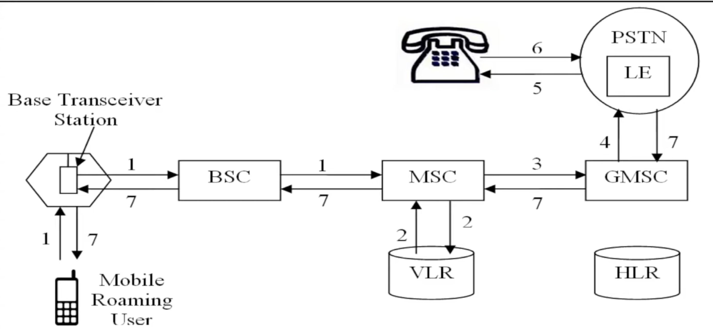
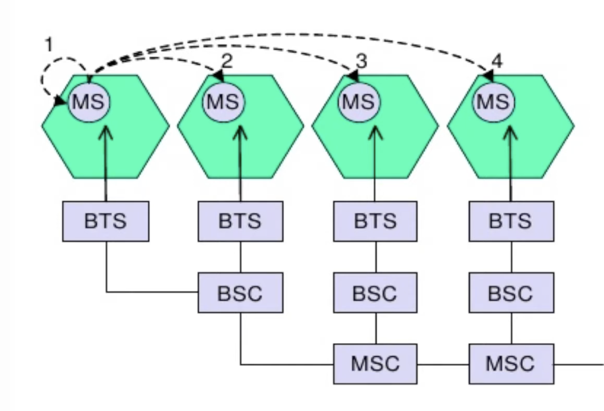

## GSM intro :

##  Channels used in GSM 
| Type                     | Purpose                                                                                                        |
| ------------------------ | ---------------------------------------------------------------------------------------------------------------|
| **1️⃣ Physical Channels**  | Actual radio frequencies and time slots used for transmission                                                   |
| **2️⃣ Logical Channels**   | Functional divisions of information (like signaling, control, and user data) carried over the physical channels |

1. Physical Channels
- A physical channel in GSM is defined by:
 - A carrier frequency (200 kHz bandwidth)
 - A time slot within a TDMA (Time Division Multiple Access) frame
- Each GSM carrier supports 8 time slots — numbered TS0 to TS7 — forming 8 physical channels.
- Each slot is a physical channel, meaning one frequency + one time slot = one channel.
> 📶 This technique is called TDMA (Time Division Multiple Access).

- A physical channel in GSM refers to the actual radio resources used for communication, defined by a specific time slot in a TDMA frame on a particular frequency.
- It is the physical medium over which bits are transmitted.

2. Logical channels 
- Logical channels define what kind of information is sent on the physical channel — e.g., voice, control signals, synchronization data, etc.| 

Category                      | Purpose                                    |
| ----------------------------- | ------------------------------------------ |
| **A. Traffic Channels (TCH)** | Carry **user data (voice or SMS)**         |
| **B. Control Channels (CCH)** | Carry **signaling and system information** |

- types : 

1. Traffic Channels (95% spectrum allocated)
    - Traffic channels are used for carrying user information like voice, SMS, or data.
    | Type                      | Description                      | Data Rate          |
    | ------------------------- | -------------------------------- | ------------------ |
    | **Full-Rate TCH (TCH/F)** | Carries one full voice call      | 13 kbps            |
    | **Half-Rate TCH (TCH/H)** | Two users share one time slot    | 6.5 kbps each      |
    | **TCH/Data**              | For circuit-switched data or fax | 2.4, 4.8, 9.6 kbps |

2. Control Channels (CCH)
- Control channels manage network access, synchronization, and handover.

They are divided into three main types: (BSF , RAP , SSF)

1. 1️⃣ Broadcast Channels (BCH) 
- Used by BTS to broadcast information to all mobiles in a cell.
- Used by the base station (BTS) to broadcast information to all mobiles in the cell.

| Channel                            | Function                                                               |
| ---------------------------------- | ---------------------------------------------------------------------- |
| **FCCH (Frequency Correction CH)** | Helps mobile tune to BTS frequency                                     |
| **SCH (Synchronization CH)**       | Provides timing and frame synchronization                              |
| **BCCH (Broadcast Control CH)**    | Broadcasts cell info (e.g., network ID, cell ID, frequency list, etc.) |

- BCCH is downlink .

2. 2️⃣ Common Control Channels (CCCH) 
- Used for communication between the mobile station (MS) and the base station (BTS) during call setup.
| Channel                          | Function                                      |
| -------------------------------- | --------------------------------------------- |
| **PCH (Paging Channel)**         | Used by BTS to alert mobile for incoming call |
| **RACH (Random Access Channel)** | Used by mobile to request access (uplink)     |
| **AGCH (Access Grant Channel)**  | BTS assigns a dedicated channel to mobile     |

3. 3️⃣ Dedicated Control Channels (DCCH)
 - Used after a channel is assigned — to manage an active connection.
| Channel                                          | Direction       | Function                                                |
| ------------------------------------------------ | --------------- | ------------------------------------------------------- |
| **SDCCH (Standalone Dedicated Control Channel)** | Uplink/Downlink | Used for call setup, location update, authentication    |
| **SACCH (Slow Associated Control Channel)**      | Uplink/Downlink | Sends periodic info like signal strength, power control |
| **FACCH (Fast Associated Control Channel)**      | Uplink/Downlink | Carries urgent signaling (e.g., during handover)        |
- 🧠 Note: FACCH temporarily steals a traffic channel slot (TCH) when needed for fast signaling.

- 

## ⚙️ Location Tracking Process
1. 🧭 Step 1: Cell and Location Area
- Each GSM network divides its coverage area into cells.
- A group of neighboring cells forms a Location Area (LA).
- Each LA has a unique Location Area Identity (LAI), broadcast via the BCCH.

2. 📡 Step 2: Mobile Station Monitors BCCH
- Every mobile (MS) listens to the BCCH of its current cell.
- It learns the LAI from the broadcast.

3. 🔄 Step 3: Location Update
- When the mobile detects it has entered a new Location Area (different LAI):
- It sends a Location Update Request via the SDCCH (Standalone Dedicated Control Channel).
- The VLR associated with that area:
    - Registers the mobile,
    - Updates the HLR (Home Location Register),
    - And deletes it from the old VLR’s record.
- ✅ This ensures the network always knows which VLR area the mobile is currently in.

MS ---> BTS ---> BSC ---> MSC/VLR ---> HLR
       (Sends Location Update)

## ☎️ 2. Call Setup in GSM
- Now that the network knows where the user is, let’s see how a call is established.
There are two cases:
1. Mobile-Originated Call (MOC) → You make a call
2. Mobile-Terminated Call (MTC) → Someone calls you

1. Mobile-Originated Call (Outgoing Call)
    1. Call Request
    - User dials a number and presses “Call”.
    - MS sends a Channel Request via RACH (Random Access Channel).
    
    2. Channel Assignment
    - BTS replies with AGCH (Access Grant Channel) → assigning an SDCCH.

    3. Call Setup Signaling
    - MS sends SETUP message (includes dialed number) on SDCCH.
    - Authentication & ciphering occur (using AUC data).

    4. Call Routing
    - MSC routes the call through the Public Switched Telephone Network (PSTN) to the destination.

    5. Traffic Channel Assignment
    - Once setup is complete, network assigns a TCH (Traffic Channel) for the voice data.

    6. Voice Communication
    - Conversation begins — voice is carried via TCH.

    7. Call Termination
    - When either party ends the call, TCH is released.

- gmsc = gateway mobile station controller.

2. B. Mobile-Terminated Call (Incoming Call)
    1. Call Arrival
    - Someone calls your number.
    - The Gateway MSC (GMSC) queries the HLR to find your current VLR.

    2. Paging
    The VLR sends a Paging Request to all BTSs in your Location Area (via PCH – Paging Channel).

    3. Mobile Response
    Your mobile recognizes its IMSI/TMSI and replies with a Paging Response via RACH.

    4. Channel Assignment
    BTS assigns an SDCCH via AGCH.

    5. Authentication & Ciphering
    The network verifies your identity and secures the link.

    6. Call Setup
    MSC sets up a Traffic Channel (TCH) for the voice call.

    7. Conversation Begins
    Speech frames are transmitted over TCH.

## 🛰️ 1. Mobility Management (MM)
- Mobility Management in GSM ensures that a mobile user remains connected and reachable even while moving across different cells, location areas, or even networks.
- It’s one of the main functions of the Network and Switching Subsystem (NSS) — mainly handled by MSC, VLR, and HLR.
- ⚙️ Mobility Management Includes Two Major Functions:
| Function                          | Description                                                                    |
| --------------------------------- | ------------------------------------------------------------------------------ |
| **Location Management**           | Keeps track of the subscriber’s current area (cell or location area).          |
| **Handoff (Handover) Management** | Ensures an active call continues seamlessly as the mobile moves between cells. |

## 🔄 2. Handoff (or Handover)
- 👉 Handoff is the process of transferring an active call or data session from one cell (BTS) to another without disconnecting the call.

### 📶 When is Handoff Needed?
- Signal strength from the current BTS drops below a threshold.
- Signal quality (C/I ratio) becomes poor.
- User moves to the edge of the cell.
- Network load balancing (too many users in one cell).
- Interference or hardware failure.

### 🧠 Who Decides Handoff?
- BSC (Base Station Controller) usually initiates and controls handoff.
- It collects signal strength and quality reports from the mobile via SACCH (Slow Associated Control Channel).

### 🔀 Types of Handoff in GSM
| Type                                  | Description                                                               |
| ------------------------------------- | ------------------------------------------------------------------------- |
| **1. Intra-cell Handoff**             | Between two channels within the same cell (for load or quality reasons).  |
| **2. Intra-BSC / Inter-cell Handoff** | Between two cells controlled by the same BSC.                             |
| **3. Inter-BSC Handoff**              | Between two cells under different BSCs but same MSC.                      |
| **4. Inter-MSC Handoff**              | Between two cells under different MSCs (more complex, signaling via SS7). |

----

| Type of Handoff            | Area of Handoff            | Controlled By | Example Scenario                           |
| -------------------------- | -------------------------- | ------------- | ------------------------------------------ |
| **Intra-Cell**             | Same BTS                   | BTS/BSC       | Change of channel inside same cell         |
| **Inter-Cell (Intra-BSC)** | Between BTS under same BSC | BSC           | Moving within same BSC region              |
| **Inter-BSC**              | Between different BSCs     | MSC           | Moving from one controller area to another |
| **Inter-MSC**              | Between different MSCs     | Both MSCs     | Moving across city/region boundaries       |

### 📡 Handoff Process Steps
1. Measurement Reports:
MS measures signal strength of serving + neighboring cells and reports to BTS via SACCH.

2. Decision:
BSC compares signal levels and decides whether to initiate handoff.

3. Channel Assignment:
BSC allocates a new channel in the target BTS.

4. Command to MS:
MS receives Handoff Command (with new frequency & time slot info).

5. Switch Over:
MS tunes to new channel and sends Handoff Complete message.

6. Call Continuity:
Call continues seamlessly via the new BTS.

## 📵 3. Dropped Calls
- Even with efficient handoff, sometimes calls still get dropped —
i.e., the connection is unexpectedly terminated.

- ⚠️ Reasons for Dropped Calls
| Category                    | Examples                                                                        |
| --------------------------- | ------------------------------------------------------------------------------- |
| **Signal-related**          | Rapid signal fading, shadowing (buildings, tunnels), or moving out of coverage. |
| **Handoff failure**         | Target BTS channel unavailable, timing mismatch, or network congestion.         |
| **Hardware/Network issues** | BTS/BSC failure, transmission line faults.                                      |
| **High speed movement**     | At very high speeds (e.g., trains), handoff can’t complete in time.             |
| **Radio interference**      | Crosstalk, noise, overlapping frequency interference.                           |

## The GSM system includes built-in security mechanisms to:
- Authenticate the subscriber (verify it’s a legitimate SIM user),
- Maintain confidentiality of communication, and
- Protect user identity on the air interface.
These are handled through SIM card, network databases, and encryption algorithms.

| Entity                               | Function                                                                    |
| ------------------------------------ | --------------------------------------------------------------------------- |
| **SIM (Subscriber Identity Module)** | Smart card in mobile storing subscriber’s secret key (*Ki*) and algorithms. |
| **AUC (Authentication Center)**      | Stores each subscriber’s *Ki* and generates authentication triplets.        |
| **HLR (Home Location Register)**     | Stores subscriber info and links to AUC.                                    |
| **MSC/VLR**                          | Handles signaling and temporary authentication processes.                   |

## 🔐 3. Security Features in GSM
GSM security rests on three pillars:
| Feature             | Purpose                                                                       |
| ------------------- | ----------------------------------------------------------------------------- |
| **Authentication**  | Verify that the subscriber (SIM) is genuine.                                  |
| **Confidentiality** | Encrypt the data on the air interface to prevent eavesdropping.               |
| **Anonymity**       | Protect the subscriber’s real identity (IMSI) by using a temporary ID (TMSI). |

- To ensure that the SIM card belongs to a valid subscriber and is not being cloned or faked.

        GSM Authentication and Security
-----------------------------------------------------
1. Network → SIM: RAND (random challenge)
2. SIM: computes SRES = A3(Ki, RAND)
3. SIM → Network: SRES
4. Network: compares its SRES with SIM’s → if match, OK
5. Both compute Kc = A8(Ki, RAND)
6. Kc used with A5 algorithm → encrypts voice/data
7. MS uses TMSI instead of IMSI for identity protection
-----------------------------------------------------
