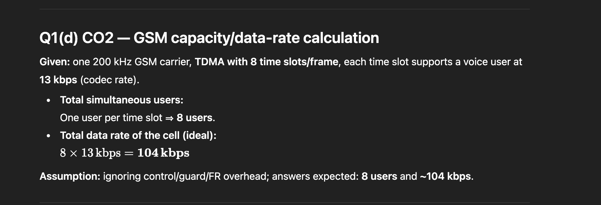

## 

## How is synchronization achieved in GSM? Who is responsible for synchronization and why is it so important?
---
- GSM achieves synchronization using two special downlink control channels:

1. ✅ 1. Frequency Synchronization – FCCH (Frequency Correction Channel)
- The BTS continuously transmits FCCH bursts.
- FCCH contains a pure sine wave tone.
- The mobile station uses this tone to:
- Correct its local oscillator frequency
- Align with BTS carrier frequency
- Purpose:
    - Ensures MS is operating on the exact same frequency as BTS.

2. Time Synchronization – SCH (Synchronization Channel)
- After locking to FCCH, the MS listens to the SCH.
- SCH burst contains:
    - Frame number
    - Base Station Identity Code (BSIC)
- The MS uses SCH to:
    - Determine exact TDMA frame timing
    - Align its transmission timing so it transmits only in its assigned time slot

### ⭐ Who is Responsible for Synchronization?
- Primarily responsible: BTS (Base Transceiver Station)
    - BTS continuously transmits FCCH & SCH as part of the Broadcast Control Channels (BCH).
    - Mobile Station (MS) only receives and adjusts itself accordingly.

## **How are MSISDN, IMSI, TMSI, MSRN, and IMEI used in cellular networks?

1. ⭐ 1. MSISDN (Mobile Station ISDN Number)
- → This is the mobile phone number of the user.
- Used for:
    - Calling a subscriber
    - Sending SMS
    - Billing and customer identity
- Role in identity/security:
    - Public identity (not secure)
    - Anyone can know it
    - Used by MSC to reach the subscriber

2. ⭐ 2. IMSI (International Mobile Subscriber Identity)
- → A unique number stored inside the SIM.
- Used for:
    - Identifying the subscriber in the network
    - Authentication with AuC
    - Location updates
- Role in identity/security:
    - Primary identity of the user
    - Kept secret because it can reveal user location
    - Network sends RAND to SIM → generates SRES for authentication

3. ⭐ 3. TMSI (Temporary Mobile Subscriber Identity)
- → A temporary identity assigned by VLR.
- Used for:
    - Identifying the subscriber without revealing IMSI
    - Paging within an LAC
    - Prevents tracking of the user
- Role in identity/security:
    - Protects user privacy
    - IMSI is sent only once → after that TMSI is used
    - Prevents eavesdroppers from tracking IMSI.

4. ⭐ 4. MSRN (Mobile Station Roaming Number)
- → A temporary number assigned by VLR during incoming call handling.
- Used for:
    - Routing incoming calls to a roaming user
    - Helps MSC locate the exact serving VLR area
- Role in identity/security:
    - Not linked directly to subscriber identity
    - Used only during call setup
    - Avoids revealing real location

5. ⭐ 5. IMEI (International Mobile Equipment Identity)
- → A unique number assigned to the mobile device (not the SIM).
- Used for:
    - Identifying the mobile device hardware
    - Checking validity through EIR (Equipment Identity Register)
    - Detecting stolen or blacklisted phones
- Role in identity/security:
    - Prevents stolen/illegal devices from accessing network
    - Can blacklist IMEI to block device usage

| Identity   | Full Form                                | Stored In         | Purpose                       | Security Role                                    |
| ---------- | ---------------------------------------- | ----------------- | ----------------------------- | ------------------------------------------------ |
| **MSISDN** | Mobile Station ISDN Number               | Operator Database | Public mobile number          | No security, public ID                           |
| **IMSI**   | International Mobile Subscriber Identity | SIM               | Main subscriber identity      | Authentication, kept secret                      |
| **TMSI**   | Temporary Mobile Subscriber Identity     | VLR               | Temporary identity for paging | Prevents tracking, protects IMSI                 |
| **MSRN**   | Mobile Station Roaming Number            | VLR               | Routing incoming calls        | Temporary routing without exposing real location |
| **IMEI**   | International Mobile Equipment Identity  | Mobile Device     | Identifies device hardware    | Blocks stolen/illegal phones                     |

