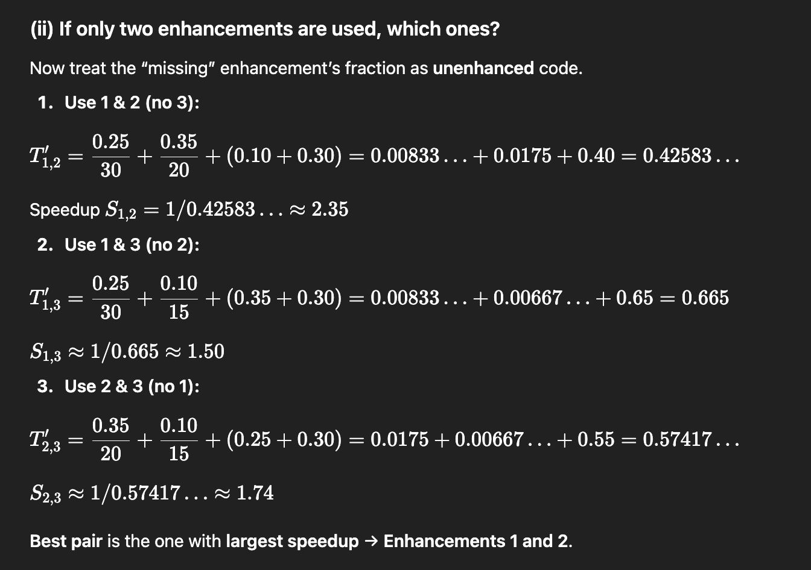

## Three enhancements with the following speed ups are proposed for a new architecture:
Speedupl-30, speedup2-20, and peedup3 =15. Only one enhancement is usable at a time.
Assume the enhancements can be used 25%,35% and 10% of the time for enhancements 1 2
and 3 respectively. For what fraction of the reduced execution time is no enhancement in use?
If only two enhancements are to be used then which two enhancements should be used? 06
---
- Remaining (no enhancement) = 1 - .25 - .35 - .1 = 0.3
- Total Time = 0.25/30 + 0.35/20 + 0.1/15 + 0.3 = 0.3325
==> Fraction = 0.3/0.3325 = 90%.

2. choose pair which also uses max portion of time. cz +0.1 is added of the not chosen .

## i) An application program is executed on a nine computer cluster. A benchmark program takes
time T on this cluster. Further 25% of T is time in which the application is run simultaneously on
all nine computers. The remaining time, the application has to run on a single computer.
Calculate the effective speedup under the aforementioned condition as compared to executing the
program on a single computer. Also calculate the percentage of code that has been parallelized in
the preceding program.