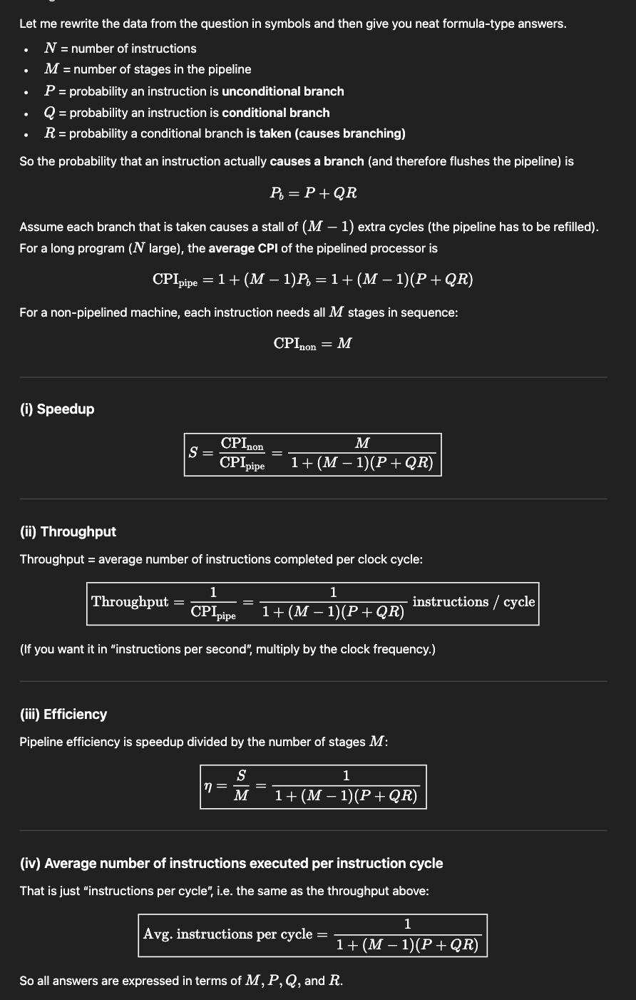

## Three enhancements with the following speed ups are proposed for a new architecture:
Speedupl-30, speedup2-20, and peedup3 =15. Only one enhancement is usable at a time.
Assume the enhancements can be used 25%,35% and 10% of the time for enhancements 1 2
and 3 respectively. For what fraction of the reduced execution time is no enhancement in use?
If only two enhancements are to be used then which two enhancements should be used? 06
---
- Remaining (no enhancement) = 1 - .25 - .35 - .1 = 0.3
- Total Time = 0.25/30 + 0.35/20 + 0.1/15 + 0.3 = 0.3325
==> Fraction = 0.3/0.3325 = 90%.

2. choose pair which also uses max portion of time. cz +0.1 is added of the not chosen .

---

## i) An application program is executed on a nine computer cluster. A benchmark program takes time T on this cluster. Further 25% of T is time in which the application is run simultaneously on
all nine computers. The remaining time, the application has to run on a single computer.
Calculate the effective speedup under the aforementioned condition as compared to executing the
program on a single computer. Also calculate the percentage of code that has been parallelized in
the preceding program.
---
==> T(parellle) = 0.25 * T(total)
==> Spped up = (0.75T + 0.25*9*T) / T
    ===> Speed up = 3;
===> Now using speedUp= 1/(1-a + a/n) = 3
    ===> a= 75% ie 75% is parellized.
---

## Let a be the percentagee of program code that can be executed simultaneously by n
computers in a cluster, each computer using a difierent set of parameters or initial conditions.
Assume that the remaining code must be executed simultaneously by a single processor. Each
processor has an execution rate of x MIPS. Determine an expression for the effective MIPS rate
when using the system for exclusive execution of this program in terms of a, n and x.
---
Eff Mips = I /Total time .
---

## ().Consider a computer which can execute a program in two operational modes; regular mode
versus enhanced mode with a probability distribution of {A, 1-A} respectively. If A varies
between a and b and 0O<=a<=1, derive an expression for the average speedup factor using
harmonic mean concept.
---

## program mix. The multiprocessor can be used in four execution modes corresponding to the
active use of one, two, three and four processors.
The following C program is to be executed on a uniprocessor and a parailei version is to be
executed on a shared memory multiprocessor. Each processor has a peak execution rate of 5
MIPS. Fi is the percentage of time that i processors will be used in the above program execution
and fl+f2+f3+f4-1. Execution rates for the distribution (f1,(2,f3,f4) are RI R2 R3 and PA
respectively. Derive an expression to show the harmonic mean execution raie R of the
multiprocessor in terms
---

---

