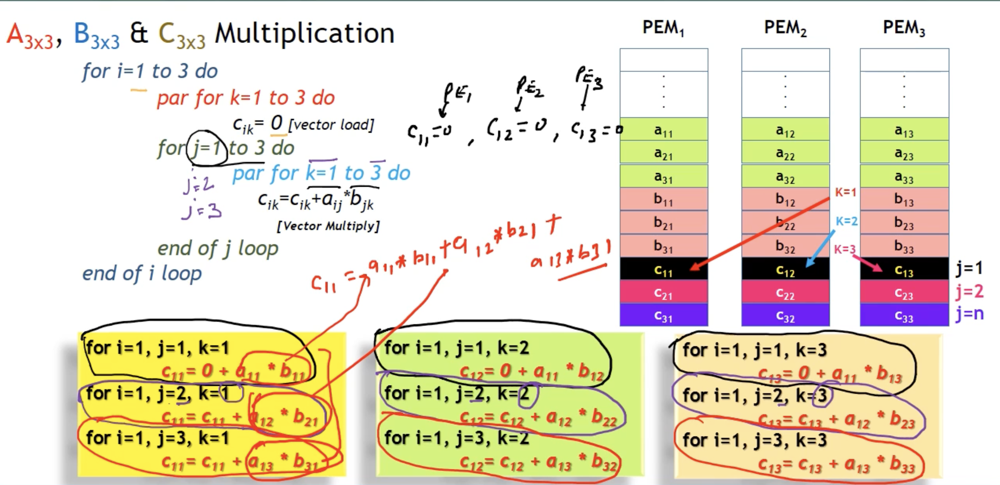
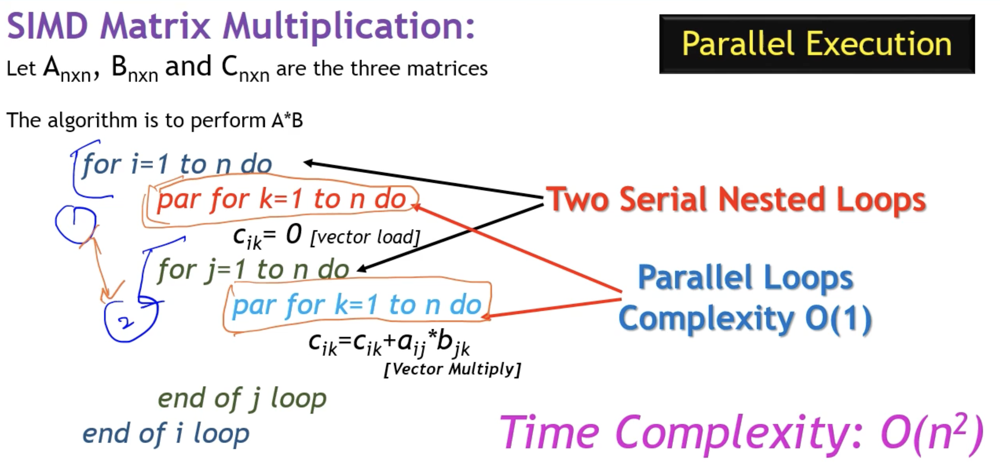
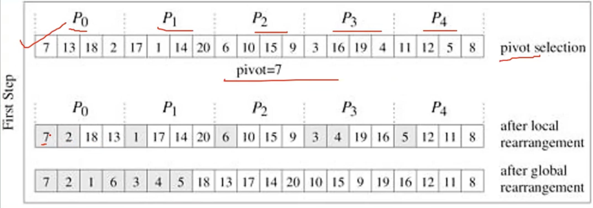

## SIMD Multiplication :



- loops ik jk
- cik = 0 and cik = cik+ aij*bjk.

- 2 serail loops & 2 pareelel loops od Compleicyty (0(1))
- Oveerall O(n^2).

- explain for 3*3 matrix.
    - i,j and loop-k. which calculates cik = cik+ aij*bjk.
    - vertical loops j & so on ...

## What is PRAM model? Design and verify an EREW-PRAM algorithm for finding Maximum of N numbers in O(log N).
### ⭐ 1. PRAM Model (Parallel Random Access Machine)
- PRAM is an idealized theoretical model used to design and analyze parallel algorithms.
- Key Features
    - Consists of P identical processors, each with a local register.
    - All processors share a single shared memory.
    - All processors execute in synchronous steps.
    - All memory accesses take unit time.
- Types of PRAM Based on Read/Write Rules
1. EREW PRAM – Exclusive Read Exclusive Write
- No two processors can read the same memory location at the same time.
- No two processors can write to the same memory at the same time.
- Most restrictive model.
2. CREW PRAM – Concurrent Read, Exclusive Write
3. CRCW PRAM – Concurrent Read, Concurrent Write

### ⭐ 2. Problem: Find Maximum of N Numbers in O(log N)
- We design an EREW PRAM algorithm using a binary reduction tree.
- We assume N processors: P₁, P₂, …, Pₙ.

- EREW PRAM Maximum Finding Algorithm (O(log N))
- At each step, half of the processors compare pairs of numbers and store the larger one.
Thus, the number of active values reduces as:
> n -> n/2 -> n/4 ... 1
- This takes log₂N steps.

```c
EREW_Max(A[1..N])      // N numbers in shared memory

1. for i = 1 to N do in parallel:
        B[i] = A[i]        // Exclusive Read, each processor reads its own index

2. for step = 1 to log N do:
        for i = 1 to N / 2^step do in parallel:
              B[i] = max( B[2*i - 1], B[2*i] )   // Compare disjoint pairs

3. Output B[1] as the maximum.
```

- Make a graph bottemup . maximum will be at top.
- n/2 processors required .


## Parallelize Quick Sort and Compute its Speedup w.r.t. Sequential Quick Sort
### ⭐ 1. Sequential Quick Sort (Recall)
- Sequential Quick Sort works by:
- Choosing a pivot
- Partitioning the array into:
    - elements < pivot
    - elements > pivot
- Recursively sorting the two sub-arrays.
- Sequential Time Complexity = 𝑂(𝑁log𝑁)

### ⭐ 2. Parallelizing Quick Sort
We can parallelize two parts:

1. (i) Parallel Partitioning
- Partition step can be parallelized using:
- Parallel prefix sums
- Parallel comparison
- Parallel scatter
- This reduces partition time from O(N) to: O(logN) (using N processors)

2. (ii) Parallel Recursive Calls
- After partitioning:
- Left sub-array and right sub-array are sorted in parallel.
- Depth of recursion = O(log N)
- So total parallel time: (N)=O(log(2N))
- or on some models using optimal work:

```c
PARALLEL_QUICKSORT(A)

1. if N <= 1: return

2. Choose pivot p

3. In parallel for all elements i:
       Compute flag[i] = 1 if A[i] < p else 0

4. Compute parallel prefix sum on flag[]
       → gives new positions for each smaller element

5. Write smaller elements and larger elements
   into new arrays using computed positions

6. Recursively call PARALLEL_QUICKSORT
       on Left and Right subarrays in parallel
```

- 