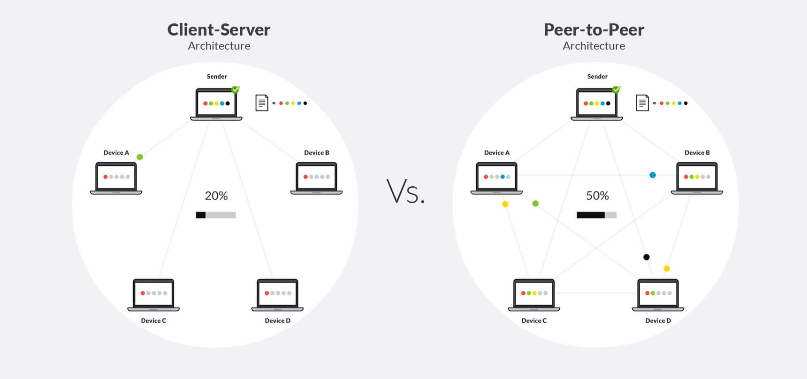
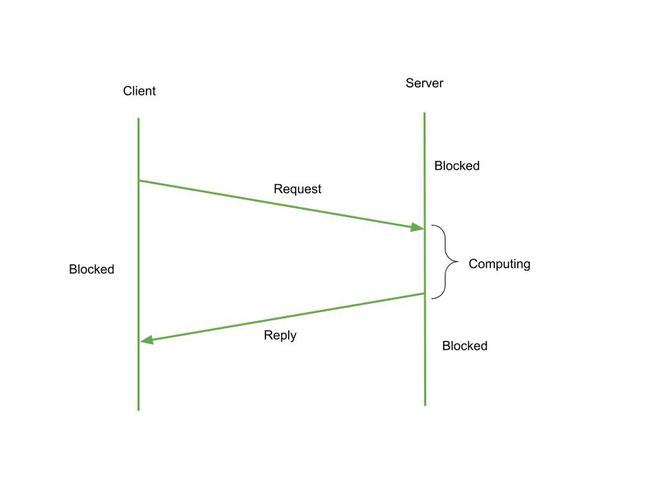
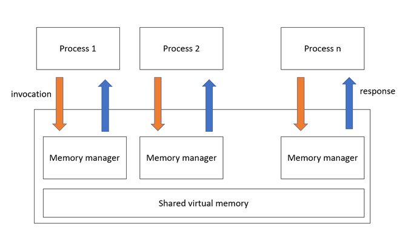

## 1. Distributed System
- A distributed system is a collection of independent computers that appear to the user as a single coherent system.
### Key characteristics : 
- Multiple nodes: Many machines (nodes), often geographically separated.
- No shared memory: Nodes communicate by message passing over a network.
- Concurrent execution: Many processes run at the same time.
- No global clock: There’s no single “perfect” clock shared by all nodes.
- Faults are normal: Machines or links can fail while the system keeps running.
### Goals
- Transparency: Hide the fact that there are many machines.
    - access transparency (same way to access local/remote resources)
    - location transparency (user doesn’t know where data is stored)
    - replication transparency (multiple copies appear as one)
- Scalability: Able to grow to many users/nodes without collapsing.
- Reliability & availability: System should continue working even if some nodes fail.
- Performance: Parallelism and data distribution for speed.
- Examples: Google search backend, distributed file systems (HDFS), distributed databases (Cassandra, MongoDB cluster), microservices architecture.

## 2. Distributed Computing
- Idea:
- Using a distributed system to solve computational problems by dividing work among multiple nodes.
    - Computation is partitioned into tasks that run on different machines.
    - Tasks communicate and coordinate through messages.
    - Goal: speed up execution, handle large data, increase reliability.
- Types
1. Data-parallel computing: Same operation on different chunks of data in parallel (e.g., MapReduce, Spark).
2. Task-parallel computing: Different tasks/functions run on different nodes and cooperate (like multiple microservices).
- Challenges
    - Communication delay and network failures.
    - Synchronization (making sure things happen in correct order).
    - Consistency of data shared across nodes.
    - Load balancing (distributing work fairly).

## 3. Distributed Applications
- Definition: Applications whose components run on multiple networked computers and interact via messages or remote calls.
- Examples
    - Web applications: Frontend in browser + backend services + databases on other servers.
    - Chat apps (WhatsApp, Telegram): Multiple servers handling messages and presence.
    - Online games: Game servers, match-making services, databases.
- Distributed databases & file storage: Apps that read/write to clusters, not a single machine.
- Components
    - Client: Runs on user device, sends requests.
    - Server(s): Provide services (auth, data, business logic).
    - Middleware: Handles communication, serialization, naming, load balancing.
- Properties to care about
    - Scalability: Handle more users by adding more servers.
    - Fault tolerance: If one component fails, app still works.
    - Consistency: All users should see “correct” or “eventually correct” state.

## Distributed Application Layers :
- Distributed applications are typically organized into layers, each with a specific function. This layered architecture simplifies design, communication, and scalability.
1. Presentation Layer (Client Layer)
    - Handles user interface
    - Runs on the user’s machine
    - Example: Web browser, mobile app
- Responsibilities:
    - Display data to user
    - Take input from user
    - Send requests to application layer

2. Application/Logic Layer (Middle Layer)
- Contains the business logic
- Processes user requests
- Often implemented as application servers
- Responsibilities:
    - Authentication
    - Processing rules
    - Coordinating between client and database
- Example:
    - A server that processes "withdraw money" or "book ticket" requests.

3. Data Layer (Database Layer)
- Stores all the data used by the distributed application
- Consists of databases, file systems, or distributed storage
- Responsibilities:
    - Managing data
    - Query processing
    - Ensuring data consistency

## 4. Paradigms of Distributed Computing
- These are common models/architectures used to design distributed systems.

1. Client–Server Model
- Clients send requests, server services them.
- Often many clients, fewer servers.
- Examples: Web browsers (client) ↔ web servers (server), database clients ↔ DB server.
- Pros: Simple, centralized control.
- Cons: Server can become a bottleneck or single point of failure.

2. Peer-to-Peer (P2P) Model
- Every node is both client and server (peer).
- No central server (or minimal centralization).
- Examples: BitTorrent, some blockchain networks.
- Pros: Highly scalable, no central bottleneck.
- Cons: Harder to manage, security and consistency are tougher.

3. Message-Passing / RPC Paradigm
- Nodes communicate by sending messages.
- RPC (Remote Procedure Call): Call a function on a remote machine as if it were local.
- Example: userService.createUser() actually sends a request over the network to a remote user-service.
    

4. Shared Data / Distributed Shared Memory
- System tries to simulate shared memory over network.
- Processes use read/write operations; underlying system maps them to messages.
- Used more in research / specialized systems.

5. Event-driven / Publish–Subscribe
- Producers publish events to a topic.
- Consumers subscribe to topics.
- Messaging system (Kafka, RabbitMQ, etc.) handles routing.
- Good for microservices that communicate via events.

## Cloud Computing:
- Definition (simple):
    - Using computing resources (servers, storage, databases, networking, software) over the internet, paid as you go.
    - Cloud computing is essentially distributed computing + virtualization + service model + pay-per-use.
- Characteristics:
    - On-demand self-service: Provision resources without human interaction with provider.
    - Broad network access: Access via internet from anywhere.
    - Resource pooling: Multiple customers share a pool of resources.
    - Rapid elasticity: Quickly scale up/down.
    - Measured service: Pay only for what you use.
- Service Models
1. IaaS – Infrastructure as a Service
- Virtual machines, storage, networks.
- Example: AWS EC2, Google Compute Engine.
2. PaaS – Platform as a Service
- Platform to deploy apps without managing OS/hardware.
- Example: Heroku, Google App Engine.
3. SaaS – Software as a Service
- Complete applications delivered over internet.
- Example: Gmail, Salesforce, Office 365.
4. Deployment Models
- Public cloud: Provided by third-party (AWS, Azure).
- Private cloud: Dedicated to single organization.
- Hybrid cloud: Combination of public + private.
- Cloud systems are highly distributed: data centers across regions, replication, load balancing, etc.

## 7. Logical Clocks
- Since there is no global physical clock and messages can be delayed, we need a way to order events.
- Logical clocks provide a way to define a “happens-before” ordering of events without using real time.

1. Lamport Logical Clocks
- Each process Pi maintains an integer counter Li.
- Rules:
    - Initialization: Li = 0 for all processes.
    - On each local event at process Pi: Li = Li + 1.
    - On sending a message m from Pi:
        - Increment clock: Li = Li + 1.
        - Attach timestamp t = Li to m.
    - On receiving a message m with timestamp t at process Pj:
        - Set Lj = max(Lj, t) + 1.
- If event a happens before b (a → b), then C(a) < C(b) where C is Lamport clock.
- However, the converse is not always true; if C(a) < C(b) we can’t be sure that a → b (they might be concurrent).

2. Vector Clocks
- To capture concurrency more precisely, we use vector clocks.
    - For a system of N processes, each process Pi maintains a vector Vi[1..N].
    - Vi[i] is Pi’s own logical time; Vi[j] is Pi’s knowledge of Pj’s time.
- Rules:
    - Initialization: All entries zero.
    - Local event at Pi: Vi[i]++.
    - Send message m from Pi:
        - Vi[i]++, then attach full vector Vi to message.
    - Receive message m with vector timestamp V from Pj at Pi:
        - For each k: Vi[k] = max(Vi[k], V[k]).
        - Then Vi[i]++.
    - Comparing vectors:
        - A < B if A[k] ≤ B[k] for all k and A[j] < B[j] for at least one j.
            - Then event with timestamp A happened before event with timestamp B.
        - If neither A < B nor B < A, the events are concurrent.
- Vector clocks can therefore detect concurrency, which Lamport clocks can’t.

## A Mobile Agent 
- is a program that can move from one network host to another autonomously and continue its execution on the new machine.
- Unlike static programs, mobile agents migrate across distributed systems, carry their code and data with them, and perform tasks locally on remote servers.
-  Key Features
- Autonomy
    - Can make decisions without human intervention.
- Mobility
    - Can move between different nodes/hosts.
- Asynchronous Execution
    - Works independently of the user’s presence.
- Interaction with Remote Hosts
    - Executes code locally on the destination machine.
- Adaptivity
    - Can modify behavior based on the environment.

### Architecture of Mobile Agent System
- A mobile-agent environment usually contains:
1. Agent : The actual program/code that performs tasks and migrates.
2. Agent Server / Agent Platform
- A host that provides:
    - execution environment
    - security
    - communication support
    - migration APIs
3. Agent Migration Mechanism
- Handles movement of:
    - code
    - state
    - data
4. Communication System
- Supports collaboration between agents.

## Types of Mobile Agents
1. Touring Agents
- Visit multiple hosts one-by-one to collect/compute data.
2. Reactive Agents
- Respond to changes in the environment.
3. Collaborative Agents
- Work with other agents to achieve a goal.
4. Interface Agents
- Assist users by learning behavior.

### Life Cycle of a Mobile Agent
- Creation
    - Agent is initialized on a source machine.
- Migration
    - Moves to a remote system.
- Execution
    - Performs tasks locally at the host.
- Suspension / Cloning (optional)
    - Agent pauses or creates copies.
- Return / Termination
    - Goes back to the source or ends after task completion.

## ⭐ ORB (Object Request Broker)
- An ORB (Object Request Broker) is a middleware component of CORBA architecture that enables communication between distributed objects located on different machines.
- It acts like a software bus that allows objects to:
    - Send requests
    - Receive responses
    - Interact with remote objects as if they were local

+-------------+          +-------------+
|   Client    |          |   Server    |
|  Object     |          |  Object     |
+------|------+          +------|------+
       |                         |
       |     ORB (Middleware)    |
       +--------------------------+
