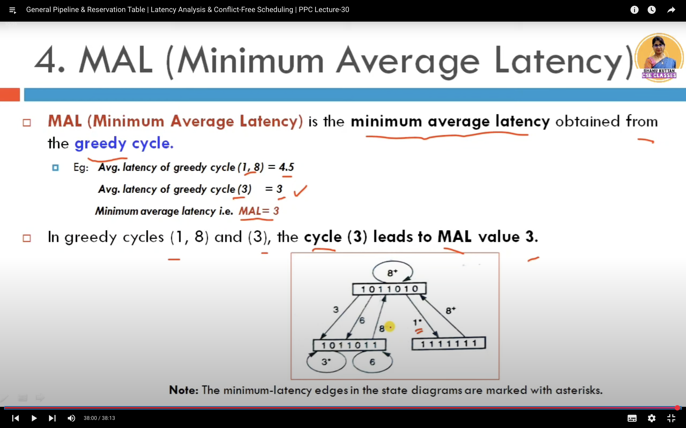

## Pipeline
- Pipeline refers to a technique where multiple instruction stages are overlapped during execution to improve throughput.
- Design involves splitting instructions into stages like fetch, decode, execute, memory access, and write-back.
- System based on it refers to building CPU architectures that utilize pipelines for instruction-level parallelism.

## Non-Linear Pipeline :

## Reservation table:

## Termenoligies:

1. Latency and Collision:

2. Permissible and Forbidden Latency :

3. Latency Sequence and Latency cycle

4. Average Latency and Constant Cycle :

## Collision Free Scheduling : 

1. Collision Vector 

2. State Diagram:

3. Simple Cycle and Greedy 

4. MAL

> Throghput corresponding to MAL  : 1/MAL . mips 
> Throghput Coresponding to tu : 1/tu.MAL or f/MAL  

- Upper bound and lower bound on MAL.

## Insert a cycle : 
- Insert a delay and avoid one colloion. 
==> Modified Reservation table will be : 
- Make Transition diag and simple cycle , greedy cycles .
==> New MAL will be lower bound ie Max checkmarks in any row 
- and Optimal throughput will be 1/MAL*tu.

## 📂 Types of Branch Prediction

1. Static Branch Prediction
This type of prediction doesn't use runtime information. It follows fixed rules.

Examples:
- Always taken: Assume every branch is taken.
- Always not taken: Assume every branch is not taken.
- Backward branches taken, forward branches not taken: Loops (which branch backwards) are assumed to be taken, while other branches are not.

Pros: Simple, low overhead
Cons: Not accurate for complex programs.

2. Dynamic Branch Prediction
This prediction uses historical information about branch behavior.

- Branch History Table (BHT)
A table storing previous branch outcomes.
Uses bits (1 or 0) to represent taken or not taken.
The processor indexes into this table using the branch address.

- Two-Bit Predictor
Avoids frequent flips between taken/not taken.
Requires two bits per branch.
- States like:
    - Strongly taken
    - Weakly taken
    - Weakly not taken
    - Strongly not taken

=> 93%
Transitions occur only after two consecutive mispredictions.

- (m, n) Branch Prediction?
The (m, n) branch predictor is a two-level adaptive branch predictor.
 - Key idea:
    - m refers to the number of bits used to record the global branch history.
    - n refers to the number of bits used in the pattern history table (PHT) for each possible global history.

This structure allows the processor to make smarter predictions based on both recent behavior and patterns in the branch instructions.

=> 96%

- ✅ Tournament Branch Prediction
    A tournament predictor is a sophisticated branch prediction technique where multiple predictors are used, and the processor chooses which predictor to trust based on past behavior.

Main idea:
It uses multiple predictors, like:
- A global predictor (looks at the history of branches).
- A local predictor (looks at the history of this particular branch).

A selector chooses which predictor to trust based on which one has been more accurate.

This helps improve accuracy in complex scenarios where simple predictors fail.

=> 97%
---

| Predictor                 | Idea                                  | Strength         |
| ------------------------- | ------------------------------------- | ---------------- |
| **2-bit predictor**       | Saturating counter                    | Good for loops   |
| **(m, n) predictor**      | m-bit history + n-bit counters        | Learns patterns  |
| **Tournament predictor**  | Local + global + selector             | Best accuracy    |
| **Alpha 21264 predictor** | Advanced tournament with 4 components | Industry-leading |

## Tomasulo’s algorithm 
is a hardware algorithm used in modern CPUs to **dynamically schedule** instructions to execute out-of-order while preserving data dependencies and avoiding hazards.

### Goals:
- Increase instruction-level parallelism (ILP)
- Allow instructions to execute as soon as their data operands are available
- Avoid pipeline stalls due to RAW, WAR, and WAW hazards
- Perform register renaming dynamically

### ✅ Key Components
1. Reservation Stations (RS):
- Buffers that hold instructions waiting for operands.
- They store instruction details and operands once available.
- Different RSs for different functional units (e.g., ALU, multiplier).

2. Common Data Bus (CDB):
- Broadcasts the result of executed instructions to all units that need it.
- Allows operands waiting in RSs to receive their data immediately.

3. Register Alias Table (RAT):
- Keeps track of where the latest version of a register is being computed.
- Helps rename registers to avoid false dependencies.
 

### ✅ How Tomasulo's Algorithm Works – Step by Step
1. Instruction Issue
- Instruction is sent to an available Reservation Station.
- If operands are available → stored.
- If not → tags are used to track where the operand will come from.

2. Execution
- Once all operands are ready, the instruction is dispatched to the functional unit.
- The functional unit computes the result.

3. Write Result
- Result is broadcast via the Common Data Bus (CDB).
- All units listening for this result receive it and update accordingly.

