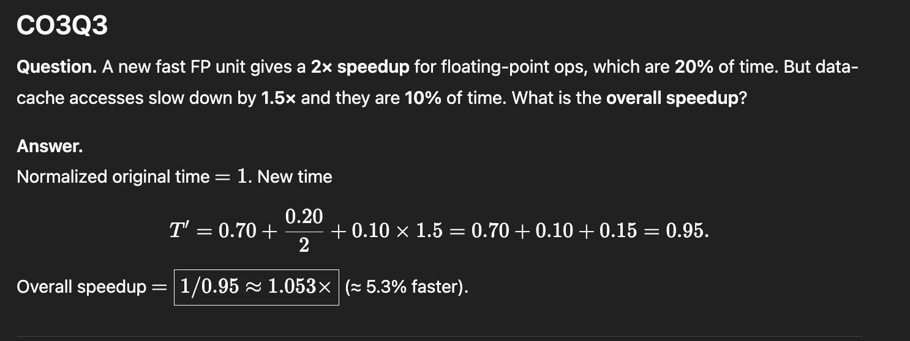
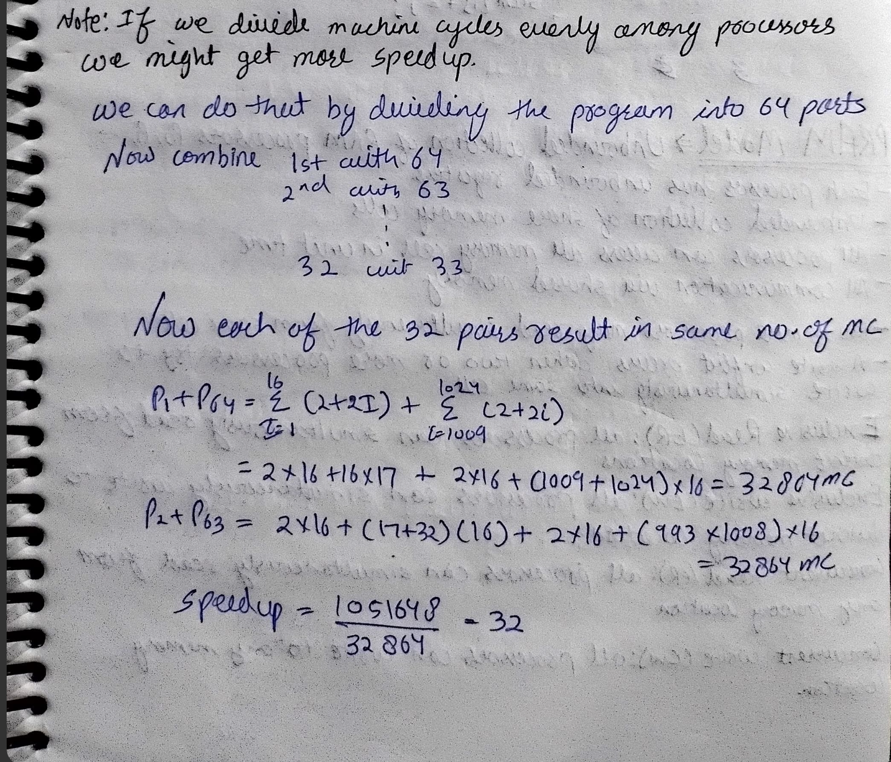

## Question. Let a be the percentage of program code that can be executed simultaneously by n computers in a cluster (each computer has rate x MIPS). The remaining code must execute on a single processor. Determine an expression for the effective MIPS rate in terms of a, n, x.

- calculate Ts+Tp
- rate = N/Ts+Tp 
- /10^6 => MIPS 

## An application runs on a 9-computer cluster. Total runtime on the cluster is T. Of this, 25% of T runs simultaneously on all 9 computers; the remaining time runs on a single computer. Find the effective speedup over a single computer and the percentage of code parallelized.

- Speed up = t / (3t/4 + 9*t/4)
- 75% parellel .
- Speed up = 1/.33 = 3

## Q3 

## 
L1: for (I = 1; I <= 4096; I++) {
L2:     SUM[I] = 0;                     // costs 2 cycles
L3:     for (J = 1; J <= I; J++) {
L4:         SUM[I] = SUM[I] + I;        // costs 2 cycles each time
      }
}

### (i) Total execution time on a uniprocessor ?

- summation (1->4096) 2+2i => 2*4096 + 2*4096*4097 

### Prescheduled block partitioning over 64 processors :

cycles = summation (4033->4066) 2+2i => 2(64) + 2 * 4096*4097-4032*4033 = 128 + 520384 = 520384 cycles .  =>>> 32x fatser .

### (iii) Modify program for balanced parallel execution on 64 processors

### (iv) Minimum time with balanced parallelism (64 processors)
/64 => 64x faster .

