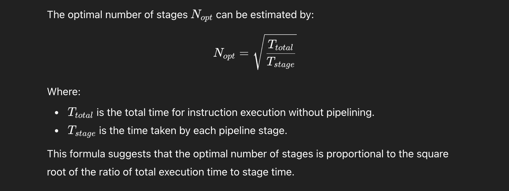

## Branching hazards 
- delayed Branching => skipping till branch is detected .
    - 30*2(branch) + 70*1(not branch) = 130/100 = 1.3 avg
- cond branch => next instr will be for sure wali instr so cycle zaya na ho .

 
## derive an expression optimal no of stages in a pipeline

## What do you understand by Flynn’s taxonomy? Explain all the four with examples.
Flynn’s taxonomy classifies computer architectures based on the number of instruction streams and data streams they handle:
1. SISD (Single Instruction, Single Data):
One instruction operates on one data stream.
Example: Traditional single-core CPU where one operation is performed at a time.

2. SIMD (Single Instruction, Multiple Data):
One instruction operates on multiple data streams simultaneously given by CU to all the PC(ALU's) and acts on same 
Example: Graphics Processing Unit (GPU) where the same operation is applied to many pixels or data points.
eg:  Array processors , Vector Pipelines 

3. MISD (Multiple Instruction, Single Data):
Multiple instructions operate on the same data stream from multiple CU's.
Example: Rare in practice but used in fault-tolerant systems where the same data is processed by different algorithms to ensure correctness.
- Systolic arrays

4. MIMD (Multiple Instruction, Multiple Data):
Multiple instructions operate on multiple data streams independently.
Example: A cluster of servers performing different tasks on different datasets concurrently.

## 

