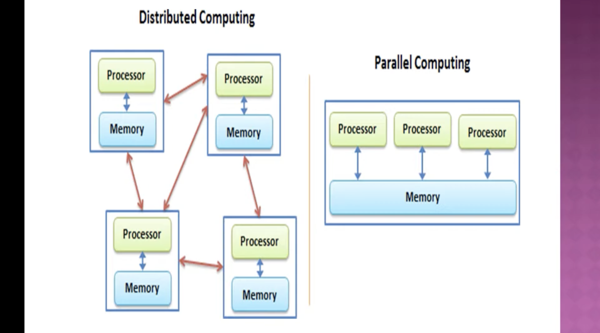

## 📘 Key Topics Explained

## 1. Parallel System & Parallel Computing

- Parallel System refers to hardware and software frameworks that perform multiple computations simultaneously.
- `Parallel Computing` is the process of breaking a large task into smaller sub-tasks and executing them concurrently to improve speed and efficiency.
    - Inovolves multiple processors or multiple cores in a single processor to perform mutiple tasks ata time .
    - Usually based on Divide and Conquer principle.
    - used where faster speed is required eg supercomputers .

### ✅ Types of Computing Systems Based on Processing Units

1. 🟠 Single-Core Processor
    1. Contains one processing unit (core).
    1. Executes one instruction at a time.
    1. Uses sequential execution.
    1. Suitable for simple tasks or applications where performance is not critical.

Example: Older computers, basic embedded systems.

2. 🟠 Multi-Core Processor
    1. Contains two or more cores within a single chip.
    1. Each core can process instructions independently or cooperatively.
    1. Reduces power consumption and increases processing efficiency compared to using multiple separate processors.
    1. Types:
    1. Dual-Core – 2 cores
    1. Quad-Core – 4 cores
    1. Hexa-Core – 6 cores
    1. Octa-Core – 8 cores and beyond

Example: Modern laptops, smartphones, desktops.

3. 🟠 Many-Core Processor
    1. Contains dozens or hundreds of cores.
    1. Designed for highly parallel tasks.
    1. Used in scientific computing, simulations, graphics rendering, AI workloads.

Example: GPUs, supercomputers.

4. 🟠 Distributed Memory System
    1. Multiple independent computers (nodes) connected by a network.
    1. Each node has its own private memory.
    1. Processes communicate by passing messages.
    1. Scales to very large systems like clusters and cloud platforms.

- Example: 
    - Web App with db , ec2 server , web hooks , APIs , cloudflare workers etc.
    - High-performance computing clusters, cloud services.

- Distrubuted vs Parellel Computing : 

## Amdahl’s Law
is a formula used to find the maximum possible speedup of a task when parts of it can be parallelized. It helps us understand the limits of improving performance by adding more processors or cores.
- 📌 The Formula
> 𝑆 = 1 / (1-p + p/n)

> T = n/n+p-1

> Eff = S/p

> CPI = 1/S 

Where:
- S = overall speedup
- P = the portion of the task that can be parallelized (between 0 and 1)
- (1 − P) = the portion of the task that must be executed serially or cant be parallelized at all .
- N = the number of processors or cores  or performance factor.

### key points 
- ✔ The serial portion becomes the bottleneck or It shows that the non-parallelizable part of the task limits the overall speedup.

2. Architectural Classification Schemes

- Methods to categorize computer architectures based on how tasks are distributed and managed.
- Includes Flynn’s taxonomy (SISD, SIMD, MISD, MIMD), which classifies systems by how data and instructions are handled.

3. Evolution of Computer Architecture

- Tracks the development from single-core processors to modern multi-core and massively parallel architectures.
- Focuses on how increased processing power and efficient data handling led to advanced computing models.

4. Parallel Architecture

- Describes different designs of processors working together.
- Includes superscalar processors, vector processors, and multi-core architectures.

